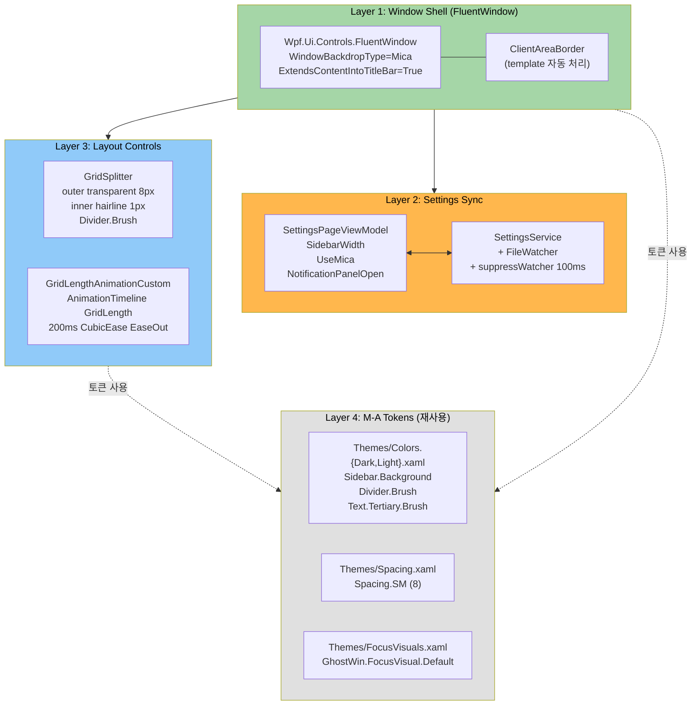
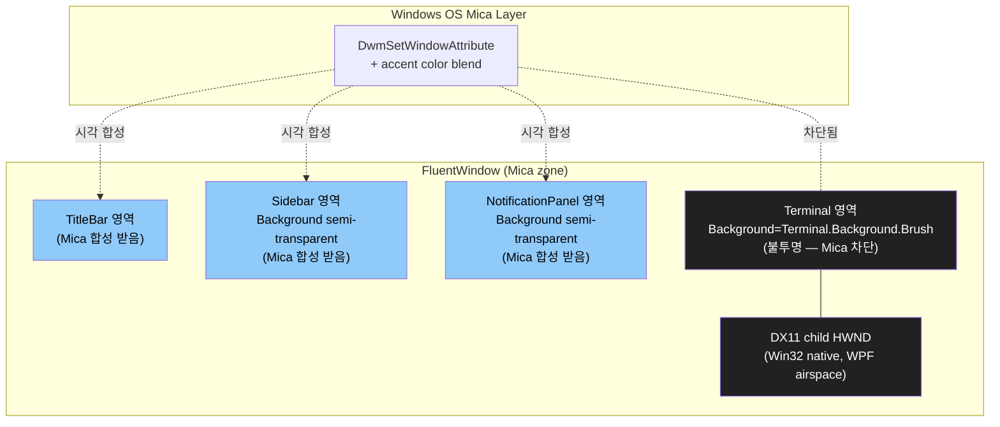
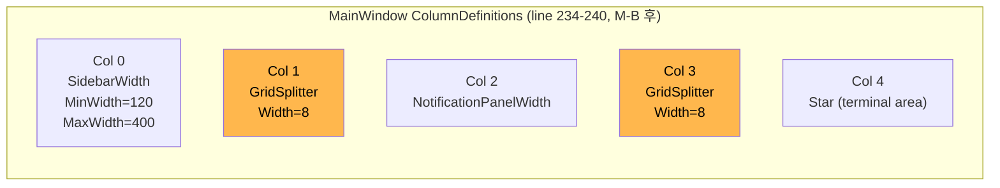
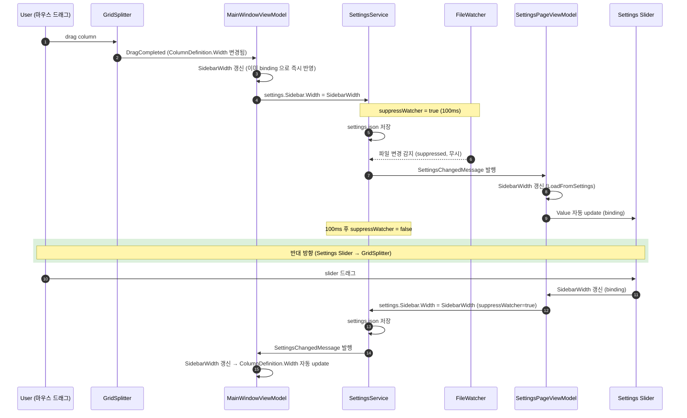
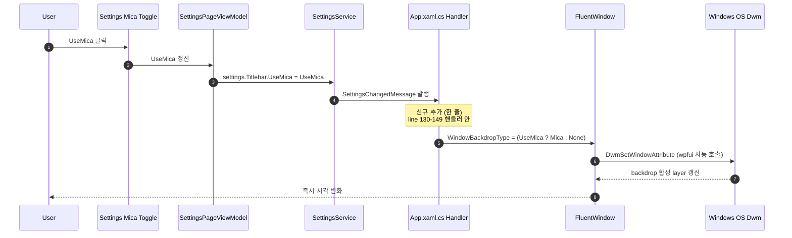

# M-16-B 윈도우 셸 — Design Document

> **한 줄 요약**: M-A 디자인 토큰 위에 `Wpf.Ui.Controls.FluentWindow` + Mica 백드롭 + 자체 GridSplitter ControlTemplate + 커스텀 `AnimationTimeline<GridLength>` + ClientAreaBorder template 의존을 통합. 13 architectural decisions + 16 component 명세, R1-R9 리스크 모두 폴백 전략 명시. 사용자 결정 D1=a (a11y 흡수) + D2=a (Day 2 prototype) 반영.
>
> **Project**: GhostWin Terminal
> **Version**: feature/wpf-migration
> **Author**: 노수장
> **Date**: 2026-04-29
> **Status**: Draft v0.1
> **Plan Doc**: [`m16-b-window-shell.plan.md`](../../01-plan/features/m16-b-window-shell.plan.md) v0.3 (Approved)
> **PRD**: [`m16-b-window-shell.prd.md`](../../00-pm/m16-b-window-shell.prd.md)

---

## Executive Summary (4-perspective)

| 관점 | 내용 |
|------|------|
| **Problem** | M-A 디자인 토큰 base 위에 윈도우 셸 자체를 표준화해야 하지만, 그동안 `Window` + `WindowChrome` + 수동 BorderThickness=8 보정으로 만든 셸이 (1) Mica false-advertising (2) GridSplitter 부재 (3) Toggle 즉시 점프 (4) 최대화/DPI 검은 갭 4가지 깊은 결함을 야기. 단순 inline 수정으로는 해결 안 됨 — 셸 자체 교체 필요. |
| **Solution** | **3-layer 교체 + 1 helper class 신설**: (Layer 1) MainWindow base = `Wpf.Ui.Controls.FluentWindow` (XAML root + xaml.cs base class + WindowChrome 의존성 제거). (Layer 2) `WindowBackdropType="Mica"` + `ExtendsContentIntoTitleBar="True"` + 런타임 swap (`DwmSetWindowAttribute` wpfui 자동 호출). (Layer 3) Sidebar/NotificationPanel divider Rectangle → 자체 ControlTemplate GridSplitter (outer 8px transparent + inner 1px hairline `Divider.Brush`). (Helper) `Animations/GridLengthAnimationCustom : AnimationTimeline<GridLength>` 신설로 NotificationPanel/Settings transition 200ms ease-out. 양방향 동기화는 M-12 검증 `suppressWatcher` 100ms 패턴 재사용. |
| **Function/UX Effect** | (1) Settings UseMica 토글 → 즉시 시각 변화 (Mica 색 합성 layer 추가). (2) 사이드바/알림 패널 가장자리 hover → SizeWE cursor → 마우스 드래그 폭 조절 → DragCompleted → SettingsChangedMessage 발행 → Settings slider 자동 반영. (3) NotificationPanel 토글 → 200ms CubicEase ease-out 슬라이드 (cmux 패리티). (4) 최대화/DPI 변경 시 검은 갭 0px (FluentWindow 의 ClientAreaBorder 자동 처리). (5) Caption row 7 zero-size E2E button 격리 → AutomationId 보존 + layout 영향 0. (6) Sidebar Tab 결정적 순회 + 글로벌 FocusVisualStyle. |
| **Core Value** | M-A 가 "토큰 base" 라면, M-B 는 "셸 base" 완성. M-16-D (cmux UX 패리티 ContextMenu/DragDrop) 가 GridSplitter + Mica 위에서 자연스럽게 쌓일 수 있는 기반. quadrant chart (Native 0.35 / UX 0.55) → (0.85 / 0.85) 위치 이동. M-A 의 메모리 4 패턴 모두 적용 (코드 grep+Read 검증 + binding silent fail 회피 + inline trump audit + SetResourceReference). |

---

## 1. Overview

### 1.1 Design Goals

1. **셸 표준화**: 일반 `Window` + 수동 보정 → wpfui FluentWindow + ClientAreaBorder template 자동 처리. 코드 -25 LOC (BorderThickness 보정 코드 제거)
2. **토큰 100% 재사용**: M-A 의 Color/Spacing/FocusVisuals ResourceDictionary 만 사용. 새 inline hex 0건, 새 inline Thickness 0건
3. **양방향 동기화 결정성**: GridSplitter ↔ Settings slider infinite-loop 0건 (suppressWatcher 100ms)
4. **DPI 자동 처리**: BorderThickness=8 수동 코드 제거 후 100/125/150/175/200% 5단계 통과
5. **회귀 0건**: Caption row 7 button hit-test, M-15 idle p95 7.79 ms ±5%, Core/App/E2E 테스트 모두 PASS

### 1.2 Design Principles

- **단일 책임**: GridSplitter ControlTemplate 은 시각 (outer transparent + inner hairline) 만, DragCompleted 핸들러는 ViewModel 갱신만, suppressWatcher 는 file watcher 차단만
- **fallback 명시**: R1-R3 검증 실패 시 폴백 (FluentWindow + 자체 WindowChrome / BorderThickness=8 보존 / Mica 부분 적용) 사전 합의
- **선언적 우선**: XAML 명시 > 코드 직접 호출. WindowBackdropType="Mica" XAML > `DwmSetWindowAttribute` 직접 호출
- **M-A 학습 반영**: 모든 binding 에 RelativeSource 명시 (N1 silent fail 회피), 모든 imperative brush 는 SetResourceReference (M-A Day 7 패턴)

### 1.3 Related Documents

- **Plan v0.3 (Approved)**: [`m16-b-window-shell.plan.md`](../../01-plan/features/m16-b-window-shell.plan.md) — 22 FR + 8 NFR + 9 risks + 8-day-bucket
- **PRD v0.2**: [`m16-b-window-shell.prd.md`](../../00-pm/m16-b-window-shell.prd.md) — 19 FR + 7 NFR + 7 risks + 부록 A 검증 위치
- **선행 M-A archive**: [`docs/archive/2026-04/m16-a-design-system/`](../../archive/2026-04/m16-a-design-system/) — Themes/* 토큰 base
- **참고 사용 사례**: `wpf-poc/MainWindow.xaml` — 검증된 FluentWindow + Mica
- **메모리 패턴**: `feedback_wpf_binding_datacontext_override.md`, `feedback_pdca_doc_codebase_verification.md`, `feedback_audit_estimate_vs_inline.md`, `feedback_setresourcereference_for_imperative_brush.md`

---

## 2. Architecture

### 2.1 Layer Composition



### 2.2 Mica 백드롭 + child HWND 분리 (R3 핵심)



**핵심**: Mica 는 transparent 영역에만 적용. DX11 child HWND 영역은 자체 Background (`Terminal.Background.Brush` M-A 토큰) 로 덮어 Mica 차단. wpf-poc/MainWindow.xaml 의 `<Border Background="Black">` 패턴 참조.

### 2.3 Component Dependencies

| Component | Depends On | Purpose |
|-----------|-----------|---------|
| **MainWindow** (FluentWindow) | Wpf.Ui.Controls + Themes/*.xaml | 셸 root, Mica 백드롭 |
| **GridSplitter** (sidebar/notif) | M-A `Divider.Brush` | 폭 조절 hit 영역 + visual hairline |
| **GridLengthAnimationCustom** | System.Windows.Media.Animation | NotificationPanel/Settings transition |
| **MainWindowViewModel** | SettingsService + IMessenger | SidebarWidth/NotificationPanelWidth 양방향 sync |
| **App.xaml.cs SettingsChangedHandler** | IEngineService + Application.Current.MainWindow | UseMica 토글 → BackdropType swap |
| **Themes/FocusVisuals.xaml (D1=a 추가)** | (none) | 글로벌 Button BasedOn 으로 자동 적용 |

---

## 3. Architectural Decisions (13건 + a11y 추가 3건)

### 3.1 Core Decisions (Plan §6.2 확장)

| # | 결정 | 옵션 | 채택 | 근거 |
|:-:|------|------|:----:|------|
| **D-01** | Window base class | `Window` 보존 / `Wpf.Ui.Controls.FluentWindow` / `Wpf.Ui.Controls.UiWindow` (deprecated) | **FluentWindow** | wpf-poc 검증 + Mica + ExtendsContentIntoTitleBar 표준 |
| **D-02** | Mica API 호출 방식 | XAML 명시 (`WindowBackdropType="Mica"`) / 코드 `DwmSetWindowAttribute` 직접 / wpfui `WindowBackdrop.ApplyBackdrop` | **XAML 명시** | 선언적, wpfui 가 Win11 22H2+ feature flag 자동 처리, fallback 자동 |
| **D-03** | UseMica 토글 swap 위치 | `App.xaml.cs` SettingsChangedMessage 핸들러 / `MainWindow.xaml.cs` Loaded / 둘 다 | **App.xaml.cs (M-A C9 패턴 재사용)** | 이미 `App.xaml.cs:130-149` 핸들러 존재 (M-A C9 ClearColor) — 한 줄 추가만 |
| **D-04** | "(restart required)" 라벨 | 보존 / 제거 (런타임 swap 검증 후) | **제거** | UseMica 가 런타임 swap 가능하면 라벨이 사용자 오해 유발. wpfui FluentWindow 가 런타임 swap 지원 (검증 Day 2) |
| **D-05** | GridSplitter 스타일 | wpfui 표준 / 자체 ControlTemplate / 표준 WPF + Background 만 변경 | **자체 ControlTemplate** | M-A `Divider.Brush` 토큰 재사용 + outer transparent (8px hit) + inner hairline (1px visual) cmux 패리티 |
| **D-06** | GridSplitter 위치 | ColumnDefinition 사이 / 별도 Grid.Column / Adorner | **ColumnDefinition 사이 (Width="8")** | WPF 표준 패턴, ResizeBehavior=PreviousAndNext |
| **D-07** | 양방향 동기화 | event-based / suppressWatcher / Behavior | **suppressWatcher 100ms** | M-12 SettingsService 에 이미 `_suppressFileWatcher` 패턴, 검증된 infinite-loop 0건 |
| **D-08** | NotificationPanel transition | Visibility 즉시 / opacity / Width slide 200ms / 자체 Storyboard | **Width slide 200ms CubicEase EaseOut** | cmux 패리티, ColumnDefinition.Width 직접 애니메이션 |
| **D-09** | Settings 페이지 transition | Visibility 즉시 / opacity fade 200ms / Width slide 350ms | **opacity fade 200ms** | Settings 가 wide content (MaxWidth=680) — Width slide 시 layout shift 부담. opacity 가 자연 |
| **D-10** | GridLengthAnimation 위치 | `src/GhostWin.App/Animations/` 신규 / Inline XAML / 3rd party | **Animations/ 폴더 신설** | dependencies 0, GridLength 직접 지원 미존재 (커스텀 필요), 단위 테스트 가능 |
| **D-11** | BorderThickness 처리 | 코드 직접 설정 보존 / FluentWindow ClientAreaBorder 자동 / 둘 다 (폴백) | **ClientAreaBorder + 폴백 보존 (R2)** | DPI 자동 보정 기대, 실패 시 코드 보존 (Day 3 검증) |
| **D-12** | ResizeBorderThickness | 4 (현재) / 8 (Win11 표준) | **8** | hit-test 표준, DPI 변경 시 일관성 |
| **D-13** | Caption row 7 zero-size button | 현재 위치 보존 / 별도 hidden Panel 격리 / 완전 제거 | **별도 hidden Panel** | E2E AutomationId 보존, layout 영향 0, Visibility="Visible" + 0×0 |

### 3.2 Accessibility Decisions (D1=a 흡수)

| # | 결정 | 옵션 | 채택 | 근거 |
|:-:|------|------|:----:|------|
| **D-14** | Sidebar TabIndex 명시 | 미명시 (현재) / TabIndex 0~10 / 자동 | **TabIndex 0~10 명시** | M-A Settings 폼 패턴 (TabIndex 0~15) 재사용, 결정적 순회 |
| **D-15** | Sidebar AutomationProperties.Name | 일부만 (현재) / 모든 Workspace + 버튼 | **모든 Workspace + 버튼** | NVDA 의미 있는 이름 인식 |
| **D-16** | 글로벌 FocusVisualStyle | 적용 안 함 (현재) / `App.xaml` Button Style BasedOn / `Themes/FocusVisuals.xaml` 글로벌 | **`Themes/FocusVisuals.xaml` 글로벌 BasedOn** | M-A 의 named Style 재사용, 모든 Button 자동 적용 |

---

## 4. UI/UX Design

### 4.1 MainWindow Grid 구조 (D-05/D-06 적용 후)



**현재 (M-B 전)**:
```xml
<ColumnDefinition Width="{Binding SidebarWidth}" MinWidth="120" MaxWidth="400"/>
<ColumnDefinition Width="Auto"/>          <!-- Rectangle 1px (line 360) -->
<ColumnDefinition Width="{Binding NotificationPanelWidth}"/>
<ColumnDefinition Width="Auto"/>          <!-- Rectangle 1px (line 368) -->
<ColumnDefinition Width="*"/>
```

**M-B 후**:
```xml
<ColumnDefinition Width="{Binding SidebarWidth}" MinWidth="120" MaxWidth="400"/>
<ColumnDefinition Width="8"/>             <!-- GridSplitter 영역 -->
<ColumnDefinition Width="{Binding NotificationPanelWidth}"/>
<ColumnDefinition Width="8"/>             <!-- GridSplitter 영역 -->
<ColumnDefinition Width="*"/>
```

### 4.2 GridSplitter ControlTemplate 초안 (D-05)

```xml
<!-- Themes/Colors.Dark.xaml + Colors.Light.xaml 의 Divider.Brush 재사용 -->
<Style x:Key="GhostWin.GridSplitter" TargetType="GridSplitter">
    <Setter Property="Background" Value="Transparent"/>
    <Setter Property="Width" Value="8"/>
    <Setter Property="HorizontalAlignment" Value="Stretch"/>
    <Setter Property="VerticalAlignment" Value="Stretch"/>
    <Setter Property="ResizeBehavior" Value="PreviousAndNext"/>
    <Setter Property="ResizeDirection" Value="Columns"/>
    <Setter Property="Cursor" Value="SizeWE"/>
    <Setter Property="Focusable" Value="False"/>  <!-- E2E 영향 회피 -->
    <Setter Property="Template">
        <Setter.Value>
            <ControlTemplate TargetType="GridSplitter">
                <Grid Background="{TemplateBinding Background}">
                    <!-- Inner hairline: 1px, 가운데 배치 -->
                    <Rectangle Width="1"
                               Fill="{DynamicResource Divider.Brush}"
                               HorizontalAlignment="Center"
                               VerticalAlignment="Stretch"
                               IsHitTestVisible="False"/>
                </Grid>
            </ControlTemplate>
        </Setter.Value>
    </Setter>
</Style>
```

**시각 효과**:
- 마우스 hit 영역: 8px (사용자 조절 쉬움)
- visible 영역: 1px hairline (cmux 미니멀)
- hover 시 cursor=SizeWE (자동)
- focus 차단 (E2E AutomationId 영향 0)

### 4.3 양방향 동기화 Sequence (D-07)

**Critical 발견 (코드 grep + Read 검증)**: `SidebarWidth` 가 두 ViewModel 에 모두 존재
- `MainWindowViewModel.SidebarWidth` (line 236) — Grid ColumnDefinition.Width binding
- `SettingsPageViewModel.SidebarWidth` (line 62) — Settings Slider Value binding
- 둘 다 별도로 `settings.Sidebar.Width` 에서 load
- 동기화 매개체: `SettingsService.SettingsChangedMessage` (M-12 검증)



### 4.4 Mica 백드롭 토글 Flow (D-03)



### 4.5 NotificationPanel Transition Animation (D-08)

```xml
<!-- MainWindowViewModel.cs 신규 코드 (line 105-109 대체) -->
public bool IsNotificationPanelOpen
{
    get => _isNotificationPanelOpen;
    set
    {
        if (SetProperty(ref _isNotificationPanelOpen, value))
        {
            var target = value ? 280.0 : 0.0;
            var animation = new GridLengthAnimationCustom
            {
                From = NotificationPanelWidth,
                To = new GridLength(target),
                Duration = TimeSpan.FromMilliseconds(200),
                EasingFunction = new CubicEase { EasingMode = EasingMode.EaseOut }
            };
            // ColumnDefinition 의 BeginAnimation 직접 호출
            // (NotificationPanelWidth property 는 GridLength 변경 시 BeginAnimation 으로)
            _notificationPanelColumn?.BeginAnimation(
                ColumnDefinition.WidthProperty, animation);
        }
    }
}
```

> **주의**: `ColumnDefinition` 참조 보존 방법 — `MainWindow.xaml.cs.OnLoaded` 에서 ViewModel 에 `_notificationPanelColumn` 주입. 또는 (대안) AttachedProperty 로 ColumnDefinition 자동 binding. Day 5 prototype 후 결정.

---

## 5. Component Specs

### 5.1 GridLengthAnimationCustom 클래스 명세 (D-10)

**위치**: `src/GhostWin.App/Animations/GridLengthAnimationCustom.cs` (신규)

```csharp
namespace GhostWin.App.Animations;

using System.Windows;
using System.Windows.Media.Animation;

/// <summary>
/// AnimationTimeline supporting GridLength interpolation.
/// WPF base does not provide this — required for ColumnDefinition.Width animation.
/// </summary>
public sealed class GridLengthAnimationCustom : AnimationTimeline
{
    public static readonly DependencyProperty FromProperty =
        DependencyProperty.Register(
            nameof(From), typeof(GridLength), typeof(GridLengthAnimationCustom));

    public static readonly DependencyProperty ToProperty =
        DependencyProperty.Register(
            nameof(To), typeof(GridLength), typeof(GridLengthAnimationCustom));

    public static readonly DependencyProperty EasingFunctionProperty =
        DependencyProperty.Register(
            nameof(EasingFunction), typeof(IEasingFunction), typeof(GridLengthAnimationCustom));

    public GridLength From
    {
        get => (GridLength)GetValue(FromProperty);
        set => SetValue(FromProperty, value);
    }

    public GridLength To
    {
        get => (GridLength)GetValue(ToProperty);
        set => SetValue(ToProperty, value);
    }

    public IEasingFunction? EasingFunction
    {
        get => (IEasingFunction?)GetValue(EasingFunctionProperty);
        set => SetValue(EasingFunctionProperty, value);
    }

    public override Type TargetPropertyType => typeof(GridLength);

    protected override Freezable CreateInstanceCore() => new GridLengthAnimationCustom();

    public override object GetCurrentValue(
        object defaultOriginValue, object defaultDestinationValue, AnimationClock animationClock)
    {
        if (animationClock.CurrentProgress is not double progress)
            return From;

        // Apply easing
        if (EasingFunction is not null)
            progress = EasingFunction.Ease(progress);

        var fromVal = From.Value;
        var toVal = To.Value;
        var current = fromVal + (toVal - fromVal) * progress;

        // Preserve unit type (Pixel / Auto / Star)
        return new GridLength(current, To.GridUnitType);
    }
}
```

**Unit Tests** (`tests/GhostWin.App.Tests/Animations/GridLengthAnimationTests.cs`):

| 케이스 | 입력 | 기대 |
|--------|------|------|
| Linear progress 0% | From=0, To=280, progress=0.0 | GridLength(0) |
| Linear progress 50% | From=0, To=280, progress=0.5 | GridLength(140) |
| Linear progress 100% | From=0, To=280, progress=1.0 | GridLength(280) |
| EaseOut 50% | From=0, To=280, CubicEase EaseOut, progress=0.5 | GridLength(245) (1-(1-0.5)^3 * 280) |
| Reverse | From=280, To=0, progress=1.0 | GridLength(0) |
| Star unit preservation | From=GridLength(0), To=new GridLength(1, Star) | progress 100% → Star unit |

### 5.2 Caption Row 7 zero-size button 격리 패턴 (D-13)

**현재 위치**: `MainWindow.xaml:175-204` 의 7개 button (Width=0, Height=0, Focusable=False)
- E2E_BackToTerminal, E2E_OpenWorkspace, E2E_CloseWorkspace, E2E_FocusSidebar, E2E_TogglePane, E2E_TogglePaneVertical, E2E_ClosePane

**M-B 후 구조**:
```xml
<!-- 변경 전: Caption row 안에서 layout 영향 (Width=0 이지만 layout 시 visit) -->
<Grid Grid.Column="0">
    <Button Width="0" Height="0" AutomationProperties.AutomationId="E2E_BackToTerminal" .../>
    ...
</Grid>

<!-- 변경 후: 별도 hidden Panel 격리 -->
<Grid Grid.Column="0">
    <!-- 일반 caption row 컨텐츠 -->
</Grid>

<!-- MainWindow root 레벨에 별도 hidden host -->
<Canvas x:Name="E2EHiddenHost"
        Width="0" Height="0"
        ClipToBounds="True"
        IsHitTestVisible="False"
        Panel.ZIndex="-1">
    <Button AutomationProperties.AutomationId="E2E_BackToTerminal" Focusable="False"/>
    <!-- 7개 button 모두 이동 -->
</Canvas>
```

**효과**:
- AutomationId 보존 → E2E test 회귀 0
- layout 패스에서 Caption row 영향 0 (Canvas 자체가 hidden)
- ClipToBounds + ZIndex=-1 → 시각 영향 0

### 5.3 글로벌 FocusVisualStyle BasedOn (D-16, D1=a 흡수)

**현재**: `Themes/FocusVisuals.xaml` 에 named Style `GhostWin.FocusVisual.Default` 만 존재 (M-A)

**M-B 후 추가**:
```xml
<!-- Themes/FocusVisuals.xaml 에 추가 -->
<Style TargetType="Button" BasedOn="{StaticResource {x:Type Button}}">
    <Setter Property="FocusVisualStyle" Value="{StaticResource GhostWin.FocusVisual.Default}"/>
</Style>
<Style TargetType="ToggleButton" BasedOn="{StaticResource {x:Type ToggleButton}}">
    <Setter Property="FocusVisualStyle" Value="{StaticResource GhostWin.FocusVisual.Default}"/>
</Style>
<Style TargetType="ListBoxItem" BasedOn="{StaticResource {x:Type ListBoxItem}}">
    <Setter Property="FocusVisualStyle" Value="{StaticResource GhostWin.FocusVisual.Default}"/>
</Style>
<Style TargetType="ComboBox" BasedOn="{StaticResource {x:Type ComboBox}}">
    <Setter Property="FocusVisualStyle" Value="{StaticResource GhostWin.FocusVisual.Default}"/>
</Style>
```

**리스크**: wpfui ControlsDictionary 가 이미 Style.TargetType 정의를 갖고 있으므로 BasedOn 충돌 가능 — Day 7 prototype 시 검증 필요. 충돌 시 `x:Key` 명시 + 개별 Control 에 `Style="{StaticResource ...}"` 적용으로 폴백.

### 5.4 영향 받는 파일 목록 (코드 grep 검증, 2026-04-29)

| 파일 | 변경 종류 | 추정 LOC |
|------|----------|:-------:|
| `src/GhostWin.App/MainWindow.xaml` (root, 14, 175-204, 234-377) | FluentWindow + Mica + GridSplitter + hidden Canvas + Sidebar TabIndex/AutomationProperties | +80 / -30 |
| `src/GhostWin.App/MainWindow.xaml.cs` (66-118) | base class + BorderThickness 코드 제거 + ColumnDefinition 주입 | -30 / +10 |
| `src/GhostWin.App/App.xaml.cs` (130-149) | SettingsChangedMessage 핸들러에 BackdropType swap 한 줄 | +3 |
| `src/GhostWin.App/ViewModels/MainWindowViewModel.cs` (105-109) | NotificationPanelWidth setter → BeginAnimation, GridSplitter DragCompleted 메서드, suppressWatcher 사용 | +30 / -2 |
| `src/GhostWin.App/Controls/SettingsPageControl.xaml` (34, 67-78) | HorizontalAlignment + 라벨 제거 | +3 / -3 |
| `src/GhostWin.App/Controls/CommandPaletteWindow.xaml` (6, 13) | Width 비율, Margin Top 비율 | +5 / -2 |
| `src/GhostWin.App/Animations/GridLengthAnimationCustom.cs` (신규) | AnimationTimeline 구현 | +60 |
| `src/GhostWin.App/Themes/FocusVisuals.xaml` | 글로벌 BasedOn (D-16) | +25 |
| `tests/GhostWin.App.Tests/Animations/GridLengthAnimationTests.cs` (신규) | 6 unit test | +50 |

**Total 추정**: 9 files, +266 / -67 ≈ 200 LOC 순증

---

## 6. Failure Fallback (R1-R3 검증 실패 시)

| 리스크 | 검증 시점 | 검증 통과 시 | 검증 실패 시 폴백 |
|--------|:---------:|--------------|------------------|
| **R1 FluentWindow + Caption row 호환** | Day 1 | Caption row 7 button hit-test 정상 | (a) FluentWindow + 자체 WindowChrome 보존 (Caption row hit-test 영역 명시) (b) FluentWindow 채택 + Caption row template 재작성 |
| **R2 BorderThickness=8 제거** | Day 3 | DPI 5 단계 통과 | (a) BorderThickness=8 코드 보존 (NFR-05 deferred) (b) ClientAreaBorder + BorderThickness 부분 적용 (Maximized 상태만) |
| **R3 Mica + child HWND** | Day 2 | DX11 영역 자체 Background 로 Mica 차단 정상 | (a) DX11 child HWND 영역에 명시적 BorderThickness=0 + Background=Terminal.Background.Brush (b) Mica 만 적용 + ExtendsContentIntoTitleBar=False (TitleBar 만 Mica) |
| **R4 양방향 sync infinite-loop** | Day 4 | suppressWatcher 100ms 통과 | (a) SettingsChangedMessage 의 source 식별자 추가 (Splitter / Slider) (b) RequestUpdate 패턴 (one-way + Manual sync command) |
| **R5 GridLengthAnimation custom** | Day 5 | unit test 6/6 PASS | (a) Storyboard XAML 기반 (GridLength → Star/Pixel 변환 한계 있음) (b) DispatcherTimer 직접 60fps loop |
| **R6 LightMode + Mica 합성** | Day 2 + 8 | Sidebar 텍스트 컨트라스트 4.5:1 | (a) Sidebar.Background opacity 조절 (M-A 토큰 재정의는 별도 mini) (b) LightMode + Mica 비호환 명시 — UseMica + Light 동시 시 Mica 자동 disable |
| **R7 a11y 영역 충돌** | Day 7 | a11y 작업 retroactive rework 0건 | (해당 없음, D1=a 흡수 결정) |
| **R8 N1 binding silent fail 재발** | 매 Day | 모든 새 binding 코드 grep 검증 | (a) PresentationTraceSources.TraceLevel=High 활성화 + Output window 검증 (b) 단위 테스트로 binding path 직접 검증 |
| **R9 wpfui ApplicationThemeManager ↔ M-A Swap 충돌** | Day 1-2 | M-A `MergedDictionaries.Swap` 정상 + wpfui ThemesDictionary 우선순위 | (a) wpfui ThemesDictionary 제거 + M-A 토큰만 사용 (b) wpfui Theme="Dark" 고정 + M-A 토큰이 색 override |

---

## 7. Test Plan

### 7.1 Test Scope

| 종류 | 대상 | 도구 | 통과 기준 |
|------|------|------|-----------|
| **Unit Test** | GridLengthAnimationCustom | xUnit | 6/6 PASS (5.1 표) |
| **Build Test** | Debug + Release | msbuild | 0 warning |
| **E2E Smoke** | Caption row 7 button + Min/Max/Close | xUnit FlaUI | hit-test 회귀 0건 |
| **E2E Slow** | Settings flow + sidebar / notification panel | xUnit FlaUI | 기존 PASS 유지 |
| **DPI 회귀** | 100/125/150/175/200% 5 단계 | 사용자 PC 시각 검증 | 검은 갭 0px |
| **LightMode + Mica** | Day 2 prototype + Day 8 final | 사용자 PC 시각 검증 | 컨트라스트 4.5:1 |
| **M-15 회귀** | idle / resize-4pane / load 3 시나리오 | `scripts/measure_render_baseline.ps1` | idle p95 7.79ms ±5% |
| **양방향 sync** | GridSplitter ↔ Settings slider | 수동 + Visual Studio Live Visual Tree | infinite-loop 0건 |

### 7.2 Test Cases (Critical)

- [ ] Happy path: GridSplitter 드래그 → Settings slider 자동 반영
- [ ] Happy path: Settings slider 드래그 → GridSplitter 자동 반영
- [ ] Happy path: Mica 토글 → 즉시 시각 변화 (Day 2 prototype)
- [ ] Happy path: 최대화 → 일반 → 최대화 반복 → 검은 갭 0px
- [ ] Edge case: GridSplitter MinWidth=120 도달 시 더 줄어들지 않음
- [ ] Edge case: GridSplitter MaxWidth=400 도달 시 더 늘어나지 않음
- [ ] Edge case: NotificationPanel 빠른 토글 (200ms 안에 다시 토글) → 애니메이션 중단 + 새 target 향해 보간
- [ ] Edge case: DPI 100% → 200% 외부 모니터 드래그 → 검은 갭 0px
- [ ] Edge case: LightMode → Mica 켜기 → 컨트라스트 유지
- [ ] Regression: Caption row 7 button AutomationId 모두 인식 (E2E)

---

## 8. M-A Token Mapping

M-B 가 사용하는 M-A 토큰 (재사용만, 신규 추가 0):

| M-A 토큰 | M-B 사용처 |
|----------|-----------|
| `Window.Background.Brush` | FluentWindow Background (Mica transparent zone) |
| `Sidebar.Background.Brush` | Sidebar Grid (Mica 합성 layer) |
| `Sidebar.Border.Brush` | Sidebar Border |
| `Sidebar.Hover.Brush` | Workspace ListBox hover (M-A C7 fix 토큰) |
| `Sidebar.Selected.Brush` | Workspace ListBox selected (M-A C7 fix 토큰) |
| `Divider.Brush` | **GridSplitter inner hairline 1px** (D-05 핵심) |
| `Text.Primary.Brush` | Sidebar text |
| `Text.Secondary.Brush` | Settings 라벨 |
| `Text.Tertiary.Brush` | **GHOSTWIN 헤더 (D-13 신규 사용)** |
| `Accent.Primary.Brush` | active indicator (M-A C8 fix 토큰) |
| `Accent.CloseHover.Brush` | Close button hover (M-A C8 fix 토큰) |
| `Terminal.Background.Brush` | DX11 child HWND 영역 (Mica 차단) |
| `Spacing.SM` (8) | GridSplitter Width=8 (Spacing 토큰 직접 사용) |
| `GhostWin.FocusVisual.Default` | 글로벌 BasedOn (D-16 신규 사용) |

**검증**: 13 M-A 토큰 재사용 + 0 신규. NFR-01 (토큰 100% 재사용) 자동 만족.

---

## 9. Implementation Order (Plan §4.1 매핑)

| Day | Phase | 산출물 | 검증 |
|:---:|-------|---------|------|
| 1 | FluentWindow base 교체 | XAML root + xaml.cs base class | 빌드 + 일반 동작 |
| 2 | Mica + LightMode prototype | XAML BackdropType + App.xaml.cs swap + 라벨 제거 | 토글 즉시 시각 변화 + LightMode 합성 |
| 3 | DPI + ResizeBorder | BorderThickness 코드 제거 + ResizeBorder 4→8 | DPI 5 단계 |
| 4 | GridSplitter | Rectangle → GridSplitter ControlTemplate + DragCompleted | 양방향 sync (R4) |
| 5 | GridLengthAnimation | Animations/ 폴더 + 클래스 + unit test + 적용 | NotificationPanel 200ms ease-out |
| 6 | 부가 결함 7건 | inline 수정 (FR-14~20) | 시각 통과 |
| 7 | a11y 흡수 | Sidebar TabIndex + AutomationProperties + 글로벌 BasedOn | Tab 결정적 순회 + NVDA |
| 8 | 측정 + 사용자 검증 | M-15 + DPI 5 + LightMode 합성 final + 5 핵심 결함 | NFR-03/05/06 통과 |

---

## 10. Convention Reference (Plan §7.1 재확인)

- **Window base class**: `Wpf.Ui.Controls.FluentWindow` 표준 (M-B 신규 컨벤션)
- **Animation 위치**: `src/GhostWin.App/Animations/` 폴더 (M-B 신설)
- **GridSplitter 스타일**: M-A `Divider.Brush` + outer transparent / inner hairline (M-B 신규 컨벤션)
- **suppressWatcher 패턴**: M-12 SettingsService 의 `_suppressFileWatcher` 재사용
- **AutomationId 격리**: zero-size button 은 `Canvas IsHitTestVisible=False ZIndex=-1` 패턴 (M-B 신규)
- **글로벌 FocusVisualStyle**: `Themes/FocusVisuals.xaml` BasedOn (M-B + a11y mini 흡수)

---

## 11. Risks Summary (Plan §5 재확인)

| Risk | Impact | Likelihood | Verified Day | Mitigation 요약 |
|:----:|:-------:|:----------:|:------------:|----------------|
| R1 FluentWindow Caption row | 🔴 상 | 🟡 중 | 1 | wpf-poc 패턴 + 폴백 (자체 WindowChrome) |
| R2 BorderThickness 제거 | 🔴 상 | 🟡 중 | 3 | DPI 5단계 검증 + 폴백 (수동 코드 보존) |
| R3 Mica + child HWND | 🟠 상 | 🟠 상 | 2 | DX11 자체 Background + 폴백 (TitleBar만 Mica) |
| R4 양방향 sync | 🟡 중 | 🟢 하 | 4 | suppressWatcher 100ms (M-12 검증) |
| R5 GridLengthAnimation | 🟡 중 | 🟢 하 | 5 | StackOverflow 표준 패턴 + unit test |
| R6 LightMode + Mica | 🟡 중 | 🟡 중 | 2 + 8 | Day 2 prototype 조기 발견 (D2=a) |
| R7 a11y 충돌 | 🟢 하 | 🟠 상 | 7 | D1=a 흡수 결정 |
| R8 N1 재발 | 🟡 중 | 🟢 하 | 매일 | grep 검증 + 메모리 패턴 |
| R9 wpfui ↔ M-A Swap 충돌 | 🟡 중 | 🟡 중 | 1-2 | wpfui ThemesDictionary 우선순위 검증 |

---

## 12. Next Steps

1. **사용자 design 검토** — 13 architectural decisions + GridSplitter ControlTemplate + GridLengthAnimation 명세
2. **`/pdca do m16-b-window-shell`** — Day 1 시작 (FluentWindow base class 교체)
3. Day 1-8 순차 진행, 9 commit 분리
4. `/pdca analyze` (gap-detector + Match Rate)
5. Match Rate ≥ 95% 시 `/pdca report`
6. `/pdca archive m16-b-window-shell --summary`

---

## Version History

| Version | Date | Changes | Author |
|---------|------|---------|--------|
| 0.1 | 2026-04-29 | Initial — 13 architectural decisions + 3 a11y decisions (D1=a 흡수) + 양방향 sync sequence diagram + Mica + child HWND 분리 (R3) + GridLengthAnimationCustom 클래스 + ControlTemplate 초안 + Caption row 격리 + 글로벌 FocusVisualStyle BasedOn + M-A 토큰 13건 재사용 매핑 + R1-R9 폴백 전략 | 노수장 |
