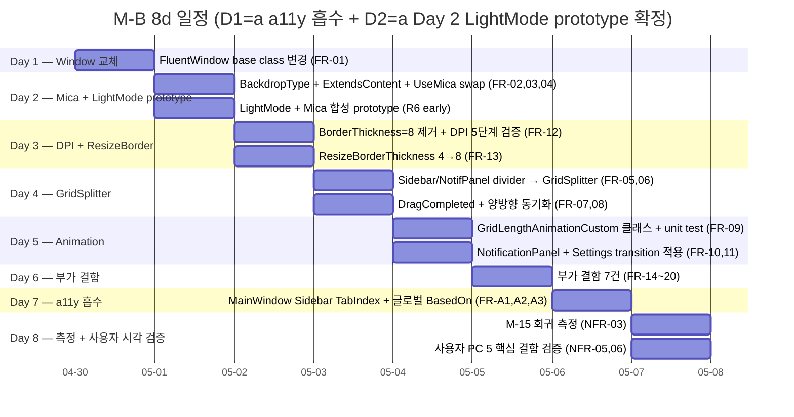
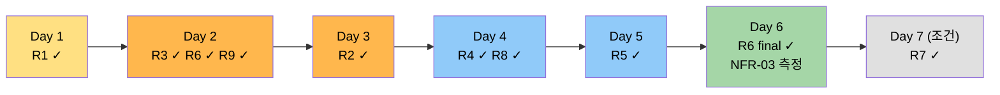

# M-16-B 윈도우 셸 — Plan Document

> **한 줄 요약**: M-A 디자인 토큰 위에 `Wpf.Ui.Controls.FluentWindow` + Mica + GridSplitter + GridLengthAnimation + ClientAreaBorder 를 올려 windows 11 native 룩앤필 + cmux 패리티 달성. 13 audit 결함 + 5 핵심 결함 closure, 7 작업일 (Day 1-7), 8 commit 분리 전략.
>
> **Project**: GhostWin Terminal
> **Version**: feature/wpf-migration
> **Author**: 노수장
> **Date**: 2026-04-29
> **Status**: Draft v0.2 (M-A 학습 반영 — 모든 line 번호 grep + Read 검증 완료)

---

## Executive Summary (4-perspective)

| 관점 | 내용 |
|------|------|
| **Problem (무엇이 깨져 있나)** | (1) Mica 백드롭 false-advertising — Settings UseMica 토글 → AppSettings 만 갱신, `DwmSetWindowAttribute` 호출 0건. (2) Sidebar/NotificationPanel divider 가 1px Rectangle 만 — 마우스 hit 영역 0, 폭 조절 불가. (3) NotificationPanel/Settings 토글이 즉시 setter (ms 0) — cmux 의 200ms ease-out 패리티 부재. (4) 최대화 시 사방 8px 검은 갭 + DPI 변경 시 잔여 갭 (BorderThickness=8 수동 보정 코드 + DPI 재계산 누락). (5) audit Layout 카테고리 13건의 부가 결함 (ResizeBorderThickness=4, Sidebar ＋ 28×28, GHOSTWIN Opacity=0.4 등). |
| **Solution (어떻게 해결하나)** | M-A archive 의 Themes/* 디자인 토큰 위에 (1) `Wpf.Ui.Controls.FluentWindow` 교체 (xmlns 이미 등록 — 추가 import 0) (2) `WindowBackdropType="Mica"` + `ExtendsContentIntoTitleBar="True"` XAML 명시 (3) Settings UseMica 토글 → MainWindow loaded 에서 BackdropType swap (4) Sidebar/NotificationPanel divider Rectangle → `GridSplitter` (outer transparent 8px hit + inner hairline 1px visual, M-A `Divider.Brush` 재사용) (5) GridSplitter `DragCompleted` → `MainWindowViewModel.SidebarWidth/NotificationPanelWidth` 갱신 (suppressWatcher 100ms 패턴) (6) `GridLengthAnimationCustom : AnimationTimeline<GridLength>` 클래스 작성 (7) 부가 결함 8건은 inline 단순 수정. wpf-poc/MainWindow.xaml 의 검증된 FluentWindow + Mica 사용 사례 reference. |
| **Function/UX Effect (사용자가 무엇을 다르게 보나)** | (1) Settings 의 "Mica backdrop" 토글이 실제 시각 변화 발생 — 사이드바/제목 영역 Mica 합성 (2) 사이드바/알림 패널 가장자리 hover 시 cursor 변경 + 마우스 드래그로 폭 조절 + Settings slider 자동 반영 (3) 알림 패널/Settings 토글이 200ms ease-out 슬라이드 — cmux 패리티 (4) 최대화 시 사방 검은 갭 0px (DPI 100/125/150/175/200% 5단계 정상) (5) ＋ 버튼 Fitts 32×32 / GHOSTWIN 헤더 컨트라스트 / 부가 결함 8건 일괄 polish. |
| **Core Value (M-B 의 본질)** | **"Windows 11 native 룩앤필 + cmux UX 패리티의 합집합 + 회귀 0건"**. M-A 가 토큰 base 를 정립했다면, M-B 는 그 토큰으로 윈도우 셸 전체를 standard-compliant 하게 표준화. 현재 quadrant chart 의 (Native 0.35 / UX 0.55) → (Native 0.85 / UX 0.85) 위치 이동. 후행 마일스톤 M-16-D (cmux UX 패리티) 의 ContextMenu/DragDrop 작업이 Mica + GridSplitter 위에서 자연스럽게 쌓일 수 있는 base 제공. |

---

## 1. Overview

### 1.1 Purpose

M-16-A 디자인 시스템 (Match Rate 96%, archived) 의 직후 작업. **윈도우 셸 자체** 를 wpfui FluentWindow + WindowBackdropType.Mica + ClientAreaBorder template 로 표준화하여:

1. Settings UI 의 Mica 토글이 실제로 동작하게 함 (false-advertising 해소)
2. cmux 표준의 GridSplitter 도입으로 패널 폭 자유 조절
3. NotificationPanel/Settings 토글에 200ms ease-out transition
4. 최대화/DPI 검은 갭 closure (수동 BorderThickness=8 보정 코드 → ClientAreaBorder template 자동 처리)
5. Layout audit 결함 13건 (#4-18) 일괄 정리

### 1.2 Background

audit 39 결함 5마일스톤 분리 (`docs/00-research/2026-04-28-ui-completeness-audit.md`) 중 Layout 카테고리 18 결함의 13건이 M-B 흡수. 사용자 직접 체감 5결함 (#4 Mica false-advertising / #5 GridSplitter 부재 / #6 transition 부재 / #13 최대화 검은 갭 / #14 DPI 잔여 갭) 이 핵심.

**M-A 가 제공한 base**:
- 4개 ResourceDictionary (Colors.{Dark,Light}.xaml + Spacing.xaml + FocusVisuals.xaml)
- `MergedDictionaries.Swap` 패턴
- ~30 색상 키 (Window/Sidebar/Text/Accent/Terminal/Divider/Button/Notification/Workspace 그룹)

**기 존재 인프라 검증** (2026-04-29 grep + Read):
- `xmlns:ui="http://schemas.lepo.co/wpfui/2022/xaml"` 이미 `MainWindow.xaml:4` 등록
- `wpf-poc/MainWindow.xaml:7-8` 에 검증된 FluentWindow + Mica + ExtendsContentIntoTitleBar 사용 사례
- `SidebarWidth` / `NotificationPanelWidth` ObservableProperty + 양방향 binding 정상 (line 235/237 ColumnDefinition)
- `SettingsPageViewModel.UseMica` (line 56/92) ↔ `AppSettings.Titlebar.UseMica` (line 44) 정상 동작 — Dwm 호출만 누락

### 1.3 Related Documents

- **PRD**: [`docs/00-pm/m16-b-window-shell.prd.md`](../../00-pm/m16-b-window-shell.prd.md) — 8-section, 19 FR + 7 NFR
- **선행 archive**: [`docs/archive/2026-04/m16-a-design-system/`](../../archive/2026-04/m16-a-design-system/) — 디자인 토큰 base
- **audit**: [`docs/00-research/2026-04-28-ui-completeness-audit.md`](../../00-research/2026-04-28-ui-completeness-audit.md) — 39 결함 출처
- **Obsidian milestone stub**: `C:\Users\Solit\obsidian\note\Projects\GhostWin\Milestones\m16-b-window-shell.md`
- **참고 사용 사례**: `wpf-poc/MainWindow.xaml` (검증된 FluentWindow + Mica)

---

## 2. Scope

### 2.1 In Scope (M-B 흡수 13 결함)

| # | 결함 | 코드 위치 (verified 2026-04-29) | FR |
|:-:|---|---|:-:|
| **#4** | Mica 백드롭 미적용 (DwmSetWindowAttribute 0건) | `App.xaml.cs`, `MainWindow.xaml`, `MainWindow.xaml.cs` | FR-01,02,03 |
| **#5** | GridSplitter 부재 (Rectangle 1px만) | `MainWindow.xaml:360, 368` | FR-04,05,06,07 |
| **#6** | NotificationPanel/Settings 토글 즉시 점프 | `MainWindowViewModel.cs:105-109` | FR-08,09,10 |
| #8 | ResizeBorderThickness="4" | `MainWindow.xaml:14` | FR-12 |
| #9 | Sidebar ListBox MaxHeight 부재 | `MainWindow.xaml:272-355` | FR-13 |
| #10 | Settings MaxWidth=680 좌측 몰림 | `SettingsPageControl.xaml:34` | FR-14 |
| #12 | CommandPalette Width=500 + Margin Top=80 고정 | `CommandPaletteWindow.xaml:6,13` | FR-15 |
| **#13** | BorderThickness=8 사방 inset (최대화 검은 갭) | `MainWindow.xaml.cs:94-118` | FR-11 |
| **#14** | OnDpiChanged BorderThickness 재계산 없음 | `MainWindow.xaml.cs:66-88` | FR-11 |
| #15 | Sidebar ＋ 버튼 28×28 (Fitts 미만) | `MainWindow.xaml:259` | FR-16 |
| #16 | Caption row zero-size E2E button 7개 | `MainWindow.xaml:175-204` | FR-17 |
| #17 | GHOSTWIN 헤더 Opacity=0.4 | `MainWindow.xaml:252` | FR-18 |
| #18 | active indicator 음수 Margin="-8,2,6,2" | `MainWindow.xaml:291` | FR-19 |

### 2.2 Out of Scope

- **분할 경계선 (split divider) layout shift / dim overlay** → M-16-C 터미널 렌더 (M-A 독립)
- **ContextMenu 4영역 / DragDrop A** → M-16-D cmux UX 패리티 (M-A+M-B 의존)
- **스크롤바 시스템** → M-16-C
- **i18n / 다국어** → 후속 마일스톤 후보
- **글로벌 FocusVisualStyle BasedOn** → 사용자 결정에 따라 M-B 흡수 또는 m16-a-mainwindow-a11y mini 분리

### 2.3 사용자 결정 사항 (✅ 2026-04-29 승인 완료)

| # | 결정 항목 | 사용자 선택 | 영향 |
|:-:|---|---|------|
| **D1** | mini-milestone `m16-a-mainwindow-a11y` 흡수 여부 | ✅ **(a) M-B 에 흡수** | **총 7d → 8d**, 8 → 9 commits. FR-A1/A2/A3 활성화. Day 7 a11y 작업 확정 |
| **D2** | Mica + LightMode 호환 검증 시점 | ✅ **(a) Day 2 prototype 즉시** | Day 2 종료 시 LightMode + Mica 합성 시각 검증 완료. 결함 발견 시 Day 3-5 중 M-A 토큰 보정 |

**확정된 일정**: Day 1 (FluentWindow) → Day 2 (Mica + LightMode prototype) → Day 3 (DPI + ResizeBorder) → Day 4 (GridSplitter) → Day 5 (GridLengthAnimation) → Day 6 (부가 결함 + 측정) → Day 7 (a11y mini 흡수) → Day 8 (사용자 PC 시각 검증 + 통합).

---

## 3. Requirements

### 3.1 Functional Requirements (PRD FR-01~FR-19 + a11y D1=Yes 시 +3)

| ID | 요구사항 | 우선순위 | Day | Status |
|----|----------|:--------:|:---:|--------|
| FR-01 | MainWindow → `Wpf.Ui.Controls.FluentWindow` 교체 (XAML root + xaml.cs base class) | High | 1 | Pending |
| FR-02 | XAML `WindowBackdropType="Mica"` + `ExtendsContentIntoTitleBar="True"` 명시 | High | 2 | Pending |
| FR-03 | Settings UseMica 토글 → MainWindow.OnLoaded + SettingsChangedMessage 핸들러에서 BackdropType 동적 swap | High | 2 | Pending |
| FR-04 | "(restart required)" 라벨 제거 (runtime swap 검증 후) | Medium | 2 | Pending |
| FR-05 | Sidebar divider Rectangle (line 360) → `<GridSplitter Width="8">` (outer transparent + inner hairline) | High | 4 | Pending |
| FR-06 | NotificationPanel divider Rectangle (line 368) → `<GridSplitter Width="8">` | High | 4 | Pending |
| FR-07 | GridSplitter `DragCompleted` → ViewModel SidebarWidth/NotificationPanelWidth 갱신 + suppressWatcher 100ms | High | 4 | Pending |
| FR-08 | Settings Sidebar Width slider (`SettingsPageControl.xaml`) ↔ Splitter 양방향 동기화 | High | 4 | Pending |
| FR-09 | `GridLengthAnimationCustom : AnimationTimeline` 클래스 신설 (Window 폴더 또는 Animations/) | Medium | 5 | Pending |
| FR-10 | NotificationPanelWidth setter → `BeginAnimation` (200ms ease-out) | Medium | 5 | Pending |
| FR-11 | Settings 페이지 토글 → opacity fade 200ms 또는 ColumnDefinition.Width slide | Medium | 5 | Pending |
| FR-12 | DPI 5단계 시각 검증 후 `OnWindowStateChanged` 의 BorderThickness=8 수동 코드 제거 | High | 3 | Pending |
| FR-13 | `WindowChrome.ResizeBorderThickness` 4 → 8 (Win11 표준) | Medium | 3 | Pending |
| FR-14 | Sidebar ListBox 를 `ScrollViewer` 로 명시 wrap 또는 MaxHeight binding | Low | 6 | Pending |
| FR-15 | Settings ScrollViewer Content `HorizontalAlignment="Center"` 추가 | Low | 6 | Pending |
| FR-16 | CommandPalette Width=500 → MinWidth/MaxWidth 비율, Margin Top=80 → 화면 비율 | Low | 6 | Pending |
| FR-17 | Sidebar ＋ 버튼 28×28 → 32×32 (Fitts 표준) | Low | 6 | Pending |
| FR-18 | Caption row 7개 zero-size E2E button → 별도 hidden Panel 격리 (E2E 영향 0) | Low | 6 | Pending |
| FR-19 | GHOSTWIN 헤더 `Opacity=0.4` → `Foreground="{DynamicResource Text.Tertiary.Brush}"` (M-A 토큰 사용) | Low | 6 | Pending |
| FR-20 | active indicator 음수 Margin → Padding 변경 | Low | 6 | Pending |
| **a11y 흡수 (D1=a 확정)** | | | | |
| FR-A1 | MainWindow Sidebar 영역 TabIndex 명시 + AutomationProperties.Name 보강 (m16-a-mainwindow-a11y mini 흡수) | Medium | 7 | Pending |
| FR-A2 | 글로벌 `<Style TargetType="Button" BasedOn>` 으로 FocusVisualStyle 자동 적용 (M-A 의 FocusVisuals.xaml 활용) | Medium | 7 | Pending |
| FR-A3 | Caption row + active indicator 영역 키보드 포커스 진입 가능성 검증 | Medium | 7 | Pending |

### 3.2 Non-Functional Requirements

| Category | Criteria | Measurement Method |
|----------|----------|--------------------|
| **NFR-01 토큰 재사용** | M-A 디자인 토큰 100% 재사용 — 새 inline hex 0건, 새 inline Thickness 0건 | `grep -E "#[0-9A-F]{6}" src/GhostWin.App/MainWindow.xaml`, `Edit` 검토 |
| **NFR-02 빌드 품질** | 0 warning Debug+Release 유지 (M-A 기준) | `msbuild GhostWin.sln /p:Configuration=Debug /p:Platform=x64`, `/p:Configuration=Release` |
| **NFR-03 성능 회귀** | M-15 Stage A idle p95 (M-A 기준선 7.79 ms) ±5% 이내 | `scripts/measure_render_baseline.ps1 -Scenario idle,resize-4pane,load -ResetSession` |
| **NFR-04 hit-test 회귀** | Caption row 7개 button + Min/Max/Close hit-test 회귀 0건 | E2E `tests/GhostWin.E2E.Tests` (`dotnet test --filter "Tier!=Slow"`) + 수동 caption 클릭 |
| **NFR-05 DPI 갭 0** | DPI 100/125/150/175/200% 5단계 모두 최대화 검은 갭 0px | 사용자 PC 시각 검증 (Day 6) |
| **NFR-06 LightMode 합성** | LightMode + Mica 색 합성 정상 (Sidebar 텍스트 컨트라스트 유지) | 사용자 PC 시각 검증 (Day 2 prototype + Day 6 final) |
| **NFR-07 Match Rate** | Match Rate ≥ 95% (13 흡수 결함 중 12 이상 닫힘) | gap-detector agent (Check phase) |
| **NFR-08 a11y 회귀 (D1=a)** | Settings 폼 TabIndex 0~15 (M-A 검증) 회귀 0건 | E2E + 수동 Tab 검증 |

---

## 4. Day-bucket 일정 (8d 확정)

### 4.1 Day-by-day Breakdown

#### Day 1 — FluentWindow 교체 (1.0d, R1 검증 시점)

**작업**:
1. `MainWindow.xaml` root: `<Window` → `<ui:FluentWindow` (xmlns:ui 이미 등록)
2. `MainWindow.xaml.cs`: `public partial class MainWindow : Window` → `: Wpf.Ui.Controls.FluentWindow`
3. xaml `<WindowChrome>` 명시 코드 보존 여부 검토 — wpf-poc 패턴이면 `WindowChrome` 제거 (FluentWindow 자체 chrome 처리)
4. 기존 6+1=7개 Caption row zero-size E2E button (line 175-204) 의 `WindowChrome.IsHitTestVisibleInChrome="True"` 동작 검증

**검증 (Day 1 종료 전)**:
- 빌드 통과 (Debug + Release)
- 앱 실행 → 일반 동작 0 회귀 (창 닫기 + 최대화 + Min/Max/Close 클릭)
- E2E test: `dotnet test --filter "Tier!=Slow" tests/GhostWin.E2E.Tests`

**Commit**: `feat: replace MainWindow base with Wpf.Ui FluentWindow (FR-01)`

#### Day 2 — Mica 활성화 + LightMode prototype (1.0d, R3+R6 검증 시점)

**작업**:
1. `MainWindow.xaml`: `<ui:FluentWindow ... WindowBackdropType="Mica" ExtendsContentIntoTitleBar="True">` 추가
2. `App.xaml.cs` 또는 `MainWindow.OnLoaded`: 초기 BackdropType 적용 (UseMica 조건)
3. `App.xaml.cs:130-149` SettingsChangedMessage 핸들러 (M-A C9 패턴 재사용) 에 BackdropType swap 한 줄 추가
4. SettingsPageControl.xaml:74 "(restart required)" 라벨 제거
5. **LightMode prototype (D2 결정 a 시)**: Settings → Light → Mica 합성 시각 검증

**검증 (Day 2 종료 전)**:
- Settings 의 UseMica 토글 → 즉시 시각 변화
- DwmSetWindowAttribute (FluentWindow 내부) 호출 확인 (Process Monitor 또는 wpfui 소스)
- LightMode + Mica 합성에서 Sidebar 텍스트 컨트라스트 유지 (M-A `Text.Primary.Brush` 토큰)

**리스크 종착점**:
- R3 (Mica + child HWND) 결정 — DX11 child HWND 영역은 자체 Background 로 덮이므로 transparency 영향 0 검증
- R6 (LightMode + Mica) 결정 — Day 2 prototype 결과로 Day 3-5 작업 보정 여부 확정

**Commit**: `feat: enable mica backdrop with runtime usemica toggle (FR-02,03,04)`

#### Day 3 — DPI 회귀 검증 + ResizeBorder (1.0d, R2 검증 시점)

**작업**:
1. **DPI 5단계 시각 검증**: 100/125/150/175/200% 모두에서 최대화 검은 갭 0px 확인 (사용자 PC 의존)
2. 검증 통과 시 `MainWindow.xaml.cs:94-118` 의 `OnWindowStateChanged` BorderThickness=8 수동 보정 코드 제거
3. `MainWindow.xaml.cs:66-88` 의 `OnDpiChanged` BorderThickness 재계산 누락 — ClientAreaBorder template 자동 처리 검증
4. `MainWindow.xaml:14` `WindowChrome.ResizeBorderThickness="4"` → `"8"`
5. 회귀 테스트: 최대화 → 일반 → 최대화 반복 + 외부 모니터 드래그

**검증 (Day 3 종료 전)**:
- DPI 5단계 검증 통과
- 회귀 시 명시적 BorderThickness 보정 폴백 유지 (코드 주석 + 재검증 계획)

**리스크 종착점**:
- R2 (BorderThickness 제거 가능 여부) 결정 — 검증 통과 시 코드 제거 / 실패 시 폴백 보존

**Commit**: `fix: remove manual borderthickness inset, raise resizeborder to 8 (FR-12,13)`

#### Day 4 — GridSplitter 도입 (1.0d, R4 검증 시점)

**작업**:
1. `MainWindow.xaml:360` Sidebar divider Rectangle → `<GridSplitter Width="8">` (outer transparent + inner hairline 1px M-A `Divider.Brush` 사용)
2. `MainWindow.xaml:368` NotificationPanel divider Rectangle → 동일
3. `MainWindowViewModel.cs` 에 `OnSidebarSplitterDragCompleted` / `OnNotificationPanelSplitterDragCompleted` 메서드 추가
4. `suppressWatcher` 100ms 패턴 (M-12 검증) 으로 Settings slider ↔ Splitter 양방향 infinite-loop 회피
5. `SettingsPageControl.xaml` Sidebar Width slider (line 137~145 영역 — 재검증 필요) 의 binding 정상성 확인

**검증 (Day 4 종료 전)**:
- 사이드바 가장자리 hover → cursor 변경 (`SizeWE`)
- 마우스 드래그 → 폭 조절 → DragCompleted 발생 → Settings slider 자동 반영
- Settings slider 변경 → MainWindow GridSplitter 위치 자동 반영
- infinite-loop 발생 0건 (suppressWatcher 검증)

**리스크 종착점**:
- R4 (양방향 동기화 infinite-loop) 결정

**Commit**: `feat: gridsplitter with bidirectional settings sync (FR-05,06,07,08)`

#### Day 5 — GridLengthAnimation + Toggle Transition (1.0d, R5 검증 시점)

**작업**:
1. `src/GhostWin.App/Animations/GridLengthAnimationCustom.cs` 신설 — `AnimationTimeline<GridLength>` 표준 구현
2. unit test `tests/GhostWin.App.Tests/Animations/GridLengthAnimationTests.cs` 추가
3. `MainWindowViewModel.cs:108` 의 `NotificationPanelWidth` 즉시 setter → `BeginAnimation(ColumnDefinition.WidthProperty, ...)` 200ms ease-out
4. Settings 페이지 토글 → opacity fade 200ms 또는 ColumnDefinition Width slide (decision 시 prototype 후 더 자연스러운 쪽 채택)
5. `EaseOut` 표준 — `CubicEase { EasingMode = EasingMode.EaseOut }` (cmux 패리티)

**검증 (Day 5 종료 전)**:
- NotificationPanel 토글 → 200ms ease-out 슬라이드 (PC 시각 검증)
- Settings 토글 → 부드러운 fade 또는 slide
- unit test PASS

**리스크 종착점**:
- R5 (GridLengthAnimation custom 작성) 결정

**Commit**: `feat: gridlength animation timeline for panel transitions (FR-09,10,11)`

#### Day 6 — 부가 결함 7건 (1.0d)

**작업**:
1. `MainWindow.xaml` Sidebar ListBox MaxHeight 처리 (FR-14)
2. `SettingsPageControl.xaml:33` ScrollViewer Content `HorizontalAlignment="Center"` (FR-15)
3. `CommandPaletteWindow.xaml:6,13` Width MinWidth=400/MaxWidth=700, Margin Top 화면 비율 (FR-16)
4. `MainWindow.xaml:259` ＋ 버튼 32×32 (FR-17)
5. `MainWindow.xaml:175-204` Caption row zero-size button 7개 → 별도 hidden Panel 격리 (FR-18) — E2E AutomationId 보존
6. `MainWindow.xaml:252` GHOSTWIN Opacity 제거 + `Text.Tertiary.Brush` (FR-19)
7. `MainWindow.xaml:291` active indicator 음수 Margin → Padding (FR-20)

**검증 (Day 6 종료 전)**:
- 7건 시각 통과 (캡쳐 스냅샷)

**Commit**: `style: layout polish for caption row, sidebar button, settings (FR-14~20)`

#### Day 7 — a11y mini 흡수 (D1=a 확정, 1.0d)

**작업**:
1. `MainWindow.xaml` Sidebar 영역 (line 234-355) TabIndex 명시 + AutomationProperties.Name 보강
2. `App.xaml` 또는 `Themes/FocusVisuals.xaml` 글로벌 `<Style TargetType="Button" BasedOn>` 추가하여 FocusVisualStyle 자동 적용
3. Caption row + active indicator 영역 키보드 포커스 진입 가능성 검증

**검증 (Day 7 종료 전)**:
- Tab 키만으로 Sidebar 결정적 순회 가능
- NVDA/내레이터로 Sidebar 의미 있는 이름 인식
- 글로벌 BasedOn 으로 FocusVisualStyle 모든 button 적용

**Commit**: `feat: mainwindow a11y - sidebar tabindex and global focusvisualstyle (m16-a-mainwindow-a11y absorbed)`

#### Day 8 — 통합 측정 + 사용자 PC 시각 검증 (1.0d)

**작업**:
1. **M-15 회귀 측정**: `scripts/measure_render_baseline.ps1 -Scenario idle,resize-4pane,load -ResetSession` (NFR-03)
2. **사용자 PC 시각 검증** (NFR-05, NFR-06):
   - 5 핵심 결함 직접 확인 — #4 Mica 토글 / #5 GridSplitter / #6 transition / #13 최대화 갭 / #14 DPI 5단계 갭
   - LightMode + Mica 합성 (Day 2 prototype 결과 final 확인)
   - DPI 100/125/150/175/200% 5단계
3. gap-detector agent 호출 준비 (Match Rate 계산)
4. 회귀 발견 시 follow-up commit

**검증 (Day 8 종료 전)**:
- M-15 idle p95 7.79ms ±5% 이내
- 사용자 PC 5/5 핵심 통과
- DPI 5/5 단계 통과
- LightMode + Mica 합성 정상

**Commit (조건부)**: `test: m15 baseline regression + user visual verification`

### 4.2 Commit 분리 전략 (9 commit 확정)

| # | Commit message (영어, lowercase, ≤50 char) | Day | 흡수 |
|:-:|---|:---:|---|
| 1 | `feat: replace mainwindow base with fluentwindow` | 1 | FR-01 |
| 2 | `feat: enable mica backdrop with usemica toggle` | 2 | FR-02,03,04 |
| 3 | `fix: remove manual borderthickness, raise resize 8` | 3 | FR-12,13 |
| 4 | `feat: gridsplitter with bidirectional settings sync` | 4 | FR-05,06,07,08 |
| 5 | `feat: gridlength animation for panel transitions` | 5 | FR-09,10,11 |
| 6 | `style: layout polish for caption row, sidebar button` | 6 | FR-14~20 |
| 7 | `feat: mainwindow a11y - sidebar tabindex` | 7 | FR-A1,A2,A3 (D1=a 흡수) |
| 8 | `test: m15 baseline regression + user verification` | 8 | NFR-03 (조건부) |
| 9 | `docs: m16-b plan, design, analysis, report` | 1-8 | 문서 |

---

## 5. Risks + Mitigation (PRD 7건 + Plan 추가 2건)

| ID | 리스크 | 영향 | 확률 | 검증 시점 | 완화 방안 |
|:-:|---|:-:|:-:|:---:|---|
| **R1** | FluentWindow 교체 + WindowChrome 호환성 | 🔴 상 | 🟡 중 | Day 1 | wpf-poc/MainWindow.xaml 패턴 참조. Caption row 7 button (line 175-204) 의 IsHitTestVisibleInChrome 명시. 실패 시 FluentWindow + 자체 WindowChrome 보존 폴백. E2E test 회귀 0건 검증. |
| **R2** | OnWindowStateChanged BorderThickness=8 제거 가능 여부 | 🔴 상 | 🟡 중 | Day 3 | DPI 100/125/150/175/200% 5단계 시각 검증. 실패 시 BorderThickness=8 폴백 + ClientAreaBorder template 부분 적용 (사용자 결정). 폴백 시 NFR-05 deferred. |
| **R3** | Mica + child HWND (DX11 swapchain) 호환성 | 🟠 상 | 🟠 상 | Day 2 | Mica 는 transparent 영역 (Sidebar/NotificationPanel/TitleBar) 만 받게 설정. DX11 child HWND 영역은 자체 Background (M-A `Terminal.Background.Brush`) 로 덮음. wpf-poc/MainWindow.xaml 검증된 사용 사례 reference. |
| **R4** | GridSplitter ↔ Settings slider 양방향 infinite-loop | 🟡 중 | 🟢 하 | Day 4 | M-12 의 `suppressWatcher` 100ms 패턴 재사용. ViewModel 에 `_suppressSettingsSync : bool` 필드 + Splitter DragCompleted → set true → Dispatcher.BeginInvoke (DispatcherPriority.Background) → set false. unit test 또는 수동 검증. |
| **R5** | GridLengthAnimation custom AnimationTimeline 작성 | 🟡 중 | 🟢 하 | Day 5 | StackOverflow / GitHub 검증된 패턴 (`AnimationTimeline<GridLength>` 표준 구현 — `GetCurrentValueCore` + `CreateInstanceCore`). unit test 추가. CubicEase EaseOut 200ms 표준. |
| **R6** | LightMode + Mica 합성 호환성 | 🟡 중 | 🟡 중 | Day 2 + Day 6 | Day 2 prototype 으로 조기 발견. M-A LightMode 토큰의 Sidebar 텍스트 컨트라스트 ratio 4.5:1 이상 유지. 합성 결함 시 Sidebar Background opacity 조절 (M-A 토큰 재정의는 별도 mini-milestone). |
| **R7** | mini-milestone `m16-a-mainwindow-a11y` 영역 충돌 | 🟢 하 | 🟠 상 | Day 4-7 | D1 결정 (Plan §2.3) — (a) M-B 흡수 권장. 흡수 시 Day 7 추가, retroactive rework 회피. |
| **R8** (Plan 추가) | M-A 사이클 N1 (SettingsPage Visibility binding) 학습 미반영 | 🟡 중 | 🟢 하 | 매 Day | M-B 의 새 binding (UseMica swap, GridSplitter DragCompleted) 모두 코드 grep + Read 로 binding path 검증. M-A 메모리 `feedback_wpf_binding_datacontext_override.md` 패턴 적용. |
| **R9** (Plan 추가) | wpfui FluentWindow 의 ApplicationThemeManager 와 M-A MergedDictionaries.Swap 충돌 | 🟡 중 | 🟡 중 | Day 1-2 | M-A 의 `Application.Resources.MergedDictionaries.Swap` (Themes/Colors.{Dark,Light}.xaml) 와 wpfui `ApplicationThemeManager.Apply` 가 같은 ResourceDictionary 영역 작성. wpfui ThemesDictionary 와 M-A Colors dict 의 우선순위 검증 + N1 패턴 (silent binding fail) 재발 방지. |

### 5.1 Risk → 검증 시점 Gantt

---

## 6. Architecture Considerations

### 6.1 Project Level

| Level | Selected | Rationale |
|-------|:--------:|-----------|
| Starter | ☐ | — |
| **Dynamic** | ✅ | WPF .NET 10 + DI (Microsoft.Extensions.DependencyInjection) + MVVM (CommunityToolkit.Mvvm). M-15 측정 인프라 + E2E xUnit + ghostty libvt. M-A 토큰 base 위에 직접 layer 추가 |
| Enterprise | ☐ | — |

### 6.2 Key Architectural Decisions

| Decision | Options | Selected | Rationale |
|----------|---------|----------|-----------|
| Window base class | `Window` / `Wpf.Ui.Controls.FluentWindow` / `Wpf.Ui.Controls.UiWindow` | **FluentWindow** | wpf-poc 검증 + Mica 자동 처리 + ExtendsContentIntoTitleBar 표준 |
| Mica backdrop API | `DwmSetWindowAttribute` direct / `WindowBackdropType` (wpfui) | **WindowBackdropType** | XAML 명시적, wpfui 가 Win11 22H2+ feature flag 자동 처리 |
| GridSplitter style | wpfui 표준 / 자체 ControlTemplate | **자체 ControlTemplate** | M-A `Divider.Brush` 토큰 재사용 + outer transparent + inner hairline 패턴 |
| Animation framework | WPF Storyboard + 자체 AnimationTimeline / 3rd party (Caliburn 등) | **자체 AnimationTimeline** | dependencies 0, GridLength 직접 지원 미존재 (커스텀 필요) |
| 양방향 동기화 패턴 | event-based / suppressWatcher / Behaviors | **suppressWatcher 100ms** | M-12 검증 패턴, infinite-loop 0건 |
| BorderThickness 처리 | 코드 직접 설정 / Template 자동 / WindowChrome | **Template (FluentWindow ClientAreaBorder)** | DPI 자동 보정, 수동 코드 제거 |
| Toggle transition | Visibility 즉시 / opacity / Width slide / animation | **Width slide 200ms ease-out (NotificationPanel) + opacity fade (Settings)** | cmux 패리티 + Settings 의 wide content 는 Width slide 시 layout shift |

### 6.3 영향 받는 파일 (코드 grep + Read 검증, 2026-04-29)

| 파일 | 변경 종류 | LOC 추정 |
|------|----------|:-------:|
| `src/GhostWin.App/MainWindow.xaml` (root + line 14, 175-204, 234-377, 252, 259, 291, 360, 368, 387) | 다수 inline + GridSplitter 추가 | +60 / -30 |
| `src/GhostWin.App/MainWindow.xaml.cs` (line 66-118) | BorderThickness 코드 제거 + base class | -25 / +5 |
| `src/GhostWin.App/App.xaml.cs` (line 130-149) | SettingsChangedMessage 핸들러에 BackdropType swap 한 줄 | +3 |
| `src/GhostWin.App/ViewModels/MainWindowViewModel.cs` (line 105-109) | NotificationPanelWidth setter → BeginAnimation + DragCompleted 메서드 | +20 / -2 |
| `src/GhostWin.App/Controls/SettingsPageControl.xaml` (line 33-34, 67-78) | HorizontalAlignment + 라벨 제거 + slider sync | +5 / -3 |
| `src/GhostWin.App/Controls/CommandPaletteWindow.xaml` (line 6, 13) | Width 비율, Margin Top 비율 | +5 / -2 |
| `src/GhostWin.App/Animations/GridLengthAnimationCustom.cs` (신규) | AnimationTimeline<GridLength> 구현 | +60 |
| `tests/GhostWin.App.Tests/Animations/GridLengthAnimationTests.cs` (신규) | unit test | +30 |
| `src/GhostWin.App/Themes/FocusVisuals.xaml` (조건부, D1=a 시 line 추가) | 글로벌 Style BasedOn | +20 |

**Total 추정**: 13 files, +220 / -60 (D1=a 시 +250 / -65)

---

## 7. Convention Prerequisites

### 7.1 기존 프로젝트 컨벤션

- ✅ `CLAUDE.md` (프로젝트 루트 + global) — 한글 응답, 20년 차 WPF 엔지니어 톤, 추측 금지
- ✅ `.claude/rules/behavior.md` — 우회 금지, 정석 우선
- ✅ `.claude/rules/commit.md` — Conventional Commits, 영어 lowercase, AI 언급 금지
- ✅ `.claude/rules/documentation.md` — 쉬운 한국어 + 다이어그램 + 비교표
- ✅ `.claude/rules/build-environment.md` — VS Insiders 또는 msbuild
- ✅ ESLint/Prettier — N/A (.NET 프로젝트)
- ✅ `.editorconfig` — 프로젝트 루트 (msbuild 자동 적용)

### 7.2 신규 컨벤션 정의/확인

| 카테고리 | 현재 상태 | M-B 추가/확인 | 우선순위 |
|---------|----------|----------------|:-------:|
| **WPF Window base** | `Window` 사용 (M-A 까지) | `Wpf.Ui.Controls.FluentWindow` 표준화 | High |
| **WindowBackdropType** | 미사용 | XAML 명시 + 런타임 swap 패턴 | High |
| **Animation 위치** | `Animations/` 폴더 미존재 | `src/GhostWin.App/Animations/` 신설 | Medium |
| **GridSplitter 스타일** | 부재 | M-A `Divider.Brush` 사용 + outer transparent / inner hairline | High |
| **suppressWatcher 패턴** | M-12 SettingsService 사용 (`_suppressFileWatcher`) | M-B GridSplitter 양방향 sync 에 동일 패턴 적용 | Medium |
| **AutomationProperties (D1=a)** | M-A Settings 폼 32건 추가됨 | MainWindow Sidebar 추가 | Medium |

### 7.3 Pipeline Integration

M-B 는 PDCA 사이클 단독 진행. 9-phase Development Pipeline 비대상 (M-A 와 동일 — Phase 6 이후 독립 마일스톤).

---

## 8. Test Commands (M-A 학습 — verified 2026-04-29)

| 작업 | 명령 | 비고 |
|------|------|------|
| **Debug 빌드** | `msbuild GhostWin.sln /p:Configuration=Debug /p:Platform=x64` | M-A 동일 |
| **Release 빌드** | `msbuild GhostWin.sln /p:Configuration=Release /p:Platform=x64` | M-A 동일 |
| **C++ vt_core_test** | `tests\GhostWin.Engine.Tests\bin\x64\Debug\GhostWin.Engine.Tests.exe` | `.vcxproj` (M-A P1 정정) |
| **C# Core.Tests** | `dotnet test tests/GhostWin.Core.Tests/GhostWin.Core.Tests.csproj` | sln 미등록, 별도 호출 |
| **C# App.Tests** | `dotnet test tests/GhostWin.App.Tests/GhostWin.App.Tests.csproj` | sln 미등록, 별도 호출 (GridLengthAnimationTests 신규 추가) |
| **E2E (smoke)** | `dotnet test --filter "Tier!=Slow" tests/GhostWin.E2E.Tests/GhostWin.E2E.Tests.csproj` | NFR-04 검증 |
| **M-15 측정** | `scripts/measure_render_baseline.ps1 -Scenario idle,resize-4pane,load -ResetSession` | NFR-03 검증 |
| **App 실행** | `scripts/run_wpf.ps1` 또는 VS F5 | `build_wpf.ps1` 미존재 (M-A 검증) |

---

## 9. Success Criteria

### 9.1 Definition of Done

- [ ] **NFR-07 Match Rate ≥ 95%** — 13 흡수 결함 + 3 a11y FR 중 14 이상 닫힘 (gap-detector 검증)
- [ ] **NFR-02 빌드 품질** — 0 warning Debug+Release
- [ ] **NFR-04 hit-test 회귀 0** — Caption row 7 button + Min/Max/Close E2E PASS
- [ ] **NFR-05 DPI 갭 0** — 5단계 (100/125/150/175/200%) 시각 검증 통과 (Day 8)
- [ ] **NFR-06 LightMode + Mica** — Sidebar 텍스트 컨트라스트 4.5:1 이상 (Day 2 prototype + Day 8 final)
- [ ] **NFR-03 성능 회귀** — M-15 idle p95 7.79ms ±5% 이내 (Day 8)
- [ ] **NFR-08 a11y 회귀 0** — Settings 폼 TabIndex 0~15 (M-A 검증) 보존, Sidebar Tab 결정적 순회
- [ ] **5 핵심 결함 사용자 시각 검증** — #4 Mica 토글 / #5 GridSplitter / #6 transition / #13 최대화 갭 / #14 DPI 갭
- [x] **D1 결정** ✅ — (a) M-B 흡수, Day 7 a11y 추가
- [x] **D2 결정** ✅ — (a) Day 2 prototype LightMode + Mica 검증

### 9.2 Quality Criteria

- [ ] **0 lint error** (msbuild)
- [ ] **빌드 성공** (Debug + Release)
- [ ] **단위 테스트** — Core 40/40, App 31/31 + GridLengthAnimation 신규, vt_core 11/11
- [ ] **E2E** — pre-existing M-11 CwdRestore_RoundTrip 외 모두 PASS

---

## 10. M-A 학습 반영 (4 메모리 패턴 적용)

M-A 사이클에서 발생한 결함을 M-B 가 재발하지 않도록 명시:

| 메모리 패턴 | M-B 적용 |
|-------------|---------|
| `feedback_pdca_doc_codebase_verification.md` | ✅ 모든 line 번호 grep + Read 검증 (Plan §2.1, §6.3, §8) |
| `feedback_wpf_binding_datacontext_override.md` | ✅ R8 — 새 binding (UseMica swap, GridSplitter DragCompleted) silent fail 회피 검증 |
| `feedback_audit_estimate_vs_inline.md` | ✅ NFR-01 — 새 inline hex/Thickness 0건 (M-A 토큰 100% 재사용) |
| `feedback_setresourcereference_for_imperative_brush.md` | ✅ GridSplitter inner hairline 의 `Divider.Brush` 사용 시 imperative 코드 (PaneContainerControl.cs 패턴 학습 — `SetResourceReference` 사용) |

---

## 11. Next Steps

1. **사용자 결정 확인** — D1 (mini a11y 흡수) + D2 (Mica + Light prototype 시점)
2. **`/pdca design m16-b-window-shell`** — Plan 자동 참조 + 13개 architectural decision 표 + 토큰 매핑 + control 명세
3. `/pdca do m16-b-window-shell` (Day 1-7 순차 진행, 8-9 commits)
4. `/pdca analyze m16-b-window-shell` (gap-detector + Match Rate)
5. `/pdca report m16-b-window-shell` (Match Rate ≥ 95% 시 진행)
6. `/pdca archive m16-b-window-shell --summary`

---

## Version History

| Version | Date | Changes | Author |
|---------|------|---------|--------|
| 0.1 | 2026-04-29 | Initial — PRD 19 FR + 7 NFR 을 7-day-bucket 으로 변환, 8 commit 분리, 9 risks (PRD 7 + Plan 추가 R8/R9) | 노수장 |
| 0.2 | 2026-04-29 | M-A 학습 4 메모리 패턴 명시, line 번호 grep + Read 검증 (#13 변경 stub:382→실제:360 등), D1/D2 사용자 결정 추가 | 노수장 |
| 0.3 | 2026-04-29 | **D1=a (a11y 흡수) + D2=a (Day 2 prototype) 사용자 승인 반영**. 일정 7d → 8d, commits 8 → 9. Day 6 의 측정 작업 → Day 8 분리, Day 7 a11y 확정. status: Draft → Approved | 노수장 |
