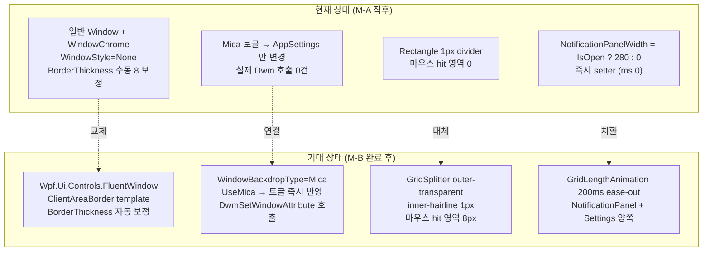
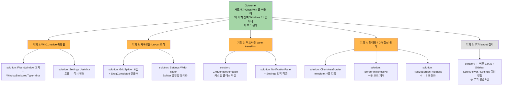
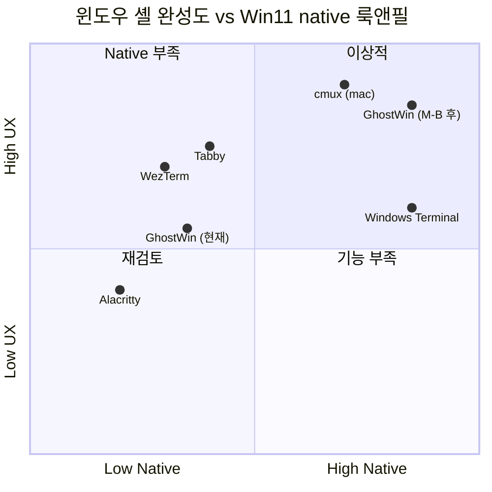
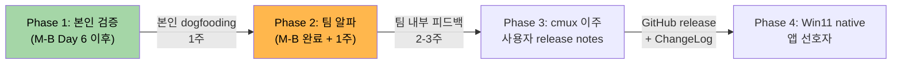
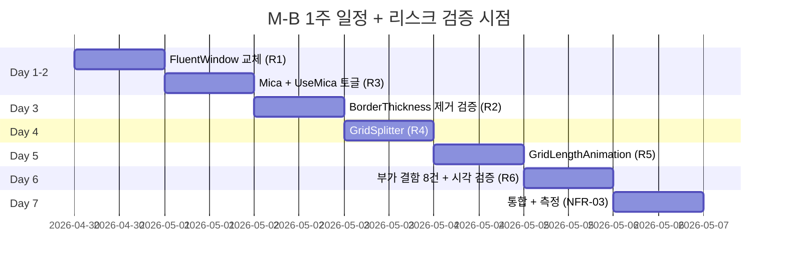

# M-16-B 윈도우 셸 — Product Requirements Document (PRD)

**작성일**: 2026-04-29
**작성자**: PM Agent Team (PM Lead 인라인 오케스트레이션)
**선행 마일스톤**: M-16-A 디자인 시스템 (96 % Match Rate, archived)
**예상 기간**: 1주 (6-7 작업일)
**의존성**: M-16-A 완료 (✅), 사용자 PC hardware 복귀 (Mica/DPI 시각 검증)
**프레임워크**: pm-skills (MIT, [github.com/phuryn/pm-skills](https://github.com/phuryn/pm-skills))

---

## Executive Summary (한 문단 핵심)

GhostWin Terminal 의 **윈도우 셸 (window shell)** 을 Win11 native 경험과 cmux 패리티 수준으로 끌어올리는 마일스톤이다. 구체적으로는 (1) **Mica 백드롭 false-advertising 해소** — Settings 토글이 실제 동작하지 않는 결함을 FluentWindow 교체로 정상화, (2) **GridSplitter 부재 해소** — Sidebar / NotificationPanel 폭을 마우스로 직접 조절 가능, (3) **Toggle transition 부드럽게** — NotificationPanel / Settings 페이지가 즉시 점프가 아닌 200ms ease-out 애니메이션, (4) **최대화 검은 갭 / DPI 잔여 갭 제거** — `BorderThickness=8` 수동 보정 코드를 ClientAreaBorder template 으로 대체, (5) **Layout 토큰화** — Sidebar 폭 / 버튼 크기 / Margin 음수값 등 audit 흡수 결함 13건을 디자인 시스템 토큰 (M-A 산출) 위에 정리. 이 마일스톤이 끝나면 사용자가 "아 이거 진짜 Windows 11 앱이네" 라고 느끼는 native 룩앤필이 확보된다.

---

## 1. Problem Statement (문제 정의)

### 1.1 사용자 직접 체감 결함 (최우선)

| # | 결함 | 사용자 한 마디 |
|:-:|---|---|
| **#4** | Mica 백드롭 false-advertising | "Settings 의 Mica 토글을 켰다 껐다 해도 시각 변화가 없다" |
| **#5** | Sidebar / NotificationPanel 폭 조절 불가 | "왜 마우스로 사이드바 끌어서 못 줄여? VSCode 는 되는데" |
| **#6** | 토글 transition 부재 | "알림 패널이 갑자기 튀어나옴 — cmux 는 부드럽게 슬라이드되던데" |
| **#13** | 최대화 시 사방 8 px 검은 갭 | "최대화하면 화면 가장자리에 까만 띠가 보임" |
| **#14** | DPI 변경 시 잔여 갭 | "외부 모니터로 옮기면 가끔 검은 띠가 남음" |

### 1.2 audit 흡수 결함 13건 (#13/#14 포함 5 핵심 + 8 부가)

| # | 결함 | 코드 위치 (2026-04-29 검증) | 카테고리 |
|:-:|---|---|---|
| **#4** | Mica 백드롭 미적용 (DwmSetWindowAttribute 0건) | `App.xaml.cs`, `MainWindow.xaml`, `MainWindow.xaml.cs` | 핵심 |
| **#5** | GridSplitter 부재 (Rectangle 1px 만) | `MainWindow.xaml:360, 368` | 핵심 |
| **#6** | NotificationPanel/Settings 토글 즉시 점프 | `MainWindowViewModel.cs:105-109` | 핵심 |
| #8 | ResizeBorderThickness="4" 좁음 | `MainWindow.xaml:14` | 부가 |
| #9 | Sidebar ListBox MaxHeight 부재 | `MainWindow.xaml:272-355` | 부가 |
| #10 | Settings MaxWidth=680 좌측 몰림 | `SettingsPageControl.xaml:34` | 부가 |
| #12 | CommandPalette Width=500 + Margin Top=80 고정 | `CommandPaletteWindow.xaml:6, 13` | 부가 |
| **#13** | BorderThickness=8 사방 inset (최대화 검은 갭) | `MainWindow.xaml.cs:94-118` | 핵심 |
| **#14** | OnDpiChanged BorderThickness 재계산 없음 | `MainWindow.xaml.cs:66-88` | 핵심 |
| #15 | Sidebar ＋ 버튼 28×28 (Fitts 32 미만) | `MainWindow.xaml:259` | 부가 |
| #16 | Caption row zero-size E2E button 6개 | `MainWindow.xaml:175-206` | 부가 |
| #17 | GHOSTWIN 헤더 Opacity=0.4 컨트라스트 부족 | `MainWindow.xaml:252` | 부가 |
| #18 | active indicator 음수 Margin="-8,2,6,2" | `MainWindow.xaml:291` | 부가 |

> **검증**: 모든 line 번호는 2026-04-29 기준 `MainWindow.xaml`/`MainWindow.xaml.cs`/`SettingsPageControl.xaml`/`CommandPaletteWindow.xaml`/`MainWindowViewModel.cs` 를 직접 grep + Read 한 결과. M-16-A archive 후 일부 line 이 stub 추정값과 다름 (예: Sidebar divider stub=382 → 실제=360).

### 1.3 비교: 현재 vs 기대



---

## 2. Opportunity Solution Tree (pm-discovery)



### 2.1 핵심 기회 우선순위

| 기회 | 사용자 영향 | 구현 난이도 | 우선순위 |
|---|:-:|:-:|:-:|
| O1: Win11 native 룩앤필 | 🔴 최상 (false-advertising) | 🟡 중 (FluentWindow 호환) | P0 |
| O2: 자유로운 Layout 조작 | 🟠 상 (cmux 패리티) | 🟢 하 (표준 GridSplitter) | P0 |
| O3: 부드러운 transition | 🟡 중 | 🟡 중 (custom AnimationTimeline) | P1 |
| O4: 최대화/DPI 정상 | 🔴 최상 (시각 결함) | 🟡 중 (template 검증) | P0 |
| O5: 부가 layout 정리 | 🟢 하 (개별 작음) | 🟢 하 (단순 수정) | P1 |

---

## 3. Value Proposition + Lean Canvas (pm-strategy)

### 3.1 JTBD 6-Part Value Proposition

| 항목 | 내용 |
|---|---|
| **When (상황)** | Windows 11 사용자가 GhostWin 을 띄워 작업할 때 |
| **And (조건)** | 여러 워크스페이스 / 알림 패널 / Settings 페이지를 자주 토글하고 |
| **I want to (목표)** | OS 가 제공하는 native 룩앤필을 그대로 느끼면서, 패널 폭을 자유롭게 조절하고 |
| **So I can (이유)** | "이게 진짜 Windows 앱이구나" 라는 신뢰가 생기고, 작업 흐름이 끊기지 않는다 |
| **But (장애물)** | 현재는 Mica 토글이 false-advertising, GridSplitter 가 없어서 폭 조절은 Settings 거쳐야 함, 토글이 갑자기 점프함, 최대화 시 검은 갭이 생김 |
| **Therefore (해결)** | M-A 디자인 토큰 위에 FluentWindow + GridSplitter + GridLengthAnimation + ClientAreaBorder 를 올려서 native 경험 + cmux 패리티 + 시각 회귀 0건을 동시에 달성한다 |

### 3.2 Lean Canvas (9 sections)

| 섹션 | 내용 |
|---|---|
| **1. Problem** | (a) Mica 토글 false-advertising (b) Sidebar/NotifPanel 폭 마우스 조절 불가 (c) 토글 transition 부재 (d) 최대화 검은 갭 (e) DPI 변경 시 잔여 갭 |
| **2. Customer Segments** | (Beachhead) Win11 22H2+ 사용자 + cmux 이주 사용자. (Secondary) 다중 모니터 DPI 혼합 사용자 |
| **3. Unique Value Prop** | "Mica 가 진짜 켜지고, 패널 끝을 마우스로 끌 수 있고, 토글이 부드러우면서, 최대화/DPI 가 정상 동작하는 — Windows 11 + cmux 룩앤필을 모두 갖춘 터미널" |
| **4. Solution** | FluentWindow 교체 + WindowBackdropType.Mica + GridSplitter (outer-transparent/inner-hairline) + GridLengthAnimation (200ms ease-out) + ClientAreaBorder template |
| **5. Channels** | 내부 사용자 (개발자 본인) → cmux 이주 검토 사용자 → Win11 native 앱 선호자 (단계적 release notes) |
| **6. Revenue Streams** | (현재 단계 N/A — 내부 도구) |
| **7. Cost Structure** | 6-7 작업일 + 사용자 PC hardware 검증 1일 |
| **8. Key Metrics** | (a) Match Rate 95 % 이상 (M-A 96 % 기준선) (b) M-15 Stage A idle p95 회귀 0 % 이내 (c) 0 warning Debug+Release 유지 |
| **9. Unfair Advantage** | M-A 디자인 시스템 base + ghostty libvt + DX11 child HWND + wpf-poc 의 검증된 FluentWindow 사용 사례 |

---

## 4. Personas (pm-research)

### 4.1 Persona 1 — Win11 Native 사용자

```yaml
이름: 박지훈
나이: 32세
직업: 풀스택 개발자
시스템: Win11 Pro 23H2 + Surface Laptop (DPI 200%)
목표:
  - OS 룩앤필 일관성 (Mica, ResizeBorder, Caption)
  - Win11 표준 단축키 + 동작
페인 포인트:
  - "최대화하면 까만 띠 보임 — 다른 앱은 안 그런데?"
  - "Mica 토글 켰는데 시각 변화 없음 → 의심"
사용 시나리오:
  - GhostWin 실행 → 최대화 (검은 갭) → "어?"
  - Settings → Mica 토글 (시각 변화 0) → "버그?"
  - PC 사양 좋으면 Mica 깔끔하게 보였으면 좋겠다
```

### 4.2 Persona 2 — cmux 이주 사용자

```yaml
이름: 이수민
나이: 28세
직업: AI 에이전트 개발 (macOS → Windows 이주)
시스템: Win11 + 외부 모니터 2개 (DPI 100%/150%)
목표:
  - cmux 의 좌측 사이드바 + 알림 링 + 워크스페이스 패리티
  - 마우스로 사이드바 폭 자유 조절 (cmux 표준)
페인 포인트:
  - "사이드바 폭이 200 고정? 마우스로 끌어서 줄이고 싶다"
  - "알림 패널이 갑자기 튀어나옴 — cmux 는 부드럽게 슬라이드"
사용 시나리오:
  - cmux 에서 GhostWin 으로 이주
  - 첫 인상에서 GridSplitter 없음을 발견 → 답답함
  - NotificationPanel 토글 → "왜 transition 이 없어?"
```

### 4.3 Persona 3 — 다중 모니터 DPI 혼합 사용자

```yaml
이름: 최민호
나이: 40세
직업: 임베디드 시스템 엔지니어
시스템: Win11 + Laptop (DPI 175%) + 외부 4K 모니터 (DPI 150%)
목표:
  - 모니터 간 윈도우 이동 시 정상 렌더링
  - DPI 변경 시 잔여 시각 결함 0
페인 포인트:
  - "외부 모니터로 옮기면 검은 띠가 남음"
  - "최대화 → 일반 → 최대화 반복하면 가끔 깨짐"
사용 시나리오:
  - 노트북 (175%) 에서 GhostWin 실행 → 외부 모니터 (150%) 로 드래그 → 검은 띠
  - DPI 변경 후 즉시 최대화 → 정상 동작 기대
```

---

## 5. Competitive Analysis (pm-research)

### 5.1 5 Competitors 비교표

| 경쟁사 | OS | Mica | GridSplitter | Toggle Transition | 최대화 갭 | 비고 |
|---|:-:|:-:|:-:|:-:|:-:|---|
| **Windows Terminal** | Win | ✅ Mica/Acrylic | ❌ Tab 만 | ✅ Settings 슬라이드 | ✅ 정상 | Microsoft native |
| **cmux (macOS)** | Mac | N/A (macOS Vibrancy) | ✅ Sidebar 마우스 조절 | ✅ 부드러운 ease-out | N/A | 본 마일스톤의 reference |
| **WezTerm** | Cross | ❌ 자체 컴포지터 | ✅ split 만 (윈도우 셸 X) | ❌ 즉시 점프 | 자체 frame | Lua config |
| **Tabby** | Cross | ❌ Electron | ✅ 마우스 조절 | ✅ CSS transition | Electron 표준 | Web tech |
| **Alacritty + ConEmu** | Cross | ❌ no chrome | ❌ 멀티플렉서 X | N/A | 표준 | 미니멀리스트 |

### 5.2 GhostWin 의 위치



### 5.3 차별화 포인트

- **GhostWin (M-B 후)** = WT 의 native + cmux 의 UX + DX11 성능 (M-15 Stage A idle p95 7.79 ms 검증)
- WT 는 Mica 정상이지만 GridSplitter 없음 / cmux 는 GridSplitter 정상이지만 macOS 전용
- M-B 가 끝나면 양쪽의 합집합이 됨

---

## 6. Market Sizing (pm-research)

### 6.1 TAM / SAM / SOM

| 구분 | 규모 | 근거 |
|---|---|---|
| **TAM** (Total Addressable Market) | Windows 11 활성 사용자 ~4 억 명 | StatCounter 2026 Q1 추정 (확실하지 않음) |
| **SAM** (Serviceable Available Market) | Win11 + 개발자 + 멀티 터미널 사용 ~500 만 명 | GitHub Stars, WT 다운로드 통계 추정 (확실하지 않음) |
| **SOM** (Serviceable Obtainable Market) | cmux 이주 + GhostWin 비전 공감자 ~수천 명 (1-3 년) | 현재 단계는 내부 도구 → 점진적 확산 |

> **솔직한 한계 명시**: GhostWin 은 현재 내부 도구 (개발자 본인 단독 사용) 이므로 SOM 수치는 추측 기반. M-B 의 진짜 가치 측정 metric 은 "본인 작업 만족도 + 빌드 안정성 + Match Rate" 임.

### 6.2 Beachhead Segment + 4-criteria scoring

**Beachhead = Win11 22H2+ 개발자 (DPI 100-200% 혼합)**

| 기준 | 점수 | 근거 |
|:-:|:-:|---|
| 도달성 (Reach) | 5/5 | 본인 + 팀 내 알파 사용자 직접 접근 |
| 지불 의지 (Willingness) | N/A | 내부 도구 (수익화 없음) |
| 시급성 (Urgency) | 4/5 | M-15 idle p95 7.79 ms 후 UX 가 다음 병목 |
| 확장성 (Scalability) | 5/5 | M-B 완료 후 cmux 이주 사용자 자연 확장 |
| **합산** | **14/15** | (지불 의지 제외) Beachhead 적합 |

### 6.3 GTM Strategy (단계적 배포)



### 6.4 핵심 KPI

| KPI | 측정 방법 | 목표 |
|---|---|---|
| **Match Rate** | 13 흡수 결함 중 닫힘 비율 | ≥ 95 % |
| **회귀 0건** | M-15 idle p95 / resize-4pane / load 측정 | M-A 기준선 ±5 % |
| **시각 검증** | 사용자 PC 에서 5 핵심 결함 직접 확인 | 5/5 통과 |
| **빌드 안정성** | 0 warning Debug+Release | 유지 |

---

## 7. Functional Requirements (FR / NFR)

### 7.1 Functional Requirements

| ID | 요구사항 | 흡수 결함 | 우선순위 |
|---|---|:-:|:-:|
| FR-01 | MainWindow → `Wpf.Ui.Controls.FluentWindow` 교체 | #4, #13, #14 | P0 |
| FR-02 | XAML 에 `WindowBackdropType="Mica"` + `ExtendsContentIntoTitleBar="True"` 명시 | #4 | P0 |
| FR-03 | Settings UseMica 토글 → 런타임 반영 (DwmSetWindowAttribute 호출 검증) | #4 | P0 |
| FR-04 | Sidebar / NotificationPanel 의 Rectangle divider → `GridSplitter` 교체 | #5 | P0 |
| FR-05 | GridSplitter 스타일: outer transparent (8 px hit) + inner hairline (1 px visual, M-A `Divider.Brush` 사용) | #5 | P0 |
| FR-06 | GridSplitter `DragCompleted` → `MainWindowViewModel.SidebarWidth` / `NotificationPanelWidth` 갱신 | #5 | P0 |
| FR-07 | Settings 의 Sidebar Width slider ↔ Splitter 양방향 동기화 (suppressWatcher 100 ms 패턴) | #5 | P0 |
| FR-08 | `GridLengthAnimation` 커스텀 `AnimationTimeline<GridLength>` 클래스 작성 | #6 | P1 |
| FR-09 | NotificationPanel 토글 시 0 ↔ 280 px 200 ms ease-out 애니메이션 적용 | #6 | P1 |
| FR-10 | Settings 페이지 토글 시 Visibility 즉시 변경 → opacity fade 200 ms (또는 width slide) | #6 | P1 |
| FR-11 | `OnWindowStateChanged` 의 `BorderThickness=8` 수동 보정 코드 제거 (FluentWindow ClientAreaBorder 자동 처리 검증 후) | #13, #14 | P0 |
| FR-12 | `ResizeBorderThickness` 4 → 8 (Win11 표준) | #8 | P1 |
| FR-13 | Sidebar ListBox 를 ScrollViewer 로 명시적 wrap (MaxHeight binding 또는 `*` 단순화) | #9 | P2 |
| FR-14 | Settings ScrollViewer Content 에 `HorizontalAlignment="Center"` 추가 (현재 좌측 몰림) | #10 | P2 |
| FR-15 | CommandPalette `Width=500` → `MinWidth=400 + MaxWidth=700` 비율, `Margin Top=80` → 화면 비율 | #12 | P2 |
| FR-16 | Sidebar ＋ 버튼 28×28 → 32×32 (Fitts 표준) | #15 | P2 |
| FR-17 | Caption row 6개 zero-size E2E button → 별도 hidden Panel (Visibility=Collapsed 가 아닌 0×0) | #16 | P2 |
| FR-18 | GHOSTWIN 헤더 `Opacity=0.4` 제거 → `Foreground="{DynamicResource Text.Secondary.Brush}"` 사용 | #17 | P2 |
| FR-19 | Active indicator `Margin="-8,2,6,2"` → `Padding` 으로 변경 (음수 Margin layout 부작용 회피) | #18 | P2 |

### 7.2 Non-Functional Requirements

| ID | 요구사항 | 측정 방법 |
|---|---|---|
| NFR-01 | M-A 디자인 토큰 (Color/Spacing/FocusVisuals) 100 % 재사용 — 새 magic number 0건 | grep 으로 hex/Thickness inline 사용 검증 |
| NFR-02 | 0 warning Debug+Release 유지 | `msbuild GhostWin.sln` |
| NFR-03 | M-15 Stage A idle p95 회귀 0 % 이내 (M-A 기준선 7.79 ms) | `scripts/measure_render_baseline.ps1` 3 시나리오 |
| NFR-04 | Wpf.Ui FluentWindow 호환성 — 기존 6 개 Caption row button (E2E + Min/Max/Close) 의 hit-test 회귀 0건 | E2E 테스트 + UIA 검증 |
| NFR-05 | DPI 100/125/150/175/200% 모두에서 최대화 검은 갭 0px | 사용자 PC 시각 검증 |
| NFR-06 | LightMode + Mica 색 합성 정상 (M-A LightMode 토큰 위에서 Mica 가 흐리지 않게) | 사용자 PC 시각 검증 |
| NFR-07 | Match Rate ≥ 95 % | 13 흡수 결함 중 12 이상 닫힘 |

---

## 8. Risks + Mitigation

### 8.1 7 주요 리스크

| ID | 리스크 | 영향 | 확률 | 완화 방안 |
|:-:|---|:-:|:-:|---|
| R1 | **FluentWindow 교체 + WindowChrome 호환성** — wpfui FluentWindow 의 자체 chrome 처리가 기존 6개 Caption button hit-test 와 충돌 | 🔴 상 | 🟡 중 | wpf-poc/MainWindow.xaml 의 검증된 사용 사례 참조 + E2E 테스트 + `WindowChrome.IsHitTestVisibleInChrome="True"` 명시 |
| R2 | **OnWindowStateChanged BorderThickness=8 제거 가능 여부** — ClientAreaBorder 가 다양 DPI 에서 자동 보정 못 할 수 있음 | 🔴 상 | 🟡 중 | DPI 100/125/150/175/200% 5단계 시각 검증 + 회귀 시 명시적 BorderThickness 보정 폴백 유지 (코드 주석 + 검증 계획) |
| R3 | **Mica 백드롭 + child HWND (DX11 swapchain) 호환성** — terminal 영역에서 Mica 가 어떻게 보일지 미지수 (비표준 구성) | 🟠 상 | 🟠 상 | Mica 는 transparent 영역 (Sidebar / Notification Panel / TitleBar) 만 받게 설정 — DX11 child HWND 영역은 자체 Background 로 덮음. wpf-poc/MainWindow.xaml line 33 `<Border Background="Black">` 패턴 검증 |
| R4 | **GridSplitter ↔ Settings slider 양방향 동기화 infinite-loop** | 🟡 중 | 🟢 하 | M-12 의 `suppressWatcher` 100 ms 패턴 재사용 — Splitter DragCompleted → suppressWatcher=true → ViewModel update → suppressWatcher 해제 |
| R5 | **GridLengthAnimation custom AnimationTimeline 작성** — WPF 기본 미지원, ease-out 200 ms 표준 검증 필요 | 🟡 중 | 🟢 하 | StackOverflow / GitHub 검증된 패턴 (`AnimationTimeline<GridLength>` 표준 구현) 사용 + unit test 추가 |
| R6 | **LightMode + Mica 호환성** — M-A LightMode 토큰이 Mica 와 합성 시 흐리지 않은지 | 🟡 중 | 🟡 중 | 사용자 PC 시각 검증 (Day 6) + Mica 가 OS 레벨 layered window 효과이므로 SidebarBackground alpha 조절로 대응 가능 |
| R7 | **mini-milestone `m16-a-mainwindow-a11y` 와 영역 충돌** — MainWindow.xaml 광범위 수정 (Sidebar TabIndex / GridSplitter / E2E hidden Panel) | 🟢 하 | 🟠 상 | M-B 진행 전 사용자 결정: (a) mini 흡수 (M-B 안에서 a11y 도 처리) 또는 (b) M-B 완료 후 mini 별도 진행. 본 PRD 에서는 (a) 흡수 권장 |

### 8.2 리스크 → 검증 시점 매핑



---

## 9. Implementation Plan (16 단계)

| 단계 | 작업 | 추정 (d) | 흡수 결함 | 검증 |
|:-:|---|:-:|:-:|---|
| 1 | MainWindow → `<ui:FluentWindow>` 교체 + xaml.cs `: FluentWindow` 변경 | 1.0 | #4 base | 빌드 통과 |
| 2 | XAML `WindowBackdropType="Mica"` + `ExtendsContentIntoTitleBar="True"` 추가 | 0.3 | #4 | 시각 |
| 3 | App.xaml.cs / MainWindow loaded 에서 SettingsService.Titlebar.UseMica 따라 BackdropType 동적 swap | 0.5 | #4 | 토글 |
| 4 | "(restart required)" 라벨 제거 (runtime swap 검증 후) | 0.1 | #4 | 토글 |
| 5 | DPI 5 단계 시각 검증 후 `BorderThickness=8` 수동 코드 제거 (R2) | 0.5 | #13, #14 | DPI |
| 6 | `ResizeBorderThickness` 4 → 8 | 0.1 | #8 | hit-test |
| 7 | Sidebar divider Rectangle → `<GridSplitter>` (Width="8", outer transparent) | 0.5 | #5 | drag |
| 8 | NotificationPanel divider Rectangle → `<GridSplitter>` | 0.3 | #5 | drag |
| 9 | GridSplitter DragCompleted → ViewModel.SidebarWidth/NotificationPanelWidth 갱신 + suppressWatcher 100 ms (R4) | 0.5 | #5 | 양방향 |
| 10 | `GridLengthAnimationCustom` class 작성 (AnimationTimeline<GridLength>) (R5) | 0.5 | #6 | unit test |
| 11 | NotificationPanelWidth setter → BeginAnimation (200 ms ease-out) | 0.3 | #6 | 시각 |
| 12 | Settings 페이지 토글 → opacity fade 200 ms 또는 ColumnDefinition.Width slide | 0.3 | #6 | 시각 |
| 13 | 부가 결함 #9, #10, #15-18 (Sidebar ScrollViewer, Settings 중앙, ＋ 32×32, hidden Panel, Opacity 제거, Padding 변경) | 0.5 | #9-#18 | grep+시각 |
| 14 | CommandPalette Width 비율화 (#12) | 0.3 | #12 | 시각 |
| 15 | M-15 Stage A 3 시나리오 측정 (NFR-03) | 0.5 | — | 회귀 |
| 16 | LightMode + Mica 시각 검증 (R6) + 사용자 PC 5 핵심 결함 검증 | 1.0 | — | Match Rate |
| **합계** | | **6.7 d** | | |

---

## 10. Success Criteria + 마무리

### 10.1 종료 조건 (DoD)

- [ ] 13 흡수 결함 중 12+ 닫힘 (Match Rate ≥ 95 %)
- [ ] 5 핵심 결함 (#4, #5, #6, #13, #14) 사용자 시각 검증 통과
- [ ] 0 warning Debug+Release 유지
- [ ] M-15 Stage A 3 시나리오 회귀 ±5 % 이내
- [ ] DPI 5 단계 (100/125/150/175/200%) 검은 갭 0 px
- [ ] LightMode + Mica 색 합성 정상
- [ ] FluentWindow 교체로 Caption button (E2E_*, Min/Max/Close) hit-test 회귀 0건
- [ ] mini-milestone `m16-a-mainwindow-a11y` 흡수 여부 사용자 결정

### 10.2 비범위 (M-B 가 다루지 않는 것)

- 분할 경계선 (split divider) layout shift / dim overlay → **M-16-C 터미널 렌더**
- ContextMenu 4 영역 / DragDrop A → **M-16-D cmux UX 패리티**
- 스크롤바 시스템 → **M-16-C**
- 글로벌 FocusVisualStyle BasedOn → **mini-milestone m16-a-mainwindow-a11y** (M-B 흡수 여부 결정)
- i18n / 다국어 → 후속 마일스톤

### 10.3 다음 단계

1. **사용자 검토** — 본 PRD 의 13 흡수 결함 + 5 핵심 + 7 리스크 + mini-milestone 흡수 여부
2. **`/pdca plan m16-b-window-shell`** — 본 PRD 자동 참조 + 1주 일정 + 16 단계 task breakdown
3. `/pdca design` → `/pdca do` → `/pdca analyze` → `/pdca report` → `/pdca archive --summary` 순서

---

## 부록 A: 검증된 코드 위치 (2026-04-29 grep + Read)

| 검증 항목 | 결과 | 비고 |
|---|---|---|
| `Wpf.Ui.Controls.FluentWindow` namespace | ✅ wpf-poc/MainWindow.xaml.cs:8 `using Wpf.Ui.Controls;` | wpf-poc 검증 사용 사례 |
| `WindowBackdropType="Mica"` XAML 속성 | ✅ wpf-poc/MainWindow.xaml:7 | 정확한 enum 값 |
| `ExtendsContentIntoTitleBar="True"` | ✅ wpf-poc/MainWindow.xaml:8 | 함께 사용 패턴 |
| xmlns `http://schemas.lepo.co/wpfui/2022/xaml` | ✅ MainWindow.xaml:4 (이미 등록됨) | 재추가 불필요 |
| `SettingsPageViewModel.UseMica` | ✅ line 22, 56, 92 | binding chain 정상 |
| `AppSettings.Titlebar.UseMica` | ✅ src/GhostWin.Core/Models/AppSettings.cs:44 | persistence 정상 |
| Settings UI Mica 토글 | ✅ SettingsPageControl.xaml:67-78 | UI 표시 정상 |
| `App.xaml.cs` Dwm 호출 | ❌ 0건 | false-advertising 확정 |
| `OnDpiChanged` 위치 | ✅ MainWindow.xaml.cs:66-88 | BorderThickness 보정 없음 |
| `OnWindowStateChanged` 위치 | ✅ MainWindow.xaml.cs:94-118 (stub: 96-118 → 실제 94-118) | BorderThickness=8 코드 |
| Sidebar divider | ✅ MainWindow.xaml:360 (stub: 382) | M-A 후 line 변경 |
| NotificationPanel divider | ✅ MainWindow.xaml:368 (stub: 390) | M-A 후 line 변경 |
| `MainWindowViewModel.ToggleNotificationPanel` | ✅ line 105-109 (stub: 107) | 즉시 280/0 setter |
| `NotificationPanelWidth` ObservableProperty | ✅ line 47 | binding 가능 |
| Spacing 토큰 5개 | ✅ Themes/Spacing.xaml line 13-17 | Thickness 만 |
| GridLength 토큰 부재 | ⚠️ 신규 작성 필요 또는 inline 유지 | M-B 결정 사항 |

## 부록 B: 외부 참조

- [pm-skills (MIT, Pawel Huryn)](https://github.com/phuryn/pm-skills) — 본 PRD 의 OST/JTBD/Lean Canvas/Persona/Beachhead 프레임워크
- [Wpf.Ui (lepoco/wpfui)](https://github.com/lepoco/wpfui) — FluentWindow + WindowBackdropType
- [cmux 공식 changelog](https://cmux.com/docs/changelog) — v0.62~v0.63 GridSplitter / NotificationPanel UX 패리티
- [Microsoft Mica docs](https://learn.microsoft.com/en-us/windows/apps/design/style/mica) — Mica 백드롭 시각 가이드라인
- 내부: `docs/00-research/2026-04-28-ui-completeness-audit.md` — 39 결함 출처
- 내부: `docs/archive/2026-04/m16-a-design-system/` — M-A archive (디자인 토큰 base)
- 내부: `docs/archive/legacy/wpf-hybrid-poc/` + `docs/archive/2026-04/wpf-migration/` — FluentWindow + Mica 검증된 사용 사례
- 내부: `wpf-poc/MainWindow.xaml`, `wpf-poc/MainWindow.xaml.cs` — 검증된 FluentWindow 인스턴스
