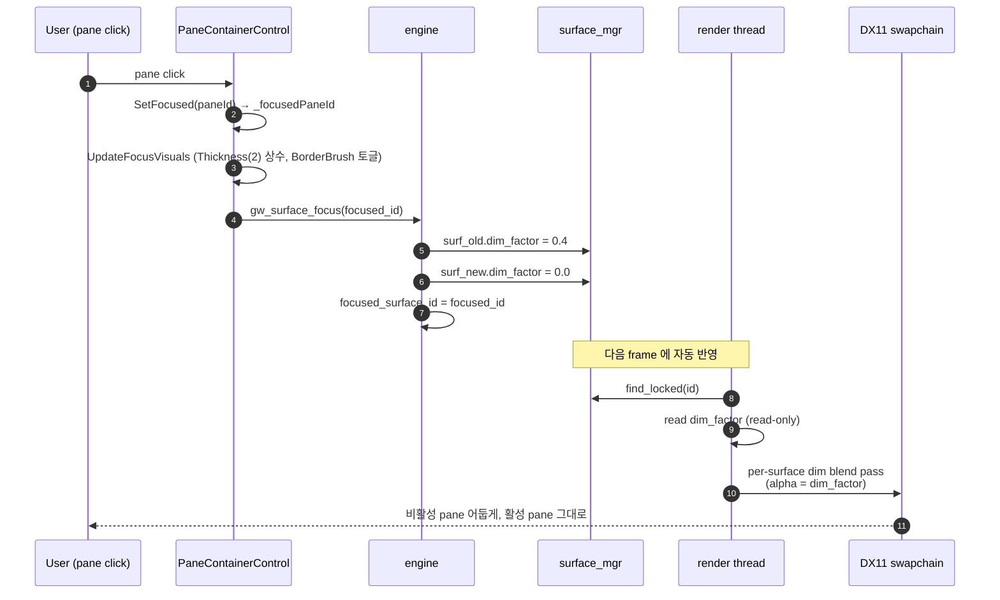
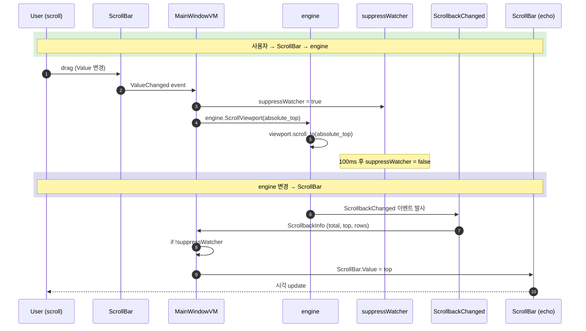
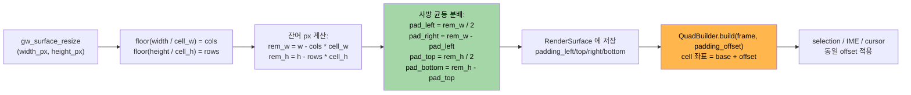

# M-16-C 터미널 렌더 정밀화 — Design Document

> **한 줄 요약**: 3 Phase 병렬 layer 설계. (A) `UpdateFocusVisuals` 항상 `Thickness(2)` + DX11 per-surface dim overlay (read-only blend, M-14 reader 안전 계약 준수). (B) native `gw_session_get_scrollback_info` API + WPF ScrollBar pane 별 (HwndHost 옆 Grid column, airspace 우회) + suppressWatcher 100ms 양방향 sync. (C) `RenderSurface` 에 padding offset 4-tuple 추가 + `QuadBuilder.build` 인자 확장 + DX11 viewport 전체 유지. **17 architectural decisions + R1-R7 폴백 명시**.
>
> **Project**: GhostWin Terminal
> **Date**: 2026-04-29
> **Status**: Draft v0.1
> **Plan Doc**: [`m16-c-terminal-render.plan.md`](../../01-plan/features/m16-c-terminal-render.plan.md) v0.1 (D1-D5 default 적용)
> **PRD**: [`m16-c-terminal-render.prd.md`](../../00-pm/m16-c-terminal-render.prd.md)

---

## Executive Summary (4-perspective)

| 관점 | 내용 |
|------|------|
| **Problem** | DX11 child HWND + WPF airspace + M-14 FrameReadGuard reader 안전 계약 + `surface_mgr->resize` deferred 흐름 4 제약을 동시 만족하면서 (1) layout shift 0 (2) ScrollBar 시각 (3) 잔여 padding 사방 분배. ghostty `padding-balance` 패턴은 standard, fork patch 추가 0. |
| **Solution** | **3 layer 변경 + 1 helper API**. (Layer A) `PaneContainerControl.UpdateFocusVisuals` 의 BorderThickness 토글 → `Thickness(2)` 상수 + `BorderBrush` 만 토글 + `RenderSurface` 의 `dim_factor` 필드 추가 + DX11 per-surface dim 패스 (read-only blend, alpha 0.4). (Layer B) `engine-api/ghostwin_engine.cpp` 에 `gw_session_get_scrollback_info(sid) → (totalRows, viewportTop, viewportRows)` 추가 + C# `IEngineService.GetScrollbackInfo` + `ScrollbackChanged` 이벤트 + WPF `ScrollBar` (pane 별, HwndHost 옆 column) + `suppressWatcher` 100ms 양방향 sync + Settings system/always/never. (Layer C) `RenderSurface` 에 `padding_left/top/right/bottom` 4-tuple 추가 + `gw_surface_resize` 의 cell-snap floor 후 잔여 px 사방 균등 분배 + `QuadBuilder.build(frame, padding_offset)` 인자 확장 + DX11 viewport 는 swapchain 전체 유지. |
| **Function/UX Effect** | (1) pane focus 전환 → child HWND BoundingRect 변동 0 (M-15 측정 정량 확증) + 비활성 pane alpha 0.4 dim. (2) ScrollBar pane 별 표시 + 마우스 드래그 → engine.ScrollViewport(absolute) 즉시 + viewport 변경 → ScrollBar.Value 자동 (latency < 16ms). (3) 최대화 시 잔여 px 이 사방 균등 분배되어 하단 잘림 사라짐. (4) M-14 reader 안전 계약 + M-15 idle p95 7.79ms ±5% 회귀 0. (5) DPI 100/125/150/175/200% 5단계 일관 동작. |
| **Core Value** | M-16 시리즈의 **터미널 본체 (DX11 child HWND) 시각 완성** = ghostty 이주 사용자 첫 5분 체감 + cmux 패리티 마지막 piece. M-14 의 reader 안전 계약 + M-15 의 measurement 인프라가 진가 발휘 (회귀 검증 자동화). M-A 의 토큰 + M-B 의 윈도우 셸 + M-C 의 터미널 = M-16 시리즈 base 완성. |

---

## 1. Overview

### 1.1 Design Goals

1. **Layout shift 0** — pane focus 전환 시 활성 pane 의 cell grid X/Y 변동 = 0 (M-15 측정 정량 확증)
2. **Reader 안전 계약 보존** — M-14 `FrameReadGuard` / `SessionVisualState` 위반 0 — dim overlay 는 read-only blend, ScrollBar 는 viewport 정보만 read
3. **DX11 viewport 전체 유지** — clear/dim 은 swapchain 전체 대상, 좌표만 padding offset 적용
4. **ghostty fork patch 0** — `balancePadding` 은 standard 옵션, 우리 fork branch (`ghostwin-patches/v1`) 변경 없음
5. **회귀 0** — M-15 idle p95 7.79ms ±5%, resize-4pane UIA count==4
6. **DPI 5단계 일관** — 100/125/150/175/200% 시각 동등 (D5=b 매 Phase 종료)

### 1.2 Design Principles

- **단일 책임**: dim overlay = visual only / ScrollBar = viewport sync only / padding = coordinate offset only
- **읽기-쓰기 분리**: dim overlay 는 read-only blend (write 0 → reader 안전 계약 자연 만족)
- **선언적 우선**: ScrollBar Visibility = Settings binding. animation 없음 (R7 회피)
- **외부 진단 우선** (M-B 학습): 추측 fix 사이클 회피, viewport coordinate trace + DXGI debug layer + 4-quadrant test

### 1.3 Related Documents

- **Plan v0.1 (D1-D5 default)**: [`m16-c-terminal-render.plan.md`](../../01-plan/features/m16-c-terminal-render.plan.md) — 9 FR + 8 NFR + 7 risks + 12.5d 3 Phase
- **PRD**: [`m16-c-terminal-render.prd.md`](../../00-pm/m16-c-terminal-render.prd.md) — 627줄 + 5 결정
- **선행 archive**: M-14 / M-15 / M-16-A / M-16-B
- **메모리 패턴**: `feedback_external_diagnosis_first.md` (M-B), `feedback_pdca_doc_codebase_verification.md` (M-A), `feedback_setresourcereference_for_imperative_brush.md` (M-A)

---

## 2. Architecture

### 2.1 3-Layer Composition

```mermaid
graph TB
    subgraph LA["Layer A: 분할 + dim overlay"]
        UF["PaneContainerControl<br/>UpdateFocusVisuals<br/>Thickness(2) 상수<br/>BorderBrush 토글"]
        DF["RenderSurface.dim_factor<br/>(0.0 = active, 0.4 = dim)"]
        DP["DX11 per-surface dim pass<br/>(read-only blend, M-14 안전)"]
        UF --> DF
        DF --> DP
    end

    subgraph LB["Layer B: ScrollBar + viewport sync"]
        SI["gw_session_get_scrollback_info<br/>(totalRows, viewportTop, viewportRows)"]
        IE["IEngineService.GetScrollbackInfo<br/>+ ScrollbackChanged 이벤트"]
        SB["WPF ScrollBar (pane 별)<br/>Grid column, HwndHost 옆"]
        SW["suppressWatcher 100ms<br/>(M-12 패턴, infinite-loop 0)"]
        SI --> IE
        IE --> SB
        SB <--> SW
    end

    subgraph LC["Layer C: padding offset"]
        RS["RenderSurface.padding_*<br/>(4-tuple: L/T/R/B)"]
        GR["gw_surface_resize<br/>잔여 px 사방 균등 분배"]
        QB["QuadBuilder.build(frame, offset)<br/>cell + selection + IME 동일"]
        VP["DX11 viewport 전체 유지<br/>(clear/dim 전체 surface)"]
        GR --> RS
        RS --> QB
        QB --> VP
    end

    LA -.M-14 reader 안전.-> M14["FrameReadGuard / SessionVisualState"]
    LB -.M-12 패턴.-> M12["SettingsService suppressFileWatcher"]
    LC -.M-14 + M-15.-> M15["measurement driver / coordinate trace"]

    style LA fill:#A5D6A7,color:#000
    style LB fill:#FFB74D,color:#000
    style LC fill:#90CAF9,color:#000
```



### 2.2 Phase A — 분할 + dim overlay 데이터 흐름



**핵심**: dim 은 `RenderSurface.dim_factor` 만 read. **write 는 `gw_surface_focus` 안에서만** (UI 스레드, lock 안). render thread 는 read-only → M-14 reader 안전 계약 자동 만족.

### 2.3 Phase B — ScrollBar 양방향 sync 데이터 흐름



**핵심**: M-12 의 `suppressWatcher` 100ms 패턴 재사용. infinite-loop 0건 보장.

### 2.4 Phase C — padding offset 데이터 흐름



**핵심**: DX11 swapchain viewport 는 전체 유지 (clear/dim 은 전체 surface 대상). 좌표만 padding offset 적용. cursor / mouse hit-test / IME composition 4 좌표계 동일 offset (R2 검증 시점).

---

## 3. Architectural Decisions (17건)

### 3.1 Phase A — 분할 + dim overlay (D-01 ~ D-06)

| # | 결정 | 옵션 | 채택 | 근거 |
|:-:|------|------|:----:|------|
| **D-01** | Border 처리 | (a) 0↔2 토글 보존 (b) 항상 Thickness(2) + BorderBrush 토글 (c) 별도 dim layer | **(b)** | layout shift 0 + 가장 단순 + render thread 영향 0 |
| **D-02** | dim overlay 위치 | (a) WPF Border layer (b) DX11 engine layer (c) 별도 HwndHost overlay | **(b) DX11 engine** | reader 안전 (read-only blend) + 성능 (alpha-only blend) + airspace 회피 |
| **D-03** | dim factor storage | (a) Session.visual_state (b) RenderSurface field (c) engine global map | **(b) RenderSurface field** | per-surface, render thread 가 그 surface 의 frame 그릴 때 직접 read |
| **D-04** | dim 색 | (a) hardcoded #00000000 (alpha) (b) Theme-aware brush (c) Settings 옵션 | **(a) hardcoded alpha** | dark/light 무관 (FR-03 cmux 패턴), Settings 옵션은 Phase D 후속 |
| **D-05** | dim alpha | 0.3 / 0.4 (cmux) / 0.5 | **0.4 (D2 default)** | cmux `unfocused-split-opacity` 표준. Settings 추가는 후속 |
| **D-06** | dim apply 시점 | (a) gw_surface_focus 콜백 즉시 (b) 다음 frame 시작 시 (c) UI 스레드 deferred | **(a) gw_surface_focus 즉시** | UI 스레드 lock 안에서 dim_factor write, render thread 는 read-only — 동시성 안전 |

### 3.2 Phase B — ScrollBar (D-07 ~ D-11)

| # | 결정 | 옵션 | 채택 | 근거 |
|:-:|------|------|:----:|------|
| **D-07** | scrollback API 형태 | (a) 3개 별도 함수 (b) 1개 함수 + struct out (c) 1개 함수 + 3 ref out | **(b) struct out** | C 호환 + P/Invoke 단순 + 미래 확장 (선택 영역 등) |
| **D-08** | C# struct 이름 | (a) ScrollbackInfo (b) ViewportInfo (c) ScrollState | **(a) ScrollbackInfo** | "scrollback" 은 ghostty/cmux 일관 명명 |
| **D-09** | 변경 알림 | (a) ScrollbackChanged 이벤트 (b) Polling (c) PropertyChanged | **(a) ScrollbackChanged 이벤트** | viewport 변경은 sparse, polling 비효율. 이벤트 driven |
| **D-10** | ScrollBar 위치 | (a) window 우측 1개 (b) pane 별 (c) Settings 토글 | **(b) pane 별 (D3 default)** | ghostty/WezTerm/cmux 패턴 일관 |
| **D-11** | 양방향 sync | (a) event-based (b) suppressWatcher 100ms (c) Behaviors | **(b) suppressWatcher** | M-12/M-A/M-B 검증 패턴, infinite-loop 0 |

### 3.3 Phase C — padding offset (D-12 ~ D-17)

| # | 결정 | 옵션 | 채택 | 근거 |
|:-:|------|------|:----:|------|
| **D-12** | padding storage | (a) DX11 viewport 변경 (b) RenderSurface 좌표 offset (c) 둘 다 | **(b) RenderSurface offset** | clear/dim 전체 surface 대상이라 viewport 전체 유지 필요 |
| **D-13** | offset 데이터 구조 | (a) 단일 padding 값 (b) L/R/T/B 4-tuple (c) Thickness 구조체 | **(b) 4-tuple** | 사방 분배 위해 4 별도 값. Thickness 는 WPF 의존 |
| **D-14** | offset 분배 알고리즘 | (a) 우/하단 몰림 (현재) (b) 사방 균등 (ghostty) (c) Settings 옵션 | **(b) 사방 균등** | ghostty `balancePadding` 표준. Settings 옵션은 Phase D 후속 |
| **D-15** | QuadBuilder API 변경 | (a) build(frame) 유지 + offset 외부 (b) build(frame, offset) 인자 추가 (c) 별도 메서드 | **(b) 인자 추가** | atomic — frame 과 offset 이 같이 사용되는데 분리 시 race |
| **D-16** | 좌표계 동일성 | (a) 자동 (DX11 transform) (b) 수동 (각 좌표 명시 offset 인자) (c) hybrid | **(b) 수동** | cursor/mouse/IME 4 좌표계 명시 통제 — 디버깅 용이 (R2 mitigation) |
| **D-17** | DPI 변경 시 padding | (a) 즉시 재계산 (b) 다음 resize 시 (c) Settings 토글 | **(a) 즉시 재계산** | M-A 의 OnDpiChanged + UpdateCellMetrics 흐름 재사용 |

---

## 4. Component Specs

### 4.1 RenderSurface 구조체 확장 (`src/engine-api/surface_manager.h:30`)

```cpp
struct RenderSurface {
    GwSurfaceId id = 0;
    GwSessionId session_id = 0;
    HWND hwnd = nullptr;
    ComPtr<IDXGISwapChain2> swapchain;
    ComPtr<ID3D11RenderTargetView> rtv;
    uint32_t width_px = 0;
    uint32_t height_px = 0;

    // M-16-C Phase A — dim overlay (UI thread write, render thread read-only)
    std::atomic<float> dim_factor{0.0f};  // 0.0 = active, 0.4 = dim

    // M-16-C Phase C — padding offset (4-tuple, sub-cell residual px)
    // gw_surface_resize 가 cell-snap floor 후 사방 균등 분배.
    // QuadBuilder + cursor + IME + mouse hit-test 모두 동일 offset 적용.
    std::atomic<uint32_t> pad_left{0};
    std::atomic<uint32_t> pad_top{0};
    std::atomic<uint32_t> pad_right{0};
    std::atomic<uint32_t> pad_bottom{0};

    // (기존 필드들 - deferred resize, IME composition, M-14 visual epoch)
    // ...
};
```

**`std::atomic`**: render thread (read) ↔ UI thread (write) 단순 동시성. M-14 의 `FrameReadGuard` 와 별개 — visual_state 변경 아님.

### 4.2 gw_session_get_scrollback_info API (Phase B B1)

**위치**: `src/engine-api/ghostwin_engine.h` + `.cpp`

```c
// In header
typedef struct {
    uint32_t total_rows;     // 전체 scrollback 크기
    uint32_t viewport_top;   // 현재 viewport 의 시작 row (0 = scrollback 최상단)
    uint32_t viewport_rows;  // viewport 가 보여주는 row 수
} GwScrollbackInfo;

GWAPI int gw_session_get_scrollback_info(
    GwEngine engine,
    GwSessionId session_id,
    GwScrollbackInfo* out_info);

// Returns: GW_OK / GW_ERR_INVALID / GW_ERR_NOT_FOUND
```

**구현**: ghostty libvt 의 `Terminal.scrollback` 정보를 추출. 기존 `ScrollViewport(delta)` 와 동일 lock 영역.

### 4.3 IEngineService API 확장 (Phase B B2)

**위치**: `src/GhostWin.Core/Interfaces/IEngineService.cs`

```csharp
public interface IEngineService
{
    // ... 기존 ...

    /// <summary>Scroll viewport (scrollback) by delta rows. Negative=up, positive=down.</summary>
    int ScrollViewport(uint sessionId, int deltaRows);

    /// <summary>
    /// M-16-C Phase B: get current scrollback state for a session.
    /// Returns false if session not found or engine not initialized.
    /// </summary>
    bool GetScrollbackInfo(uint sessionId, out ScrollbackInfo info);

    /// <summary>
    /// M-16-C Phase B: fired when viewport position changes (engine-driven).
    /// Subscribers should debounce / throttle if needed.
    /// </summary>
    event EventHandler<ScrollbackChangedEventArgs> ScrollbackChanged;
}

public readonly record struct ScrollbackInfo(
    uint TotalRows,
    uint ViewportTop,
    uint ViewportRows);

public sealed class ScrollbackChangedEventArgs(uint sessionId, ScrollbackInfo info)
    : EventArgs
{
    public uint SessionId { get; } = sessionId;
    public ScrollbackInfo Info { get; } = info;
}
```

### 4.4 ScrollBar UI 통합 (Phase B B2)

**위치**: `src/GhostWin.App/Controls/PaneContainerControl.cs:BuildElement`

기존 BuildElement 가 pane 마다 `Border + TerminalHostControl` 생성. 여기에 ScrollBar column 추가:

```csharp
private FrameworkElement BuildLeafCell(uint paneId, ...)
{
    var grid = new Grid();
    grid.ColumnDefinitions.Add(new ColumnDefinition { Width = new GridLength(1, GridUnitType.Star) });
    grid.ColumnDefinitions.Add(new ColumnDefinition { Width = GridLength.Auto }); // ScrollBar column

    var border = new Border { /* ... */ };
    var host = new TerminalHostControl();
    border.Child = host;
    Grid.SetColumn(border, 0);
    grid.Children.Add(border);

    // M-16-C Phase B (D-10 pane 별)
    var scrollbar = new ScrollBar
    {
        Orientation = Orientation.Vertical,
        SmallChange = 1,
        LargeChange = 10,
        // Visibility binding: SettingsPageVM.ScrollbarVisibility (system/always/never)
    };
    Grid.SetColumn(scrollbar, 1);
    grid.Children.Add(scrollbar);

    // ScrollBar binding (D-11 suppressWatcher)
    AttachScrollbarBinding(host, scrollbar, paneId);

    _hostControls[paneId] = host;
    return grid;
}
```

### 4.5 양방향 binding (Phase B B3, D-11 suppressWatcher 패턴)

```csharp
private void AttachScrollbarBinding(TerminalHostControl host, ScrollBar scrollbar, uint paneId)
{
    bool suppress = false;

    // user → engine
    scrollbar.ValueChanged += (s, e) =>
    {
        if (suppress) return;
        suppress = true;
        try
        {
            var sessionId = host.SessionId;
            var info = _engine.GetScrollbackInfo(sessionId, out var sb) ? sb : default;
            int delta = (int)e.NewValue - (int)info.ViewportTop;
            _engine.ScrollViewport(sessionId, delta);
        }
        finally
        {
            // M-12 패턴: 100ms 후 unsuppress (engine echo 흡수)
            Dispatcher.InvokeAsync(async () =>
            {
                await Task.Delay(100);
                suppress = false;
            });
        }
    };

    // engine → ScrollBar
    EventHandler<ScrollbackChangedEventArgs> handler = (s, e) =>
    {
        if (e.SessionId != host.SessionId) return;
        if (suppress) return;
        Dispatcher.InvokeAsync(() =>
        {
            scrollbar.Maximum = Math.Max(0, e.Info.TotalRows - e.Info.ViewportRows);
            scrollbar.Value = e.Info.ViewportTop;
            scrollbar.ViewportSize = e.Info.ViewportRows;
        });
    };
    _engine.ScrollbackChanged += handler;
    host.Unloaded += (_, _) => _engine.ScrollbackChanged -= handler;
}
```

### 4.6 padding offset 계산 (Phase C C1)

**수정**: `src/engine-api/ghostwin_engine.cpp:gw_surface_resize` (line 988-1012)

```cpp
GWAPI int gw_surface_resize(GwEngine engine, GwSurfaceId id,
                             uint32_t width_px, uint32_t height_px) {
    GW_TRY
        auto* eng = as_impl(engine);
        if (!eng || !eng->surface_mgr) return GW_ERR_INVALID;

        auto surf = eng->surface_mgr->find_locked(id);
        if (!surf) return GW_ERR_NOT_FOUND;

        eng->surface_mgr->resize(id, width_px, height_px);

        if (eng->atlas) {
            uint32_t w = width_px > 0 ? width_px : 1;
            uint32_t h = height_px > 0 ? height_px : 1;
            uint32_t cell_w = eng->atlas->cell_width();
            uint32_t cell_h = eng->atlas->cell_height();

            uint16_t cols = static_cast<uint16_t>(w / cell_w);
            uint16_t rows = static_cast<uint16_t>(h / cell_h);
            if (cols < 1) cols = 1;
            if (rows < 1) rows = 1;

            // M-16-C Phase C (D-14 사방 균등): 잔여 px 계산 + 분배
            uint32_t rem_w = w - cols * cell_w;
            uint32_t rem_h = h - rows * cell_h;
            uint32_t pad_l = rem_w / 2;
            uint32_t pad_r = rem_w - pad_l;
            uint32_t pad_t = rem_h / 2;
            uint32_t pad_b = rem_h - pad_t;

            // atomic store (render thread 가 read)
            surf->pad_left.store(pad_l, std::memory_order_release);
            surf->pad_right.store(pad_r, std::memory_order_release);
            surf->pad_top.store(pad_t, std::memory_order_release);
            surf->pad_bottom.store(pad_b, std::memory_order_release);

            eng->session_mgr->resize_session(surf->session_id, cols, rows);
        }

        return GW_OK;
    GW_CATCH_INT
}
```

### 4.7 QuadBuilder.build 인자 확장 (Phase C C2)

**수정**: `src/renderer/quad_builder.h` + `.cpp`

```cpp
class QuadBuilder {
public:
    // M-16-C Phase C (D-15): padding offset 인자 추가
    struct PaddingOffset {
        uint32_t left = 0;
        uint32_t top = 0;
        uint32_t right = 0;
        uint32_t bottom = 0;
    };

    uint32_t build(const RenderFrame& frame,
                    const PaddingOffset& padding,  // ← 신규
                    /* ... 기존 인자 ... */);
};
```

cell 좌표 계산 시 모두 `+ padding.left`, `+ padding.top` 적용. cursor / IME composition / selection rectangle 도 동일.

---

## 5. UI/UX Design

### 5.1 Phase A — Border 변경 전후

```
┌─────────────────────────┐    ┌─────────────────────────┐
│ active pane (focus)     │    │ active pane             │
│ Thickness(2) + Accent   │    │ Thickness(2) + Accent   │
└─────────────────────────┘    └─────────────────────────┘
┌─────────────────────────┐    ┌─────────────────────────┐
│ inactive pane           │    │ inactive pane           │
│ Thickness(0) (현재)     │ -> │ Thickness(2) + Transp   │
│ ↑ child HWND 2px 이동   │    │ + dim alpha 0.4 overlay │
└─────────────────────────┘    └─────────────────────────┘
```

→ Layout shift 0 + 시각적 dim 차이 = 활성 명확.

### 5.2 Phase B — ScrollBar pane layout

```
┌─────────┬──────────────────────────────────┬───┐
│ Sidebar │ Pane (DX11 child HWND)            │ S │
│         │                                   │ B │
│         │ shell prompt$ ...                 │   │
│         │ output line 1                     │   │
│         │ output line 2                     │   │
│         │ ...                               │   │
└─────────┴──────────────────────────────────┴───┘
                                                 ^
                              pane 별 ScrollBar (D-10)
```

### 5.3 Phase C — padding 분배 (4분할 시뮬레이션)

```
가용 영역: 1024 × 768
cell: 10 × 20
cols = floor(1024 / 10) = 102 (잔여 4px)
rows = floor(768 / 20) = 38 (잔여 8px)

기존 (우/하단 몰림):
┌────────────────────────────┐
│  cell grid 1020 × 760       │
│                             │
└────────────────────────────┘
                       │ 4px ←우측 여백
                       └ 8px ←하단 여백 (검은 띠)

D-14 사방 균등:
        2px (top)
   ┌─┬────────────────────────┬─┐
2px│ │ cell grid 1020 × 760    │ │2px (right)
   │ │                         │ │
   └─┴────────────────────────┴─┘
        4px (bottom)

→ 잔여 px 사방 분배, 시각적으로 자연
```

---

## 6. Failure Fallback (R1-R7)

| Risk | 검증 시점 | 통과 시 | 실패 시 폴백 |
|------|:--------:|---------|-------------|
| **R1** dim reader 안전 위반 | A4 | unit tests + DXGI debug 통과 | dim path 를 별도 RenderTarget 으로 분리 (composition pass 전체 격리) |
| **R2** 좌표계 혼선 | C3 | 4-quadrant test 통과 | offset 적용을 cell-grid 만 (cursor/IME/mouse 는 viewport 좌표) — 부분 fix |
| **R3** ScrollBar airspace 충돌 | B2 | HwndHost 옆 column 정상 | ScrollBar 를 별도 HwndHost layer 로 (성능 ↓ 허용) |
| **R4** Settings 토큰 충돌 | B4 | M-A 토큰 0건 추가 | 새 토큰 추가 (Backlog mini 분리) |
| **R5** dim 깜박임 | A3 | dark/light 전환 시 deflicker | dim alpha 를 toggle 시 fade-in 200ms (애니메이션 추가) |
| **R6** 환경 의존 | 매 Phase | DPI 5단계 통과 | 사용자 PC hardware deferred |
| **R7** measurement false-positive | 매 Phase | M-15 회귀 0 | 코드 grep + reader violation detect tool 추가 |

---

## 7. Test Plan

### 7.1 Test Scope

| 종류 | 대상 | 도구 | 통과 기준 |
|------|------|------|---------|
| Unit | engine padding offset 계산 | xUnit + GhostWin.Engine.Tests | 5 케이스 (1024/768, DPI 100/125/150/175/200) |
| Unit | ScrollBar binding (suppressWatcher) | xUnit + GhostWin.App.Tests | infinite-loop 0, 100ms 안 2 set 회귀 0 |
| Build | Debug + Release | msbuild | 0 warning |
| E2E smoke | TerminalHost 4-pane | xUnit FlaUI | UIA `E2E_TerminalHost` count == 4 |
| **Layout shift 측정** | Pane focus 전환 시 BoundingRect | M-15 measurement driver | X/Y 변동 = 0 |
| **dim overlay 색** | active vs inactive 차이 | DXGI debug + screenshot diff | alpha 0.4 = ΔE ≥ 5 |
| **viewport sync latency** | engine → ScrollBar 갱신 시간 | timestamp log | < 16ms |
| **4-quadrant click test** | cursor/mouse/IME 정확 위치 | 수동 + log | 4/4 통과 |
| **DPI 5단계** | 100/125/150/175/200% | 사용자 PC 시각 | 일관 동작 |
| **M-15 idle p95** | baseline 회귀 | `measure_render_baseline.ps1` | 7.79ms ±5% |
| **M-15 resize-4pane** | UIA count | 동상 | == 4 |

### 7.2 Critical 테스트 케이스

- [ ] **Happy**: pane focus 전환 → 활성 cell grid X/Y 변동 0
- [ ] **Happy**: 비활성 pane alpha 0.4 dim 시각
- [ ] **Happy**: ScrollBar 드래그 → engine viewport 즉시 + Value echo 100ms 안
- [ ] **Happy**: 최대화 → 잔여 px 사방 분배 (사방 1-2px 균등)
- [ ] **Edge**: DPI 변경 (100→200%) → padding 즉시 재계산
- [ ] **Edge**: 4-pane focus 순환 → 항상 1 active + 3 dim
- [ ] **Edge**: ScrollBar 빠른 드래그 (100ms 안 5회 변경) → infinite-loop 0
- [ ] **Edge**: padding 0 일 때 (cell-snap 정확 일치) → offset 모두 0
- [ ] **Regression**: M-14 reader 안전 unit tests 17/17 PASS
- [ ] **Regression**: M-15 idle p95 7.79 ms ±5%

---

## 8. M-A/M-B Token Mapping

M-C 가 사용하는 M-A 토큰 (재사용만, 신규 추가 0 — NFR-05):

| M-A 토큰 | M-C 사용처 |
|----------|-----------|
| `Accent.Primary.Brush` (#0091FF) | 활성 pane border (UpdateFocusVisuals isFocused) |
| `Spacing.SM` (8) | ScrollBar Width (Settings 라디오 padding) |
| `Text.Tertiary.Brush` | Settings Scrollbar 라벨 |
| `Divider.Brush` | (해당 없음 — pane border 는 Accent 사용) |
| `Terminal.Background.Brush` | DX11 child HWND ClearColor (M-A C9 fix) |

새 토큰 추가 0건. Phase C 의 padding offset 도 magic number — Spacing 토큰 사용 안 함 (이건 cell-relative 잔여, design system 외부).

---

## 9. Implementation Order (Plan §4.1 매핑)

| Day | Phase | 산출물 | 검증 |
|:---:|:-----:|--------|------|
| A1 | A | UpdateFocusVisuals Thickness(2) 상수 | M-15 layout shift 측정 |
| A2 | A | dim overlay design + viewport coordinate trace | document |
| A3 | A | DX11 per-surface dim pass | DXGI debug + screenshot |
| A4 | A | reader 안전 + DPI | unit tests + 시각 |
| B1 | B | gw_session_get_scrollback_info | C++ unit test |
| B2 | B | C# API + ScrollBar UI | E2E |
| B3 | B | suppressWatcher binding | timestamp log |
| B4 | B | Settings 옵션 + auto-hide | 시각 |
| B5 | B | DPI 검증 | 시각 |
| C1 | C | gw_surface_resize padding | engine unit test |
| C2 | C | RenderSurface + QuadBuilder | render frame |
| C3 | C | 좌표계 검증 | 4-quadrant |
| C4 | C | DPI 시각 | 시각 |

---

## 10. Convention Reference (Plan §7 재확인)

- **Window base class**: `Wpf.Ui.Controls.FluentWindow` (M-B)
- **engine API 명명**: `gw_session_*` / `gw_surface_*` (기존)
- **C# struct**: `record struct` (immutable, value semantics) — `ScrollbackInfo`
- **suppressWatcher 패턴**: M-12 / M-A / M-B 일관 — 100ms unsuppress
- **atomic field**: `std::atomic<uint32_t/float>` for UI ↔ render thread (M-14 보강)
- **read-only 계약**: dim path 는 read-only. write 는 UI 스레드 lock 안 (M-14 reader 안전)

---

## 11. Risks Summary

| Risk | Impact | Likelihood | Day | Mitigation |
|:----:|:------:|:----------:|:---:|------|
| R1 dim reader 안전 | 🔴 높 | 🟡 중 | A4 | read-only blend + DXGI debug 검증 |
| R2 좌표 혼선 | 🔴 높 | 🔴 높 | C3 | 4-quadrant test + viewport coordinate trace + 좌표계 매핑 표 |
| R3 ScrollBar airspace | 🟡 중 | 🟡 중 | B2 | HwndHost 옆 column (overlay 아님) |
| R4 Settings 토큰 충돌 | 🟢 낮 | 🟢 낮 | B4 | M-A 토큰 0건 추가 |
| R5 dim 깜박임 | 🟡 중 | 🟡 중 | A3 | alpha-only blend (테마 무관) |
| R6 환경 의존 | 🟡 중 | 🟡 중 | A4/B5/C4 | DPI 5단계 매 Phase 검증 (D5=b) |
| R7 false-positive | 🟡 중 | 🟢 낮 | 매 Phase 종료 | M-15 + 코드 grep 이중 검증 |

---

## 12. Next Steps

1. **사용자 design 검토** — 17 architectural decisions + RenderSurface 확장 + ScrollBar binding sequence + padding offset 계산
2. **`/pdca do m16-c-terminal-render`** — Phase A → B → C 순차, 9-10 commits
3. `/pdca analyze` (gap-detector + Match Rate)
4. Match Rate ≥ 92% 시 `/pdca report`
5. `/pdca archive --summary`

---

## Version History

| Version | Date | Changes | Author |
|---------|------|---------|--------|
| 0.1 | 2026-04-29 | Initial — 17 architectural decisions (D-01~17, 6+5+6) + 3 Phase Mermaid sequence diagrams + RenderSurface 확장 (dim_factor + 4-tuple padding) + gw_session_get_scrollback_info API + ScrollBar suppressWatcher binding + padding offset 계산 + R1-R7 폴백 + M-A 토큰 5건 재사용 매핑 | 노수장 |
