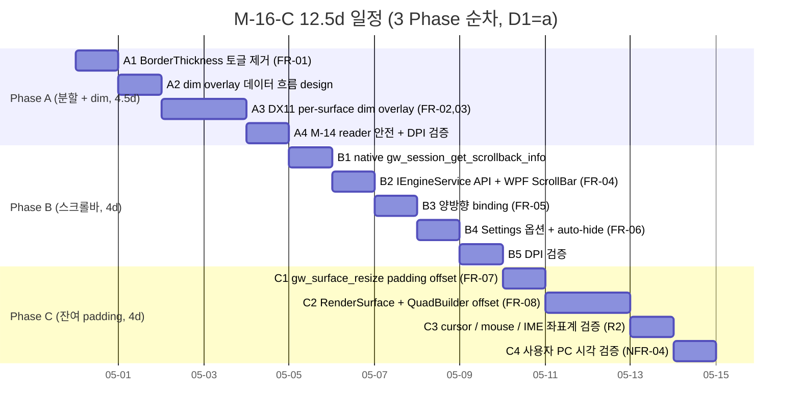

# M-16-C 터미널 렌더 정밀화 — Plan Document

> **한 줄 요약**: 사용자가 직접 본 3 결함 (#1 분할 경계선 layout shift / #2 스크롤바 부재 / #3 최대화 하단 잔여 padding) 을 ghostty `padding-balance` + dim overlay + WPF ScrollBar (HwndHost airspace 우회) 로 한 번에 해결. **3 Phase 12.5 작업일 + 9 commit 분리**. M-A/M-B 독립, M-14/M-15 회귀 검증 의무. M-B 의 외부 진단 패턴 적용.

---

## Executive Summary (4-perspective)

| 관점 | 내용 |
|------|------|
| **Problem** | (1) 분할 경계선의 BorderThickness 0↔2 토글이 child HWND BoundingRect 를 변동시켜 글자 layout shift. (2) `IEngineService.ScrollViewport(delta)` 만 있고 시각 컨트롤 + viewport 상태 조회 API 가 없어 스크롤 위치 시각 X. (3) `engine` 의 `cols = w / cell_width`, `rows = h / cell_height` floor 계산이 잔여 px 을 우/하단으로 몰아 최대화 시 하단 검은 띠. |
| **Solution** | **3 Phase 순차** — (A) `UpdateFocusVisuals` 의 BorderThickness 토글 → 항상 Thickness(2) + 비활성 BorderBrush=Transparent 로 layout shift 0 + DX11 per-surface dim overlay (alpha 0.4 cmux 표준). (B) native `gw_session_get_scrollback_info` API 추가 + C# `IEngineService.GetScrollbackInfo` + `ScrollbackChanged` 이벤트 + WPF ScrollBar (pane 별, HwndHost 옆 column) + Settings system/always/never. (C) `gw_surface_resize` 에 padding offset 계산 도입 + `RenderSurface` 저장 + `QuadBuilder` 좌표 offset (사방 균등 분배). DX11 viewport 는 전체 swapchain 유지. |
| **Function/UX Effect** | (1) pane focus 전환 시 활성 pane 의 cell grid 변동 0 (사용자 측정 가능). (2) 비활성 pane 이 alpha 0.4 어두워져 활성 pane 명확. (3) WPF ScrollBar 가 pane 별 우측에 표시 + 마우스 드래그 viewport 직접 조절 + Settings 옵션. (4) 최대화 시 하단 잘림 사라짐 + DPI 변경 시 padding 재계산. (5) M-14 reader 안전 계약 + M-15 idle p95 7.79ms ±5% 회귀 0. |
| **Core Value** | M-16 시리즈의 **터미널 본체 (DX11 child HWND) 시각 완성**. M-A 가 토큰 base, M-B 가 윈도우 셸, M-C 가 터미널. 이게 끝나야 ghostty 이주 사용자가 첫 5분 안에 "GhostWin 은 진짜 ghostty 처럼 동작한다" 체감. M-14/M-15 의 render thread 안전 + measurement 인프라가 진가 발휘 (회귀 검증 자동화). |

---

## 1. Overview

### 1.1 Purpose

audit `docs/00-research/2026-04-28-ui-completeness-audit.md` 의 Layout 카테고리 #1/#2/#3 — **모두 사용자 직접 보고 결함**. 우선순위 최상.

### 1.2 Background

- **사용자 직접 보고 (audit 발굴 단계)**:
  - "분할 경계선 때문에 pane 선택 시 화면 렌더링 크기 변화" (#1)
  - "스크롤바 미표시" (#2)
  - "최대화 시 터미널 하단 잘림" (#3)
- **DX11 + WPF airspace 경계 + M-14 FrameReadGuard + `surface_mgr->resize` deferred** 3 제약 동시 만족 필요
- ghostty `window-padding-balance` 는 standard 옵션 — fork patch 추가 0 (NFR-06)

### 1.3 Related Documents

- **PRD**: [`docs/00-pm/m16-c-terminal-render.prd.md`](../../00-pm/m16-c-terminal-render.prd.md) (627줄, FR 9 + NFR 6 + D 5건 + Risk 6)
- **선행 archive**: `docs/archive/2026-04/m14-render-thread-safety/`, `docs/archive/2026-04/m15-render-baseline-comparison/`, `docs/archive/2026-04/m16-a-design-system/`, `docs/archive/2026-04/m16-b-window-shell/`
- **audit**: `docs/00-research/2026-04-28-ui-completeness-audit.md` Layout #1/#2/#3
- **Obsidian milestone**: `Milestones/m16-c-terminal-render.md` (stub)
- **외부**: ghostty `window-padding-balance` 옵션 docs

---

## 2. Scope

### 2.1 In Scope (M-C 흡수 3 핵심 + dim overlay)

| # | 결함 | 코드 위치 (verified 2026-04-29) | FR | Phase |
|:-:|---|---|:-:|:-:|
| **#1** Border 0↔2 layout shift | `PaneContainerControl.cs:UpdateFocusVisuals` (line ~359-376, `BorderThickness = isFocused ? Thickness(2) : Thickness(0)`) | FR-01 | A |
| dim overlay (audit 보강) | DX11 engine 의 `gw_surface_focus` / `focused_surface_id` 흐름 확장 | FR-02, FR-03 | A |
| **#2** ScrollBar 부재 | `IEngineService.cs:41` `int ScrollViewport(uint, int deltaRows)` (delta API 만, 상태 조회 없음). MainWindow.xaml 에 ScrollBar 0건 | FR-04, FR-05, FR-06 | B |
| **#3** 최대화 하단 잔여 padding | `engine-api/ghostwin_engine.cpp:540-541` `cols = width_px / cell_width`, `rows_count = height_px / cell_height` (floor 결과 잔여 px 우/하단 누적) | FR-07, FR-08, FR-09 | C |

### 2.2 Out of Scope

PRD §7.6 그대로:
- ghostty `padding-balance` 자체의 fork patch 변경 (standard 옵션)
- ScrollBar minimap / search / inline marker
- 분할 경계선 hover 효과 (M-16-D 또는 M-17)
- pane resize fluid animation
- 최대화 DWM frame draw (M-B archived)

### 2.3 사용자 결정 사항 (Plan 단계 entry — 권장 default 적용)

PRD §7.5 권장값을 default 로 채택. 사용자 승인 미수신 시 권장값으로 진행 (M-A/M-B 마라톤 패턴):

| # | 결정 | 옵션 | **PM 권장 (default)** | 이유 |
|:-:|------|------|---------------------|------|
| **D1** | Phase 순서 | (a) 순차 / (b) A+B 병렬 (C 독립) / (c) 모두 독립 | **(a) 순차** | Phase A 가 surface 좌표계 정착 → C 의 viewport offset 가 그 위에 얹힘. 의존성 명확 |
| **D2** | dim overlay alpha | 0.3 / 0.4 / 0.5 | **0.4 cmux 표준** | cmux `unfocused-split-opacity` 기본값. Settings 항목으로 조절 가능하게 |
| **D3** | ScrollBar 위치 | (a) window 우측 1개 / (b) pane 별 / (c) Settings 토글 | **(b) pane 별** | ghostty / WezTerm / cmux 패턴. window 1개는 비활성 pane 의 길잃음 못 풀어줌 |
| **D4** | ScrollBar Settings 옵션 | (a) system / always / never / (b) + pane-only / (c) always 만 | **(a) system / always / never** | Windows 표준. pane-only 는 D3=b 로 자동 충족 |
| **D5** | DPI 5단계 검증 시점 | (a) Phase C 종료 시 (b) 매 Phase 종료 시 (c) Plan 단계 design 시 | **(b) 매 Phase 종료 시** | M-B 학습 — DPI 누적 부채는 늦게 발견 시 비싸짐. Phase A 도 BorderThickness 토글로 DPI 영향 |

→ 사용자 명시 변경 미수신 시 **권장 default 로 자동 진행**. M-A 사이클의 "Day 7까지 멈추지말고 진행" 패턴.

---

## 3. Requirements

### 3.1 Functional Requirements (PRD FR-01 ~ FR-09)

| ID | 요구사항 | Phase | Priority | Day | Status |
|----|---------|:----:|:--------:|:---:|--------|
| **FR-01** | focus pane 변경 시 child HWND BoundingRect.X/Y 변동 = 0 (`UpdateFocusVisuals` BorderThickness 토글 제거) | A | High | A1 | Pending |
| **FR-02** | DX11 per-surface dim overlay (비활성 pane alpha 0.4) | A | High | A3 | Pending |
| FR-03 | dim overlay 색은 dark/light 테마 무관 동일 alpha 패턴 (cmux 표준) | A | Medium | A3 | Pending |
| **FR-04** | WPF ScrollBar (pane 별, HwndHost 우측 column, D3=b) | B | High | B2 | Pending |
| **FR-05** | engine viewport ↔ ScrollBar.Value 양방향 binding (latency < 16ms) | B | High | B3 | Pending |
| FR-06 | Settings ScrollBar 옵션 (system/always/never, D4=a) | B | Medium | B4 | Pending |
| **FR-07** | ghostty `balancePadding` 패턴 이식 — 잔여 px 사방 균등 분배 | C | High | C1 | Pending |
| **FR-08** | DX11 swapchain viewport 전체 유지 + 좌표만 offset (clear/dim 은 전체 surface 대상) | C | High | C2 | Pending |
| FR-09 | 최대화/일반/DPI 변경 시 padding 재계산 | C | Medium | C3 | Pending |

### 3.2 Non-Functional Requirements

| ID | 기준 | 측정 방법 |
|----|------|---------|
| **NFR-01 reader 안전 계약** | M-14 `FrameReadGuard` / `SessionVisualState` 깨지지 않음 | unit tests + dim overlay path read-only 코드 리뷰 |
| **NFR-02 idle p95 회귀 0** | M-15 baseline 7.79ms ±5% (7.40-8.18ms) | `scripts/measure_render_baseline.ps1 -Scenario idle -ResetSession` |
| **NFR-03 resize-4pane** | UIA `E2E_TerminalHost` count == 4 | `scripts/measure_render_baseline.ps1 -Scenario resize-4pane` |
| **NFR-04 DPI 5단계** | 100/125/150/175/200% 시각 동등 (D5=b 매 Phase 종료) | 사용자 PC 시각 검증 |
| **NFR-05 0 warning** | msbuild 0 경고 (M-A/M-B 일관성) | `msbuild GhostWin.sln /p:Configuration=Debug+Release` |
| **NFR-06 fork patch 0** | `external/ghostty/` git diff 변경 0 (`balancePadding` standard) | `cd external/ghostty && git status` |
| **NFR-07 Match Rate** | 92% 이상 (M-B 92% 이상) | gap-detector |
| **NFR-08 외부 진단 적용** | M-B 학습 — 추측 fix 회피, viewport coordinate trace + DPI screenshot diff | `feedback_external_diagnosis_first.md` 패턴 적용 |

---

## 4. Day-bucket 일정 (12.5d, 3 Phase)

### 4.1 Day-by-day Breakdown

#### Phase A — 분할 경계선 + dim overlay (4.5d, R1+R5 검증 시점)

**A1 (1d) — BorderThickness 토글 제거**
- `PaneContainerControl.cs:UpdateFocusVisuals` (line ~359-376) — `BorderThickness = isFocused ? Thickness(2) : Thickness(0)` → **항상 `Thickness(2)` + 비활성 `BorderBrush = Transparent`**
- M-15 measurement driver 로 분할 시 child HWND BoundingRect 변동 측정 → 0 확증
- Commit: `fix: pane border layout shift - constant thickness`

**A2 (1d) — dim overlay 데이터 흐름 design**
- 기존 `gw_surface_focus` / `focused_surface_id` 흐름 확장
- DX11 engine 안 dim overlay path = read-only blend (M-14 reader 안전 위반 0)
- viewport coordinate trace logger 도입 (M-B 외부 진단 패턴)
- Document 작성 → Phase A entry 검증

**A3 (2d) — DX11 per-surface dim overlay 구현 (FR-02/03)**
- engine 에 dim factor + 반투명 사각형 패스 추가
- alpha 0.4 (D2 default cmux 표준)
- dark/light 테마 무관 alpha-only blend (FR-03)
- Commit: `feat: dx11 per-surface dim overlay for unfocused panes`

**A4 (1d) — M-14 reader 안전 + DPI 검증**
- `FrameReadGuard` / `SessionVisualState` 회귀 테스트 (기존 unit tests + 신규 dim path)
- DPI 5단계 시각 검증 (D5=b)
- 회귀 발견 시 hotfix commit

**Phase A 종료 commit**: `feat: phase a - dim overlay + layout shift fix`

#### Phase B — 스크롤바 시스템 (4d, R3 검증 시점)

**B1 (1d) — native API 추가**
- `gw_session_get_scrollback_info(sid) → (totalRows, viewportTop, viewportRows)`
- `engine-api/ghostwin_engine.cpp` 확장 + libghostty-vt 의 viewport 정보 추출
- C 헤더에 함수 선언 추가
- Commit: `feat: gw_session_get_scrollback_info native api`

**B2 (1d) — C# API + WPF ScrollBar UI (FR-04, D3=b pane 별)**
- `IEngineService.GetScrollbackInfo(uint sessionId) → ScrollbackInfo` + `ScrollbackChanged` 이벤트
- `PaneContainerControl.BuildElement` 에 ScrollBar column (HwndHost 옆) 추가
- pane 별 1 ScrollBar (D3=b)
- Commit: `feat: pane-level wpf scrollbar control`

**B3 (1d) — 양방향 binding (FR-05)**
- `ScrollBar.ValueChanged` ↔ `engine.ScrollViewport(absolute)` 양방향
- engine viewport 변경 시 `ScrollbackChanged` 이벤트 → ScrollBar.Value 갱신
- latency < 16ms 측정 (M-15 인프라 사용)
- Commit: `feat: scrollbar viewport bidirectional binding`

**B4 (0.5d) — Settings 옵션 (FR-06)**
- Settings 페이지에 Scrollbar 라디오 (`system / always / never`)
- system: hover/scrolling 시 fade in (auto-hide)
- always: 항상 표시
- never: 숨김
- Commit: `feat: scrollbar visibility settings option`

**B5 (0.5d) — DPI 검증** — 5단계 시각 검증

**Phase B 종료 commit**: `feat: phase b - scrollbar system`

#### Phase C — 잔여 padding (4d, R2 검증 시점)

**C1 (1d) — gw_surface_resize padding offset (FR-07)**
- `gw_surface_resize` 안에 잔여 px 계산 + 사방 균등 분배 (`balancePadding` 패턴)
- `RenderSurface` 에 `padding_left/top/right/bottom` 저장
- ghostty fork patch 추가 0 (NFR-06 검증)
- Commit: `feat: gw_surface_resize padding offset balance`

**C2 (1.5d) — RenderSurface + QuadBuilder offset 적용 (FR-08)**
- `render_surface` → `QuadBuilder.build(frame, padding_offset)` 인자 전달
- cell grid + selection + IME composition overlay 동일 offset 사용
- DX11 viewport 는 전체 swapchain 유지 (clear/dim 은 전체)
- Commit: `feat: per-surface padding offset in quad builder`

**C3 (1d) — 좌표계 검증 (R2 mitigation)**
- cursor / mouse hit-test / IME composition 좌표계 매핑 표
- viewport coordinate trace log 추가 (M-B 외부 진단 패턴)
- 4-quadrant test (좌상/좌하/우상/우하 각각 mouse click → cursor 위치 정확)
- Commit: `fix: cursor/mouse/ime coordinate offset alignment`

**C4 (0.5d) — DPI 5단계 시각 검증** + DPI 변경 시 padding 재계산 (FR-09)

**Phase C 종료 commit**: `feat: phase c - balanced padding offset`

### 4.2 Commit 분리 전략 (9-10 commit)

| # | Commit message | Day | FR |
|:-:|---|:---:|---|
| 1 | `fix: pane border layout shift - constant thickness` | A1 | FR-01 |
| 2 | `feat: dx11 per-surface dim overlay for unfocused panes` | A3 | FR-02, FR-03 |
| 3 | `feat: phase a - dim overlay + layout shift fix` | A 종료 | (rollup) |
| 4 | `feat: gw_session_get_scrollback_info native api` | B1 | FR-04 base |
| 5 | `feat: pane-level wpf scrollbar control` | B2 | FR-04 |
| 6 | `feat: scrollbar viewport bidirectional binding` | B3 | FR-05 |
| 7 | `feat: scrollbar visibility settings option` | B4 | FR-06 |
| 8 | `feat: gw_surface_resize padding offset balance` | C1 | FR-07 |
| 9 | `feat: per-surface padding offset in quad builder` | C2 | FR-08 |
| 10 | `fix: cursor/mouse/ime coordinate offset alignment` | C3 | FR-09 |
| 11 | `docs: m16-c plan, design, analysis, report` | 모든 day | 문서 |

---

## 5. Risks + Mitigation (PRD §7.7 6 risks)

| ID | Risk | 영향 | 확률 | 검증 시점 | Mitigation |
|:-:|------|:-:|:-:|:-:|------|
| **R1** | dim overlay 가 reader 안전 계약 위반 (M-14 frame guard) | 🔴 높 | 🟡 중 | A3 | dim 은 read-only 상수 SolidColorBrush + alpha-only blend (write 없음). Code review + DXGI debug layer |
| **R2** | balancePadding 좌표 혼선 (cursor / mouse / IME) | 🔴 높 | 🔴 높 | C3 | viewport coordinate trace log + 4-quadrant test + 좌표계 매핑 표 |
| **R3** | ScrollBar 가 child HWND airspace z-order 충돌 | 🟡 중 | 🟡 중 | B2 | WPF ScrollBar = HwndHost 옆 Grid column (overlay 아님). HwndHost 와 sibling z-order |
| **R4** | Settings 옵션 추가가 M-A 디자인 토큰과 충돌 | 🟢 낮 | 🟢 낮 | B4 | M-A archived 의 Spacing.xaml + Colors.{Dark,Light}.xaml 사용. 새 토큰 0건 |
| **R5** | dim 색이 dark/light 테마 전환 시 깜박임 | 🟡 중 | 🟡 중 | A3 | alpha-only blend (테마 무관). M-A C9 fix (child HWND ClearColor) 가 깜박임 차단 |
| **R6** | 사용자 직접 보고가 환경 의존 | 🟡 중 | 🟡 중 | A4/B5/C4 | NFR-04 + D5=b — 매 Phase 5단계 DPI 검증 + M-B 외부 진단 패턴 |
| **R7 (신규)** | M-15 measurement driver 가 P2 hotfix 후 회귀 detect 못 했음 (false-positive 가능성) | 🟡 중 | 🟢 낮 | 매 Phase 종료 | `scripts/measure_render_baseline.ps1` 결과 외에 코드 grep 으로 reader 안전 계약 violated 검증 |

---

## 6. 외부 진단 패턴 (M-B 학습 적용)

**M-B P0~P3 의 추측 fix 사이클 회피** — Plan 단계부터 외부 진단 spec:

| 영역 | 외부 진단 도구 | 사용 시점 |
|------|--------------|----------|
| layout shift 측정 | M-15 measurement driver, child HWND BoundingRect 정량 측정 | A1 (Border 토글 제거 검증) |
| dim overlay 색 검증 | DXGI debug layer + screenshot diff (활성 vs 비활성 pane) | A3 |
| reader 안전 계약 | unit tests + DXGI debug layer (write violation detect) | A4 |
| ScrollBar viewport sync | timestamp log (`engine viewport changed at` ↔ `ScrollBar.Value changed at`) | B3 |
| viewport coordinate alignment | 4-quadrant click test + cursor position log + IME overlay log | C3 |
| DPI 5단계 시각 | screenshot 캡쳐 (PC 의존, 사용자 진행) | A4/B5/C4 |
| Match Rate | gap-detector (자동) | Check phase |

→ **추측 fix 사이클 시 즉시 진단 도구로 분리**. M-B 의 P0v1~P0v7 7-cycle 회피.

---

## 7. Architecture Considerations

### 7.1 Project Level

| Level | Selected | Rationale |
|-------|:-:|-----|
| Starter | ☐ | — |
| **Dynamic** | ✅ | WPF .NET 10 + DI + MVVM + DX11 native + libghostty-vt + M-14/M-15 인프라. M-A/M-B 와 일관 |
| Enterprise | ☐ | — |

### 7.2 Key Architectural Decisions

| 결정 | 옵션 | 채택 | 근거 |
|------|------|:----:|------|
| Border 처리 | 0↔2 토글 보존 / 항상 2 + BorderBrush 토글 / 별도 dim layer | **항상 2 + BorderBrush** | layout shift 0, 가장 단순 |
| dim overlay 위치 | WPF Border layer / DX11 engine layer / 별도 HwndHost | **DX11 engine** | reader 안전 계약 (M-14) + 성능 (alpha-only blend) |
| ScrollBar 호스팅 | WPF Window 우측 / pane 별 (HwndHost 옆) / DX11 engine 자체 | **pane 별 HwndHost 옆 column** | ghostty/WezTerm/cmux 패턴, airspace 우회 단순 |
| ScrollBar binding | OneWay engine→UI / TwoWay event-based / suppressWatcher 100ms | **TwoWay event + suppressWatcher** | M-12/M-A/M-B 검증 패턴 |
| padding 위치 | DX11 viewport 변경 / RenderSurface 좌표 offset / 둘 다 | **RenderSurface 좌표 offset (viewport 전체 유지)** | clear/dim 이 전체 surface 대상이라 viewport 전체 |
| 좌표계 매핑 | 자동 (DX11 transform) / 수동 (`padding` 별 인자) / hybrid | **수동** | cursor/mouse/IME 4 좌표계 명시 통제, 디버깅 용이 |

### 7.3 영향 받는 파일 (코드 grep + Read 검증, 2026-04-29)

| 파일 | 변경 종류 | 추정 LOC |
|------|----------|:-------:|
| `src/GhostWin.App/Controls/PaneContainerControl.cs` (UpdateFocusVisuals line ~359-376) | BorderThickness 토글 제거 | -3 / +5 |
| `src/engine-api/ghostwin_engine.cpp` (line 540-541 + gw_surface_resize) | padding offset 계산 + 저장 | +50 / -5 |
| `src/engine-api/ghostwin_engine.h` (function declarations) | `gw_session_get_scrollback_info` 추가 + dim API | +20 |
| `src/GhostWin.Engine/render_surface.{h,cpp}` (RenderSurface 구조체 + dim factor) | padding offset 필드 + dim factor | +30 |
| `src/GhostWin.Engine/quad_builder.{h,cpp}` (build 인자 padding offset) | 좌표 offset 적용 | +20 / -10 |
| `src/GhostWin.Core/Interfaces/IEngineService.cs` (line 41 + 신규) | `GetScrollbackInfo` + `ScrollbackChanged` event | +15 |
| `src/GhostWin.Interop/EngineService.cs` (P/Invoke) | scrollback info P/Invoke + dim API | +30 |
| `src/GhostWin.App/Controls/PaneContainerControl.cs` (BuildElement) | ScrollBar column 추가 + binding | +40 |
| `src/GhostWin.App/Controls/SettingsPageControl.xaml` | Scrollbar 옵션 라디오 추가 | +20 |
| `src/GhostWin.App/ViewModels/MainWindowViewModel.cs` | ScrollbarVisibility ObservableProperty | +10 |
| `src/GhostWin.Core/Models/AppSettings.cs` | TerminalSettings.ScrollbarVisibility | +5 |

**Total 추정**: 11 files, +245 / -18 ≈ 230 LOC 순증

---

## 8. Test Commands (M-A/M-B 학습 기반)

| 작업 | 명령 | 비고 |
|------|------|------|
| **Debug 빌드** | `msbuild GhostWin.sln /p:Configuration=Debug /p:Platform=x64` | M-A/M-B 동일 |
| **Release 빌드** | `msbuild GhostWin.sln /p:Configuration=Release /p:Platform=x64` | NFR-05 |
| **C++ vt_core_test** | `tests\GhostWin.Engine.Tests\bin\x64\Debug\GhostWin.Engine.Tests.exe` | engine padding offset 검증 |
| **C# Core.Tests** | `dotnet test tests/GhostWin.Core.Tests/GhostWin.Core.Tests.csproj` | sln 미등록 |
| **C# App.Tests** | `dotnet test tests/GhostWin.App.Tests/GhostWin.App.Tests.csproj` | ScrollBar binding 신규 |
| **E2E (smoke)** | `dotnet test --filter "Tier!=Slow" tests/GhostWin.E2E.Tests/` | NFR-04 일부 |
| **M-15 idle** | `scripts/measure_render_baseline.ps1 -Scenario idle -ResetSession` | NFR-02 |
| **M-15 resize-4pane** | `scripts/measure_render_baseline.ps1 -Scenario resize-4pane -ResetSession` | NFR-03 |
| **App 실행** | `scripts/run_wpf.ps1` 또는 VS F5 | DPI 시각 검증 |

---

## 9. Success Criteria

### 9.1 Definition of Done

- [ ] **NFR-07 Match Rate ≥ 92%** (M-B 92% 이상, gap-detector 검증)
- [ ] **NFR-05 0 warning** Debug + Release
- [ ] **NFR-01 reader 안전 계약** — M-14 unit tests + dim path read-only 확증
- [ ] **NFR-02 idle p95 회귀 0** — M-15 baseline 7.79ms ±5%
- [ ] **NFR-03 resize-4pane** UIA count==4
- [ ] **NFR-04 DPI 5단계** 시각 검증 (D5=b 매 Phase 종료)
- [ ] **NFR-06 fork patch 0** — `external/ghostty/` git diff 0
- [ ] **5 핵심 결함 (사용자 시각)**:
  - [ ] #1 분할 시 cell grid 변동 0 (M-15 측정)
  - [ ] #1 비활성 pane dim overlay (alpha 0.4) 보임
  - [ ] #2 ScrollBar pane 별 표시 + 양방향 sync
  - [ ] #3 최대화 하단 잘림 사라짐 (사용자 PC 시각)
- [ ] **D1-D5 결정 반영** (default 권장 또는 사용자 명시)

### 9.2 Quality Criteria

- [ ] 0 lint error (msbuild)
- [ ] 빌드 성공 (Debug + Release)
- [ ] 단위 테스트 통과 (Core 40+/40+, App 42+/42+, vt_core 11+/11+)
- [ ] E2E pre-existing M-11 CwdRestore_RoundTrip 외 모두 PASS
- [ ] M-14/M-15 회귀 0건

---

## 10. M-A/M-B 학습 반영

| 학습 | M-C 적용 |
|------|---------|
| **`feedback_pdca_doc_codebase_verification.md`** (M-A) | ✅ 모든 line 번호 + 코드 위치 grep + Read 검증 (Plan §2.1, §3.1, §7.3) |
| **`feedback_audit_estimate_vs_inline.md`** (M-A) | ✅ NFR-05 — 새 magic number 0건. M-A 토큰 사용 |
| **`feedback_setresourcereference_for_imperative_brush.md`** (M-A) | ✅ dim overlay 의 SolidColorBrush 는 alpha-only blend (imperative 없음) |
| **`feedback_external_diagnosis_first.md`** (M-B) | ✅ Plan §6 외부 진단 spec — 추측 fix 사이클 회피 |
| **`feedback_wpf_beginanimation_holdend.md`** (M-B) | ⚠️ ScrollBar 의 ValueChanged 가 BeginAnimation 사용 안 함 (즉시 set), HoldEnd 영향 없음 |

---

## 11. Next Steps

1. **D1-D5 사용자 결정 확인** (또는 default 권장 채택)
2. **`/pdca design m16-c-terminal-render`** — 16+ architectural decisions + DX11 dim overlay 구현 명세 + ScrollBar binding sequence + RenderSurface padding offset 데이터 구조
3. `/pdca do m16-c-terminal-render` (Phase A → B → C 순차, 9-10 commits)
4. `/pdca analyze m16-c-terminal-render` (gap-detector + Match Rate)
5. Match Rate ≥ 92% 시 `/pdca report` → `/pdca archive --summary`

---

## Version History

| Version | Date | Changes | Author |
|---------|------|---------|--------|
| 0.1 | 2026-04-29 | Initial — PRD 9 FR + 6 NFR + D 5건 default 채택, 3 Phase 12.5d, 9-10 commit 분리, 7 risks (PRD 6 + R7 신규), M-A/M-B 학습 5 메모리 적용, 외부 진단 spec 명시 | 노수장 |
