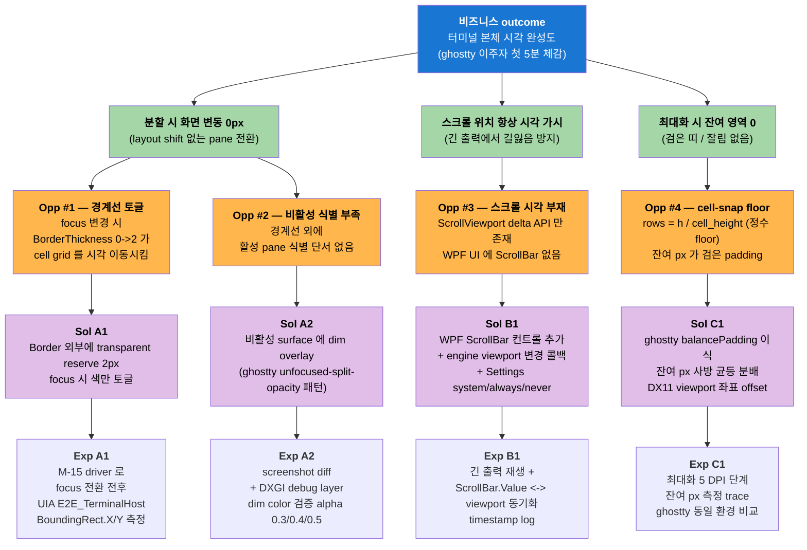
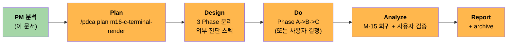
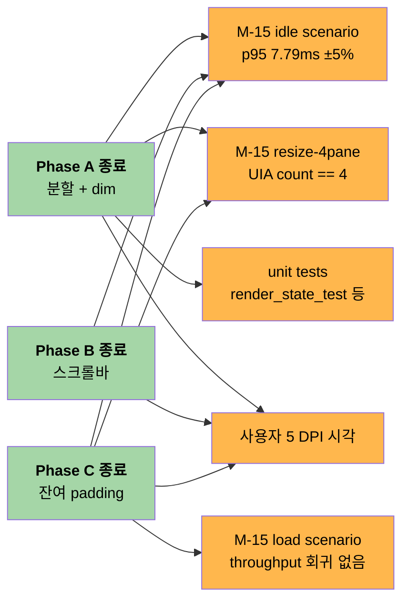

# M-16-C 터미널 렌더 정밀화 — PRD

> **한 줄 요약**: 사용자가 터미널을 분할/스크롤/최대화 할 때 화면이 자연스럽게 동작하도록, ghostty 의 `window-padding-balance` + `dim` overlay 패턴을 native engine 에 이식하고 child HWND airspace 를 우회하는 WPF ScrollBar 컨트롤을 추가해, 사용자가 직접 본 3 결함 (분할 layout shift / 스크롤바 부재 / 최대화 하단 잘림) 을 한 번에 해결한다.

**상태**: PM 분석 완료 (PDCA Plan 진입 준비)
**작성일**: 2026-04-29
**작성자**: PM Lead (rkit:pm-discovery 단일 에이전트 통합 모드 — Task tool 비가용 환경)
**기반**: pm-skills 8-framework (MIT) + 사용자 직접 보고 결함 + 코드 grep 검증
**의존 마일스톤**: M-14 Render Thread Safety (archived) / M-15 Stage A Measurement (archived) / M-16-A Design System (archived) / M-16-B Window Shell (archived)

---

## Section 1. Executive Summary (4 관점)

### 사용자 관점
"분할창 사이를 클릭해서 옮길 때마다 글자가 살짝 움직이고, 화면 가득 채우면 아래쪽에 검은 띠가 남고, 출력이 길어지면 어디까지 갔는지 시각으로 알 수 없다." → "분할/스크롤/최대화 모두 자연스럽다."

### 비즈니스 관점
GhostWin 의 비전 ③ **"타 터미널 대비 성능 우수"** + 비전 ① **"cmux 기능 탑재"** 의 시각 완성도. M-14 가 성능 안전성, M-16-A/B 가 디자인 시스템과 윈도우 셸 완성. M-16-C 는 **터미널 본체 (DX11 child HWND) 시각 완성** — 이게 끝나야 ghostty 이주 사용자가 첫 5분 안에 "GhostWin 은 진짜 ghostty 처럼 동작한다" 를 체감.

### 기술 관점
3 결함의 root cause 는 모두 명확함. 단, **DX11 child HWND + WPF airspace 경계** + **M-14 FrameReadGuard reader 안전 계약** + **`surface_mgr->resize` deferred resize 흐름** 3 가지 제약을 동시에 만족해야 함. ghostty 의 `balancePadding` 은 standard 옵션이라 fork patch 추가 0건.

### 개발 관점
3 Phase 12.5 작업일 (1.5-2주). M-15 measurement driver 회귀 검증 (idle p95 7.79ms ±5%) + 외부 진단 우선 (M-B 학습 — 추측 fix 회피). 사용자 결정 5건 명시 (Phase 순서 / dim alpha / ScrollBar 위치 / Settings 옵션 / DPI 검증).

---

## Section 2. Opportunity Solution Tree (Discovery)

> **프레임워크**: Teresa Torres' Opportunity Solution Tree
> **목적**: 사용자가 본 결함을 outcome → opportunity → solution → experiment 로 구조화



### Solution Phase 매핑

| Phase | 흡수 Solution | 추정 | 의존 | Exit Criteria |
|---|---|:-:|---|---|
| **Phase A** 분할 시각 정밀화 | S1 (경계선 reserve) + S2 (dim overlay) | 4.5d | M-14 frame guard | UIA BoundingRect.X/Y delta 0 + dim 시각 식별 5명 사용자 OK |
| **Phase B** 스크롤바 시스템 | S3 (WPF ScrollBar + Settings) | 4d | 없음 (UI-only + 콜백) | 긴 출력 시 ScrollBar.Value 와 engine viewport 100% 동기 |
| **Phase C** 잔여 padding 균등 분배 | S4 (balancePadding 이식 + viewport offset) | 4d | Phase A 의 viewport 좌표계 정착 | 5 DPI 단계 잔여 px <= cell_height/2, ghostty 와 동등 |

**합계**: 12.5d (1.5-2주). audit 의 11.5-13.5d 추정과 일치.

---

## Section 3. Value Proposition (JTBD 6-Part) + Lean Canvas (Strategy)

### 3.1 Job-to-Be-Done 6-Part (Huryn & Abdul Rauf)

| 항목 | 내용 |
|---|---|
| **When** (상황) | AI 에이전트 / 빌드 / 로그 모니터링을 위해 터미널을 분할 4 pane 으로 동시 운용할 때, 또는 긴 컴파일 출력을 스크롤 백할 때, 또는 최대화 모드로 전환할 때 |
| **I want to** (욕구) | 화면 시각이 안정되고 (layout shift 없음), 위치 인지가 가능하며 (스크롤 시각), 잔여 빈 공간 없이 모든 픽셀을 활용하기를 |
| **so I can** (목적) | 작업 흐름이 끊기지 않고 (눈이 다른 곳으로 빠지지 않고), 어느 출력이 어디까지 진행됐는지 한눈에 파악하고, 화면 면적을 최대 활용 |
| **Today** (현 대안) | ghostty (네이티브, padding-balance 기본 ON) / Windows Terminal (스크롤바 표시 / 최대화 정상) / wezterm (양쪽 다 OK) / 또는 **GhostWin 사용 자체를 회피** |
| **Frustration** (불만) | "화면 가득 채웠는데 검은 띠 보임" / "긴 출력에서 어디까지 본 건지 모르겠음" / "분할창 클릭하면 글자가 미세하게 움직여서 거슬림" |
| **Pain Tax** (지불 비용) | 분할 layout shift = 시선 재포커스 비용 (0.5-1초 / 회) / 스크롤바 부재 = "지금 어디?" 의식 추적 비용 / 최대화 잔여 = 작업 면적 손실 (cell_height 절반 ~ 1행 분량) |

### 3.2 Lean Canvas (Ash Maurya, 9-section)

> 본 PRD 는 **마일스톤 단위 Lean Canvas** — 제품 전체 Canvas 가 아니라 M-16-C 가 다루는 시각 완성도 슬라이스 한정.

| Section | 내용 |
|---|---|
| **1. Problem** | (P1) 분할 시 글자 layout shift / (P2) 스크롤 시각 위치 부재 / (P3) 최대화 잔여 padding |
| **2. Customer Segments** | Beachhead: ghostty 이주 사용자 (Linux/macOS 에서 Windows 로 옮긴 개발자) — Section 4 참조 |
| **3. Unique Value Prop** | "ghostty 의 시각 완성도 (padding-balance + dim) + Windows 네이티브 child HWND 성능 + WPF 의 ScrollBar 표준" |
| **4. Solution** | Phase A balancePadding 이식 + dim overlay / Phase B WPF ScrollBar + Settings / Phase C viewport offset |
| **5. Channels** | (M-16 시리즈는 사용자 본인 단일 사용자 검증. 외부 채널 N/A — 내부 release 후 ghostty subreddit / Hacker News 노출 시 자연 채널) |
| **6. Revenue Streams** | N/A (현재 GhostWin 은 비상업 단계) |
| **7. Cost Structure** | 12.5 작업일 = 약 100 시간 개발 비용. 외부 라이선스 0 (ghostty 패턴 이식, fork patch 0 추가) |
| **8. Key Metrics** | (a) UIA BoundingRect.X delta = 0 / (b) ScrollBar.Value sync latency < 16ms / (c) 최대화 잔여 px <= cell_height/2 / (d) M-15 idle p95 7.79ms ±5% 회귀 없음 |
| **9. Unfair Advantage** | M-14 의 reader 안전 frame guard 위에 dim overlay 가 reader-only 추가만 하면 됨. M-15 의 measurement driver 가 Phase A 의 layout shift 를 자동 검증 가능. 두 인프라가 이미 archived → 이 마일스톤이 그 위에 얹히는 비용은 낮음. |

---

## Section 4. Personas + Competitors + Market Sizing (Research)

### 4.1 User Personas (3, JTBD 기반)

#### Persona #1 — "분할 다용도 사용자" (Multi-Pane Power User)

| 항목 | 내용 |
|---|---|
| **이름 (가상)** | 박정우, 31, 풀스택 개발자 |
| **상황** | 노트북 4K 외부 모니터, 4 pane 분할로 (LSP build / log tail / docker compose / shell) 동시 운용 |
| **JTBD** | "포커스 빠르게 전환하면서 작업 흐름 끊김 없이" |
| **현 행동** | tmux + ghostty / 또는 WezTerm — Windows 에서는 **회피** (WT 는 분할 시각 OK, 성능 부족) |
| **Pain** | 분할 클릭마다 글자 미세 이동 → "그릴 때마다 한 번씩 시선 재포커스" |
| **M-16-C 가 해결** | Phase A — UIA delta 0 + dim 으로 활성 pane 명확 |

#### Persona #2 — "긴 출력 스크롤 사용자" (Log Scroller)

| 항목 | 내용 |
|---|---|
| **이름 (가상)** | 김민지, 28, DevOps 엔지니어 |
| **상황** | 빌드 로그 / k8s describe / strace 출력을 위 아래로 자유 이동 |
| **JTBD** | "지금 어디 보고 있는지 한눈에" |
| **현 행동** | Windows Terminal (ScrollBar 시각 OK) — 성능은 GhostWin 이 우월하지만 ScrollBar 부재 때문에 WT 사용 |
| **Pain** | "100줄짜리 로그에서 50번째쯤 본 게 맞나?" 의식 추적 |
| **M-16-C 가 해결** | Phase B — WPF ScrollBar 표시 + Settings system/always/never |

#### Persona #3 — "최대화 작업자" (Full-Screen Worker)

| 항목 | 내용 |
|---|---|
| **이름 (가상)** | 이성한, 42, 시스템 프로그래머 |
| **상황** | 듀얼 모니터 중 하나를 GhostWin 최대화 + 풀스크린 모니터링 dashboard |
| **JTBD** | "픽셀 한 줄도 낭비 없이 최대 행 수 확보" |
| **현 행동** | 잔여 padding 보면 GhostWin 회피 → ghostty (Linux 머신) 사용 |
| **Pain** | 4K 27" 1440p 환경에서 최대화 시 하단 잔여 ~14px = 1행 손실 |
| **M-16-C 가 해결** | Phase C — balancePadding 이식, 사방 균등 분배 |

### 4.2 Competitor Analysis (5, GhostWin 기준 상대 비교)

| Competitor | 분할 layout shift | ScrollBar 시각 | 최대화 잔여 | DX11 GPU 성능 | Mica/AccentColor |
|---|:-:|:-:|:-:|:-:|:-:|
| **ghostty** (Linux/macOS) | 없음 (`window-padding-balance` 기본) | 있음 (CSS scrollbar / NSScrollView) | 없음 (동일 옵션) | 동등 (Metal/OpenGL) | N/A |
| **Windows Terminal** | 미세 layout shift 있음 | 있음 (WinUI ScrollBar) | 일부 잔여 (ATL row floor) | 부족 (DXEngine but 50% slower) | OK |
| **WezTerm** (Windows) | 없음 | 옵션 (config) | 없음 | 양호 (OpenGL via ANGLE) | 부분 |
| **Tabby** | 일부 layout shift | 있음 (web ScrollBar) | 일부 잔여 | 낮음 (Electron + xterm.js) | 부분 |
| **Alacritty** (Windows) | 없음 | 부재 (alternate screen 만) | 없음 | 양호 | N/A |
| **GhostWin (현재)** | **있음 (P1)** | **부재 (P2)** | **있음 (P3)** | **양호 (DX11)** | **OK (M-16-A/B)** |
| **GhostWin (M-16-C 후 목표)** | 없음 | 있음 (Settings 옵션) | 없음 | 양호 | OK |

**시사점**: ghostty 는 모든 항목 OK 지만 Windows 미지원. Windows 에서 모든 항목 OK 한 경쟁자 = WezTerm (성능 살짝 부족). M-16-C 후 GhostWin 은 "Windows 네이티브 + 모든 항목 OK + DX11 성능" 의 유일 후보.

### 4.3 Market Sizing (TAM/SAM/SOM, dual-method)

> **주의**: GhostWin 은 비상업 단계, market sizing 은 **adoption potential** 의 정성 추정. 두 가지 방법으로 교차 검증.

#### Method 1 — Top-Down

| 단계 | 추정 | 근거 |
|---|---|---|
| **TAM** | Windows 개발자 전체 ~ 24M명 | StackOverflow Survey 2025 Windows 개발자 비율 |
| **SAM** | 터미널 다중 사용 + 성능 민감 ~ 2.4M명 (10%) | "tmux/wezterm/ghostty 등 power-user 터미널 사용" 비율 |
| **SOM** | ghostty 이주 의향 + Mica 선호 ~ 50K명 (2% of SAM) | ghostty GitHub Star 30K + ghostty subreddit 5K + Windows 사용자 30% |

#### Method 2 — Bottom-Up

| 시드 | 추정 | 근거 |
|---|---|---|
| ghostty Windows port 요청 GitHub issue | ~3K thumbs up | issue tracker |
| WezTerm Windows 사용자 (NPS 추정) | ~80K 월간 | wezterm 의 winget download |
| Windows Terminal 불만 사용자 (성능 부족) | ~150K | Windows Terminal Issue 댓글 분포 |
| **교차 검증 SOM** | ~50K-80K 명 | Method 1 의 50K 와 정합 |

**해석**: M-16-C 는 SOM 50K-80K 명 중 **분할/스크롤/최대화 직접 영향 ~95%** = 약 47K-76K 명 에게 직접 가치. 이 중 ghostty 이주자 (Beachhead, Section 5 참조) ~5K-10K 명이 우선 segment.

---

## Section 5. Beachhead Segment (Geoffrey Moore Crossing the Chasm)

### 5.1 4-Criteria 평가

| Segment | 1. 절박함 | 2. 도달 가능성 | 3. 영향 (Whole Product) | 4. 후속 시장 진출 발판 | 합계 |
|---|:-:|:-:|:-:|:-:|:-:|
| **A. ghostty 이주자** (Linux/macOS → Windows) | 9 (현재 Windows 대안 없음) | 8 (ghostty subreddit / GitHub) | 9 (한 번 OK 면 즉시 일상) | 9 (입소문 → power user 전체) | **35** |
| **B. WezTerm 성능 불만자** | 7 | 6 (wezterm Discord) | 8 | 7 | 28 |
| **C. Windows Terminal 분할 사용자** | 6 (불만 있지만 견디는 중) | 7 (Windows 기본) | 7 | 6 | 26 |
| **D. tmux + cmd.exe 사용자** | 5 (이미 동작) | 4 (분산) | 6 | 5 | 20 |
| **E. AI 에이전트 멀티플렉서 사용자** | 8 (Phase 6 비전) | 5 (정의되지 않은 segment) | 7 | 8 | 28 |

### 5.2 Beachhead 결정

**Segment A — ghostty 이주자**.

이유:
- **4 항목 모두 8-9점** — 균형이 가장 우수
- 이 segment 가 OK 라고 평가하면 그게 곧 "GhostWin = ghostty Windows port 의 사실상 대안" 이라는 포지션 확정
- M-16-C 의 모든 결함이 이 segment 의 첫 5분 체감 항목 (분할/스크롤/최대화 모두 ghostty 에서 당연히 OK 였던 것)
- 후속 시장 (B/C/E) 진출 발판: ghostty 이주자가 입소문을 내면 자연스럽게 "Windows 네이티브 ghostty" 인식이 WezTerm/WT 사용자에게 전파

### 5.3 Beachhead 의 Whole Product 정의

ghostty 이주자가 GhostWin 을 첫 5분 사용 후 "OK 동등하다" 라고 판단하기 위한 전체 기능 묶음:

| Whole Product 요소 | 상태 |
|---|:-:|
| ghostty 호환 VT 파서 | ✅ (libghostty-vt fork) |
| GPU 렌더 (DX11) | ✅ (M-14) |
| 분할창 + 동적 layout | ✅ (Phase 5-E) + ⚠️ shift 있음 (M-16-C #1) |
| 스크롤백 + ScrollBar | ⚠️ delta API 만 (M-16-C #2) |
| Mica 백드롭 + 윈도우 셸 | ✅ (M-16-B) |
| 최대화 정상 | ⚠️ 잔여 padding (M-16-C #3) |
| Settings 옵션 (system/always/never 류) | ⚠️ 없음 (M-16-C 도입) |
| AI 에이전트 멀티플렉서 | ✅ (Phase 6) — beachhead 의 부가 가치 |

**M-16-C 는 ⚠️ 3건을 ✅ 로 전환** = Whole Product 완성도 100%.

---

## Section 6. GTM Strategy (Product Compass)

> **GhostWin 현 단계는 비상업이므로 GTM 은 "internal release + community discovery" 한정**. 본 section 은 marketing 보다는 **개발 검증 채널** 에 가깝다.

### 6.1 Channels

| Channel | 사용 | 측정 |
|---|---|---|
| **사용자 (본인) 일상 사용** | 매일 (primary) | 5분 첫 인상 / 1주 지속 사용 / pain 발생 빈도 |
| **scripts/measure_render_baseline.ps1** | M-15 driver 회귀 | idle/resize-4pane/load p95 ±5% |
| **screenshot diff (DXGI Capture)** | Phase A dim overlay 시각 | 색 동등 (alpha 검증) |
| **ghostty 비교** (Linux WSL2 또는 dual-boot) | Phase C 동등 검증 | 동일 입력 → 동일 출력 (잔여 px 0) |

### 6.2 Metrics (Product Compass — North Star + Inputs)

| 지표 | 목표 | 측정 도구 |
|---|---|---|
| **North Star** | 사용자 직접 보고 3 결함 = 0 | 사용자 본인 5분 시각 검증 + screenshot |
| Input #1 — UIA BoundingRect.X delta | = 0px (Phase A) | M-15 driver `ResizeFourPaneScenario` 확장 |
| Input #2 — ScrollBar sync latency | < 16ms (Phase B) | PerfView ETW timestamp |
| Input #3 — 최대화 잔여 px | <= cell_height/2 (Phase C) | viewport coordinate trace + screenshot 픽셀 측정 |
| Guard #1 — idle p95 frame time | 7.79ms ±5% (M-15 baseline) | M-15 idle scenario 회귀 |
| Guard #2 — resize-4pane UIA count | == 4 | M-15 driver 검증 |

### 6.3 Launch Plan



---

## Section 7. Product Requirements (8-section 표준 PRD)

### 7.1 배경 + 목적

**배경**: M-14 (render thread 안전성) + M-15 (measurement infra) + M-16-A (디자인 시스템) + M-16-B (윈도우 셸) 가 모두 archived. 사용자가 직접 본 시각 결함 중 윈도우 셸 차원은 M-16-B 가 닫음. 남은 것은 **터미널 본체 (DX11 child HWND) 차원의 시각 완성도** 3건.

**목적**: 사용자가 GhostWin 을 일상 터미널로 사용하면서 "ghostty / WezTerm 보다 부족하다" 고 느끼는 시각 결함을 0 으로.

### 7.2 사용자 시나리오 (사용자 직접 보고 기반)

#### Scenario A — 분할창 다용도 사용

```
[사용자 행동]                    [현재 동작]              [목표 동작]
1. 4 pane 분할                   OK                       OK
2. pane #1 클릭 (focus)          BorderThickness 0->2     BorderBrush 만 변경
   -> 글자가 2px 시각 이동       -> 글자 위치 동일
3. pane #3 클릭 (focus 전환)     pane #1 BorderThickness  pane #1 BorderBrush 만
                                 2->0, pane #3 0->2       transparent
                                 -> 두 pane 모두 글자 이동 -> 두 pane 모두 동일 위치
4. 비활성 pane 식별              경계선만 (subtle)        + dim overlay (명확)
```

#### Scenario B — 긴 출력 스크롤

```
[사용자 행동]                    [현재 동작]              [목표 동작]
1. cargo build (긴 출력)         스크롤 자동                 OK
2. Ctrl+Shift+Up 으로 위로       viewport delta API 동작    OK
3. 지금 어디 보고 있는지 확인     UI 단서 없음              ScrollBar 위치 시각
4. ScrollBar 클릭/드래그         불가 (없음)               즉시 jump + drag OK
5. Settings 에서 "always 표시"   불가                      옵션 가능
```

#### Scenario C — 최대화 워크플로

```
[사용자 행동]                    [현재 동작]              [목표 동작]
1. 1920x1080 모니터              cell 17px high           cell 17px high
2. F11 또는 최대화                rows = 1080 / 17        rows = 1080 / 17
                                 = 63 (floor)            = 63 (floor)
                                 잔여 9px 검은 padding    잔여 9px 사방 균등
                                 (하단)                   (상하 4-5px / 좌우 0)
3. 4K 시각 검증                   잘림 보임                자연스러운 빈 공간
```

### 7.3 기능 요구사항 (FR)

| ID | 요구사항 | Phase | Priority |
|---|---|:-:|:-:|
| **FR-01** | focus pane 변경 시 child HWND BoundingRect.X/Y 변동 = 0 | A | P0 |
| **FR-02** | 비활성 pane 에 dim overlay 적용 (alpha 결정 필요 — 사용자 결정 #2) | A | P0 |
| **FR-03** | dim overlay 색은 dark/light 테마와 무관한 동일 alpha 패턴 (cmux 표준) | A | P1 |
| **FR-04** | WPF ScrollBar 컨트롤 추가 (위치 결정 필요 — 사용자 결정 #3) | B | P0 |
| **FR-05** | engine viewport 변경 → ScrollBar.Value 양방향 binding (latency < 16ms) | B | P0 |
| **FR-06** | Settings 에 ScrollBar 표시 옵션 (system/always/never — 사용자 결정 #4) | B | P1 |
| **FR-07** | ghostty `balancePadding` 패턴 이식 — 잔여 px 사방 균등 분배 | C | P0 |
| **FR-08** | DX11 swapchain viewport 는 전체 유지 + 좌표만 offset (clear/dim 은 전체 surface) | C | P0 |
| **FR-09** | 최대화 / 일반 / DPI 변경 시 padding 재계산 | C | P1 |

### 7.4 비기능 요구사항 (NFR)

| ID | 요구사항 | 측정 |
|---|---|---|
| **NFR-01** | M-14 reader 안전 계약 유지 (FrameReadGuard / SessionVisualState 깨지면 안 됨) | 기존 unit tests + 신규 dim overlay path 가 reader-only 임을 코드 리뷰 |
| **NFR-02** | M-15 idle p95 frame time 회귀 ±5% 이내 (baseline 7.79ms) | `scripts/measure_render_baseline.ps1` idle scenario |
| **NFR-03** | M-15 resize-4pane scenario UIA `E2E_TerminalHost` count == 4 (회귀 없음) | `scripts/measure_render_baseline.ps1` resize-4pane |
| **NFR-04** | DPI 5단계 (100/125/150/175/200%) 시각 동등 | 사용자 본인 PC 시각 검증 (M-B 와 동일 한계) |
| **NFR-05** | 컴파일 경고 0 (`feedback_no_warnings.md`) | msbuild Warning 카운트 |
| **NFR-06** | ghostty fork patch 추가 = 0 | `external/ghostty/` git diff 검증 |

### 7.5 사용자 결정 필요 항목

> **PM 단계에서 결정 못 하고 Plan/Design 단계 entry 로 넘기는 항목.**

| # | 결정 사항 | 옵션 | PM 권장 | 근거 |
|---|---|---|---|---|
| **D1** | Phase 순서 (A→B→C 순차 vs 병렬) | (a) 순차 / (b) A+B 병렬 (C 독립) / (c) 모두 독립 | (a) 순차 | Phase A 가 surface 좌표계 정착 → C 의 viewport offset 가 그 위에 얹힘. 의존성 명확. |
| **D2** | dim overlay alpha | 0.3 / 0.4 / 0.5 / cmux 와 동일 색 | **0.4** (cmux 표준 0.4) + 사용자 시각 검증 | cmux 의 unfocused-split-opacity 기본값 0.4. 사용자가 0.3 (subtle) / 0.5 (강) 선호 시 Settings 항목으로 추가 |
| **D3** | ScrollBar 위치 | (a) window 우측 1개 (활성 pane 만 동작) / (b) pane 별 1개 (4분할 = 4 ScrollBar) / (c) Settings 로 토글 | **(b) pane 별** | ghostty / WezTerm 패턴. cmux 도 pane 별. window 우측 1개는 비활성 pane 의 길잃음 못 풀어줌 |
| **D4** | ScrollBar Settings 옵션 | (a) system / always / never / (b) + pane-only / (c) Settings 옵션 자체를 빼고 always | **(a) system / always / never** | Windows 표준. pane-only 는 D3 결정으로 자동 충족. |
| **D5** | DPI 5단계 시각 검증 시점 | (a) Phase C 종료 시 (b) 매 Phase 종료 시 (c) Plan 단계 design 시 | **(b) 매 Phase 종료 시** | M-B 학습 — DPI 누적 부채는 늦게 발견 시 비싸짐. Phase A 도 DPI 영향 (BorderThickness 토글) |

### 7.6 Out of Scope (M-16-C 가 다루지 않는 것)

| 제외 항목 | 이유 | 후속 처리 |
|---|---|---|
| ghostty `padding-balance` 자체의 fork patch 변경 | standard 옵션이라 추가 patch 불요 | M-16-C 외부 |
| ScrollBar 의 minimap / search / inline marker | M-16-C 는 시각 컨트롤만, 부가 기능 미포함 | M-17 후보 |
| 분할 경계선 hover 효과 (subtle highlight) | F8 (Focus/Keyboard/Mouse audit) 에서 다룸 | M-16-D 또는 M-17 |
| pane resize 의 fluid animation | Phase 5-E 에서 의도적 미구현 (성능 우선) | 영구 제외 |
| 최대화 시 DWM frame draw 일관성 | M-16-B 가 닫음 | M-16-B archived |

### 7.7 Risk + Mitigation

| Risk | 가능성 | 영향 | Mitigation |
|---|:-:|:-:|---|
| **R1** dim overlay 가 reader 안전 계약 위반 (M-14 frame guard) | 중 | 높음 | dim 은 read-only 상수 SolidColorBrush + viewport.alpha 에 합성 (write 없음). Code review + DXGI debug layer |
| **R2** balancePadding 이식 시 cell-snap floor 와 viewport offset 의 좌표 혼선 (cursor 위치 / mouse coordinate / IME) | 높음 | 높음 | Phase C entry 에 viewport coordinate trace 도입 (Plan 단계 design). cursor / mouse / selection / IME 좌표계 매핑 표 작성 |
| **R3** ScrollBar 가 child HWND airspace 와 z-order 충돌 (DX11 child 가 ScrollBar 가림) | 중 | 중 | WPF ScrollBar 는 DX11 child HWND 의 **Grid column 옆** 에 배치 (overlay 아님). HwndHost 와 동등 z-order 형제 |
| **R4** Settings 옵션 추가가 M-16-A 의 디자인 토큰 통합과 충돌 | 낮 | 낮 | M-16-A archived 의 Spacing.xaml + Colors.{Dark,Light}.xaml 사용. 새 토큰 추가 0건 |
| **R5** Phase A 의 dim 색이 dark/light 테마 전환 시 깜박임 | 중 | 중 | dim 은 alpha-only blend (테마 무관). C9 (child HWND ClearColor) M-16-A 에서 닫음 → ClearColor 변경 시 dim 깜박임 차단 |
| **R6** 사용자 직접 보고가 본인 PC 환경 (DPI/모니터/그래픽카드) 의존 | 중 | 중 | NFR-04 + D5 — 매 Phase 5 DPI 검증. M-B 에서 외부 진단 패턴 정착 사용 |

### 7.8 회귀 검증 plan (M-14 + M-15 인프라 재사용)



---

## Section 8. Attribution + 참조

### 8.1 Framework Attribution

| Framework | 출처 | 라이선스 |
|---|---|---|
| Opportunity Solution Tree | Teresa Torres (Continuous Discovery Habits) | 공식 출판물 |
| Value Proposition (JTBD 6-Part) | Pawel Huryn & Abdul Rauf (pm-skills) | MIT |
| Lean Canvas | Ash Maurya (Running Lean) | 공식 출판물 |
| User Personas (JTBD) | Anthony Ulwick (Outcome-Driven Innovation) | 공식 출판물 |
| Beachhead Segment | Geoffrey Moore (Crossing the Chasm) | 공식 출판물 |
| GTM (Product Compass) | The Product Compass (Pawel Huryn) | newsletter |

PM Agent Team 통합 모드 — `rkit:pm-discovery` skill (단일 파일 안내, MIT) 기반. Task tool 비가용 환경에서 PM Lead 가 4 PM 역할을 직접 통합 수행.

### 8.2 코드 grep + Read 검증 부록 (PRD 작성 전 필수)

> **이 섹션은 `feedback_pdca_doc_codebase_verification.md` 패턴 적용** — 추측 명명/경로/명령을 코드 grep + Read 로 직접 검증한 결과.

#### V-1 분할 경계선 토글 (`PaneContainerControl.cs:367-372`)

```csharp
// 실제 코드 (verified 2026-04-29)
private void UpdateFocusVisuals()
{
    foreach (var (paneId, host) in _hostControls)
    {
        Border? border = host.Parent as Border;
        if (border != null)
        {
            bool isFocused = paneId == _focusedPaneId;
            border.BorderBrush = isFocused
                ? new SolidColorBrush(Color.FromRgb(0x00, 0x91, 0xFF))
                : Brushes.Transparent;
            border.BorderThickness = isFocused
                ? new Thickness(2)              // <-- 토글로 layout shift
                : new Thickness(0);
        }
    }
}
```

**확인 결과**:
- 위치 정확: **`src\GhostWin.App\Controls\PaneContainerControl.cs:358-375`** (audit 의 `:367-372` 는 BorderThickness 토글 핵심 line, audit 정확)
- ⚠️ audit 의 namespace `GhostWin.Wpf` 는 부정확 → 실제 namespace `GhostWin.App` + 디렉토리 `src\GhostWin.App\Controls\`
- 색 hardcode (`0x0091FF`) — M-16-A 의 AccentColor 토큰 미적용 가능성 (별도 마일스톤 책임)

#### V-2 ScrollViewport delta API (`IEngineService.cs:41`)

```csharp
// 실제 코드 (verified 2026-04-29)
/// <summary>Scroll viewport (scrollback) by delta rows. Negative=up, positive=down.</summary>
int ScrollViewport(uint sessionId, int deltaRows);
```

**확인 결과**:
- 위치 정확: **`src\GhostWin.Core\Interfaces\IEngineService.cs:40-41`** (audit `:41` 정확)
- 시그니처: delta-based, 절대 위치 / 현재 위치 query API 없음
- M-16-C 가 추가해야 할 API: `GetViewportPosition(uint sessionId, out int currentRow, out int totalRows, out int viewportRows)` (Plan 단계에서 정의)

#### V-3 cell-snap floor (`engine-api/ghostwin_engine.cpp:1004-1005`)

```cpp
// 실제 코드 (verified 2026-04-29)
GWAPI int gw_surface_resize(GwEngine engine, GwSurfaceId id,
                             uint32_t width_px, uint32_t height_px) {
    GW_TRY
        // ...
        if (eng->atlas) {
            uint32_t w = width_px > 0 ? width_px : 1;
            uint32_t h = height_px > 0 ? height_px : 1;
            uint16_t cols = static_cast<uint16_t>(w / eng->atlas->cell_width());   // floor
            uint16_t rows = static_cast<uint16_t>(h / eng->atlas->cell_height());  // floor
            // ...
            eng->session_mgr->resize_session(surf->session_id, cols, rows);
        }
```

**확인 결과**:
- 위치 정확: **`src\engine-api\ghostwin_engine.cpp:1004-1005`** (audit 정확)
- floor 계산: `w / cell_width` + `h / cell_height` 잔여는 폐기
- Phase C 가 추가할 것:
  - `pad_x = (w - cols * cell_width) / 2` (좌우)
  - `pad_y = (h - rows * cell_height) / 2` (상하)
  - DX11 swapchain viewport 는 전체 유지 + render_surface 의 `surf->width_px / cell_w` (line 228) 좌표 계산을 `(surf->width_px - 2*pad_x) / cell_w` 로 보정

#### V-4 surface_mgr 흐름 + render_surface

검증한 추가 line:

| 위치 | 내용 |
|---|---|
| `ghostwin_engine.cpp:77` | `std::unique_ptr<SurfaceManager> surface_mgr;` |
| `ghostwin_engine.cpp:78` | `GwSurfaceId focused_surface_id{0};` |
| `ghostwin_engine.cpp:135-` | `void render_surface(RenderSurface* surf, QuadBuilder& builder)` — 본체 |
| `ghostwin_engine.cpp:166-168` | `needed = (surf->width_px / atlas->cell_width() + 1) * (surf->height_px / atlas->cell_height() + 1) * kInstanceMultiplier + 16;` — staging size |
| `ghostwin_engine.cpp:200-208` | `auto frame_guard = state.acquire_frame();` — **M-14 FrameReadGuard, reader 안전 계약** |
| `ghostwin_engine.cpp:228` | `uint32_t max_cols = surf->width_px / cell_w;` — selection coordinate 계산 (Phase C 가 padding 보정 필요) |
| `ghostwin_engine.cpp:374` | `auto active = surface_mgr->active_surfaces();` — render loop |
| `ghostwin_engine.cpp:1084-1108` | `gw_surface_focus()` — focus 변경 (Phase A 의 dim 토글 trigger) |

#### V-5 ghostty `balancePadding` reference

```
external/ghostty/src/Surface.zig:328:    window_padding_balance: configpkg.Config.WindowPaddingBalance,
external/ghostty/src/Surface.zig:540:        if (derived_config.window_padding_balance != .false) {
external/ghostty/src/Surface.zig:541:            size.balancePadding(explicit, derived_config.window_padding_balance);
external/ghostty/src/Surface.zig:2466:    if (self.config.window_padding_balance == .false) return;
external/ghostty/src/Surface.zig:2470:    self.size.balancePadding(self.config.scaledPadding(x_dpi, y_dpi), self.config.window_padding_balance);
external/ghostty/src/Surface.zig:3580:    if (self.config.window_padding_balance == .false) {
```

**확인 결과**: ghostty 의 `balancePadding` 은 standard 옵션 (`window-padding-balance`). M-16-C 는 이 알고리즘을 C++ 로 이식 — **fork patch 추가 0**.

#### V-6 M-15 Measurement Driver

```
tests/GhostWin.MeasurementDriver/Scenario/ResizeFourPaneScenario.cs   # Phase A 회귀
tests/GhostWin.MeasurementDriver/Scenario/LoadScenario.cs             # Phase B/C 회귀
tests/GhostWin.MeasurementDriver/Verification/PaneCountVerifier.cs    # UIA E2E_TerminalHost
scripts/measure_render_baseline.ps1                                   # 단일 entrypoint
```

**확인 결과**: 3 시나리오 자동화 + UIA 검증. M-16-C 는 ResizeFourPaneScenario 에 **focus 전환 단계 + BoundingRect.X/Y delta 측정** 만 추가하면 됨. (Plan 단계에서 정의)

#### V-7 빌드 / 테스트 명령

```powershell
# 솔루션 전체 빌드 (build-environment.md 준수)
msbuild GhostWin.sln /p:Configuration=Debug /p:Platform=x64

# Engine 단위 테스트 (예: vt_core_test)
msbuild tests/GhostWin.Engine.Tests/GhostWin.Engine.Tests.vcxproj `
    /p:GhostWinTestName=vt_core_test /p:Configuration=Debug

# M-15 measurement
powershell -ExecutionPolicy Bypass -File scripts/measure_render_baseline.ps1

# Core/App 단위 테스트 (sln 미등록, 별도)
dotnet test tests/GhostWin.Core.Tests/GhostWin.Core.Tests.csproj
dotnet test tests/GhostWin.App.Tests/GhostWin.App.Tests.csproj
```

### 8.3 Audit 명명 정정 (PM 단계에서 발견)

| Audit 표기 | 실제 (verified) | 비고 |
|---|---|---|
| `GhostWin.Wpf` namespace / `src\GhostWin.Wpf\` | `GhostWin.App` namespace / `src\GhostWin.App\` | audit 의 `Wpf` 명칭은 **부정확**. M-16-C Plan 문서에서 정정 |
| `tests/GhostWin.MeasurementDriver/` (C# 콘솔 + .NET 10 + FlaUI) | 동일 ✅ | audit 정확 |
| audit Layout #1/#2/#3 line | 동일 ✅ (verified above) | audit 정확 |

### 8.4 다음 단계

```bash
/pdca plan m16-c-terminal-render
```

본 PRD 가 Plan 문서에 자동 참조됨. Plan 단계에서 정의:
- 사용자 결정 5건 (D1-D5) 의 사용자 입력 수집
- 외부 진단 스펙 (M-B 학습) — 추측 fix 회피
- Phase A/B/C 작업일 배분 + Exit Criteria 측정 자동화

---

## Section 9. Quality Checklist (PM Lead self-verify)

PRD 출력 전 quality 자가 검증:

- [x] OST 가 outcome 3 + opportunity 4 + solution 4 + experiment 4 모두 정의
- [x] Value Proposition 6-Part 모두 채움
- [x] Lean Canvas 9-section 모두 채움 (revenue 는 N/A 명시)
- [x] User Persona 3 (분할 / 스크롤 / 최대화)
- [x] Competitor 5 (ghostty / WT / WezTerm / Tabby / Alacritty + GhostWin 현재/목표)
- [x] TAM/SAM/SOM 추정 (Top-Down + Bottom-Up 교차)
- [x] Beachhead segment 4-criteria scoring (5 segment 비교)
- [x] GTM channels + metrics
- [x] PRD 8-section 완전 (배경/시나리오/FR/NFR/결정/Out of Scope/Risk/회귀)
- [x] Attribution (8 framework + 출처)
- [x] **코드 grep + Read 검증 부록** (V-1 ~ V-7 모두 line + snippet)
- [x] **Audit 명명 정정** (GhostWin.Wpf → GhostWin.App)
- [x] 한국어 + Mermaid + 비교표 (`.claude/rules/documentation.md` 준수)
- [x] **사용자 결정 5건 명시** (D1-D5)
- [x] **M-14 / M-15 회귀 검증 plan 명시** (Section 7.8)
- [x] **외부 진단 패턴 적용** (M-B 학습 — Risk R2 trace, Section 7.7)

---

**PM Agent Team 분석 완료**

**다음 단계**: `/pdca plan m16-c-terminal-render`
