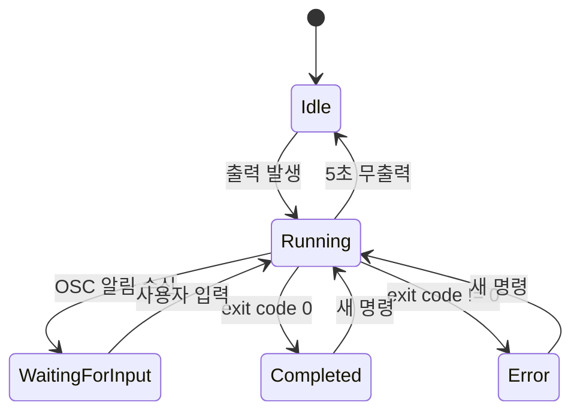

# Plan — Phase 6-B: 알림 인프라 (Notification Infrastructure)

> **문서 종류**: Plan
> **작성일**: 2026-04-16
> **PRD 참조**: `docs/00-pm/phase-6-b-notification-infra.prd.md`
> **선행 완료**: Phase 6-A OSC Hook + 알림 링 (커밋 `826768e`, 93% Match Rate)
> **비전 축**: ② AI 에이전트 멀티플렉서

---

## Executive Summary

| 관점 | 내용 |
|------|------|
| **Problem** | Phase 6-A에서 amber dot + Toast가 동작하지만, 3개 이상 탭 병렬 운영 시 알림 히스토리 추적 불가. 놓친 알림으로 에이전트가 수분~수십분 유휴 상태 방치됨 |
| **Solution** | 알림 패널(인메모리 히스토리 + WPF Popup) + 에이전트 상태 배지(5-state enum) + Toast 클릭 액션으로 "알림 → 인지 → 탭 전환" 전체 루프 완성 |
| **Function / UX Effect** | `Ctrl+Shift+I` 알림 패널 토글 → 시간순 알림 목록 → 클릭으로 해당 탭 즉시 전환. `Ctrl+Shift+U` 미읽음 즉시 점프. 사이드바에 상태 배지(Idle/Running/Waiting/Error/Completed). Toast 클릭 시 GhostWin 활성화 + 해당 탭 전환 |
| **Core Value** | 비전 ② AI 에이전트 멀티플렉서의 **운영 인프라 완성**. Phase 6-A(신호 캡처) → Phase 6-B(신호 관리+추적)으로 확장하여 5~10개 에이전트 동시 운영을 실용적으로 만듦 |

---

## 1. 현재 상태 (Phase 6-A 기반)

### 1.1 이미 있는 것

```
ghostty libvt OSC 9/99/777 파싱
  ↓ C++ VtDesktopNotifyFn 콜백
  ↓ C# NativeCallbacks.OnOscNotify (Dispatcher.BeginInvoke)
  ↓ IOscNotificationService.HandleOscEvent()
  ├── SessionInfo.NeedsAttention = true
  ├── WorkspaceInfo.NeedsAttention = true (계층 전파)
  ├── WeakReferenceMessenger.Send(OscNotificationMessage)
  │   └── App.xaml.cs → Toast 발사 (창 비활성 시)
  └── WPF Ellipse amber dot 점등 (DataTrigger 바인딩)
```

### 1.2 Phase 6-B에서 추가할 것

```
IOscNotificationService.HandleOscEvent()
  ├── (기존) SessionInfo/WorkspaceInfo 상태 갱신
  ├── (기존) Messenger → Toast
  ├── ★ NEW: NotificationHistory에 항목 추가 (인메모리 100건)
  └── ★ NEW: AgentState 전환 (Running → WaitingForInput)

알림 패널 (WPF Popup)
  ├── ★ NEW: 알림 히스토리 ListBox (시간순)
  ├── ★ NEW: 클릭 → 해당 탭 전환 + 읽음 처리
  └── ★ NEW: Ctrl+Shift+U → 미읽음 즉시 점프

사이드바 배지
  └── ★ NEW: AgentState enum → 아이콘/색상 배지

Toast 클릭 액션
  └── ★ NEW: OnActivated → 창 복원 + 탭 전환
```

---

## 2. 기능 요구사항 상세

### FR-01: 알림 패널 (Notification Panel)

**핵심 아이디어**: 모든 세션의 알림을 시간순 리스트로 보여주고, 클릭 한 번으로 해당 탭 전환.

#### 2.1.1 데이터 모델

```csharp
// 알림 히스토리 항목 — OscNotificationMessage 확장
public record NotificationEntry(
    uint SessionId,
    string SessionTitle,
    string Title,
    string Body,
    DateTimeOffset ReceivedAt,
    bool IsRead);
```

- `OscNotificationService.HandleOscEvent()` 호출 시 `NotificationEntry` 생성 → 컬렉션 앞에 추가
- 최대 100건 유지 (FIFO, `ObservableCollection` 사용)
- `IsRead = false` 초기값

#### 2.1.2 UI 위치 및 레이아웃

```
┌──────────────────────────────────────────────────┐
│ 사이드바          │ 알림 패널 (280px)  │ 터미널    │
│ ┌──────────┐     │ ┌───────────────┐  │           │
│ │ WS 1     │     │ │ 14:32 WS-2   │  │           │
│ │ WS 2  🔵 │     │ │ Claude 대기중 │  │           │
│ │ WS 3  ⚡ │     │ ├───────────────┤  │           │
│ │ + 추가   │     │ │ 14:28 WS-1   │  │           │
│ └──────────┘     │ │ 작업 완료     │  │           │
│                  │ ├───────────────┤  │           │
│                  │ │  모두 읽음     │  │           │
│                  │ └───────────────┘  │           │
└──────────────────────────────────────────────────┘
```

- **위치**: 사이드바와 터미널 사이에 슬라이드인 패널 (Grid Column 삽입)
- **대안 검토**: WPF Popup → Airspace 충돌 위험 있음 (D3D11 SwapChain 위에 WPF 렌더링). Grid Column 방식이 안전.
- **너비**: 280px 고정, 열림/닫힘 애니메이션 (DoubleAnimation, 200ms)
- **배경**: `#1C1C1E` (사이드바보다 약간 밝은 어두운 톤)

#### 2.1.3 패널 항목 UI

```
┌──────────────────────────────────────┐
│ 🔵 14:32   Workspace-2              │
│    Claude is waiting for input       │
│    ──────────────────────────        │
│ ✓  14:28   Workspace-1              │
│    Task completed successfully       │
└──────────────────────────────────────┘
```

각 항목:
- 미읽음 표시: 좌측 파란 원 (읽음 시 회색 체크)
- 시간: `HH:mm` 형식
- 세션 이름: WorkspaceInfo.Title
- 메시지: LastOscMessage (1줄, TextTrimming)
- 클릭: 해당 워크스페이스 활성화 + `IsRead = true`

#### 2.1.4 키보드 단축키

| 단축키 | 동작 | cmux 대응 |
|--------|------|-----------|
| `Ctrl+Shift+I` | 알림 패널 열기/닫기 | `⌘⇧I` |
| `Ctrl+Shift+U` | 가장 최근 미읽음 알림 탭으로 즉시 전환 | `⌘⇧U` |

#### 2.1.5 알림 억제 조건

cmux 방식 적용:
1. 알림을 보낸 세션이 현재 활성 세션이면 → 패널에 추가하되 `IsRead = true`로 설정
2. 알림 패널이 열려있는 상태에서 새 알림 → 패널에 추가하되 Toast 억제

### FR-02: 에이전트 상태 배지 (Agent Status Badge)

**핵심 아이디어**: 사이드바 각 탭에 현재 에이전트 상태를 아이콘+색상으로 표시.

#### 2.2.1 상태 모델

```csharp
public enum AgentState
{
    Idle,              // 기본 — 쉘 프롬프트 대기
    Running,           // 출력 진행 중
    WaitingForInput,   // OSC 알림 수신 (NeedsAttention=true)
    Error,             // 프로세스 비정상 종료
    Completed          // 프로세스 정상 종료
}
```

`SessionInfo`에 `AgentState` 프로퍼티 추가.

#### 2.2.2 상태 전환 다이어그램



#### 2.2.3 상태 감지 방법

| 전환 | 감지 소스 | 구현 위치 |
|------|----------|----------|
| → Running | ConPTY stdout 출력 발생 | `SessionManager` (기존 I/O 루프) |
| Running → Idle | 5초 타이머 만료 | `SessionManager` (타이머) |
| → WaitingForInput | `OscNotificationService.HandleOscEvent()` | 기존 코드 확장 |
| → Completed | `ConPtySession.ProcessExited` (exit=0) | `SessionManager` |
| → Error | `ConPtySession.ProcessExited` (exit≠0) | `SessionManager` |
| → Running (재시작) | stdin 쓰기 감지 | `SessionManager` |

**핵심 설계 결정**: Running 판정을 **stdout 출력 기반**으로 함.
- 장점: 추가 API 없이 기존 I/O 루프에서 타임스탬프만 기록
- 단점: 백그라운드 작업 중 출력 없으면 Idle로 오판 가능
- 수용 근거: OSC 기반 상태(WaitingForInput)가 가장 중요한 상태이고, Running/Idle 구분은 보조적. 오판 시 사용자 영향 최소.

#### 2.2.4 사이드바 배지 UI

```xaml
<!-- 기존 Ellipse (amber dot) 옆에 상태 배지 추가 -->
<TextBlock Text="{Binding AgentStateBadge}"
           FontSize="10" Margin="4,0,0,0"
           Foreground="{Binding AgentStateColor}"
           Visibility="{Binding ShowAgentBadge,
               Converter={StaticResource BoolToVisibility}}"/>
```

| 상태 | 텍스트 | 색상 | 표시 |
|------|--------|------|------|
| Idle | — | — | 숨김 |
| Running | `●` (채운 원) | #34C759 (초록) | 표시 |
| WaitingForInput | `●` (채운 원) | #007AFF (파란) | 표시 |
| Error | `✕` | #FF3B30 (빨간) | 표시 |
| Completed | `✓` | #8E8E93 (회색) | 표시 |

**NeedsAttention과 AgentState 관계**:
- `AgentState == WaitingForInput` ↔ `NeedsAttention == true` (동기화)
- amber dot은 NeedsAttention 바인딩 유지 (기존 동작 보존)
- 상태 배지는 AgentState 바인딩 (새 기능)

### FR-03: Toast 클릭 액션 (Toast Click-to-Switch)

**핵심 아이디어**: Toast 클릭 → GhostWin 창 활성화 + 해당 탭 전환.

#### 2.3.1 Toast 생성 변경

```csharp
// 현재 (Phase 6-A)
new ToastContentBuilder()
    .AddText(msg.Title ?? "GhostWin")
    .AddText(msg.Body ?? msg.Title)
    .Show();

// Phase 6-B: sessionId 인자 추가
new ToastContentBuilder()
    .AddArgument("action", "switchTab")
    .AddArgument("sessionId", msg.SessionId.ToString())
    .AddText(msg.Title ?? "GhostWin")
    .AddText(msg.Body ?? msg.Title)
    .Show();
```

#### 2.3.2 클릭 핸들러

```csharp
// App.xaml.cs에 등록
ToastNotificationManagerCompat.OnActivated += args =>
{
    var parsed = ToastArguments.Parse(args.Argument);
    if (parsed.TryGetValue("sessionId", out var idStr) &&
        uint.TryParse(idStr, out var sessionId))
    {
        Dispatcher.BeginInvoke(() =>
        {
            // 1) 창 복원 (최소화 상태면)
            MainWindow.Activate();
            // 2) 해당 세션의 워크스페이스로 전환
            _workspaceService.ActivateBySessionId(sessionId);
            // 3) 알림 dismiss
            _oscService.DismissAttention(sessionId);
        });
    }
};
```

#### 2.3.3 엣지 케이스

| 케이스 | 처리 |
|--------|------|
| sessionId가 이미 없음 (탭 닫김) | 무시 (로그만) |
| 앱이 종료된 상태에서 Toast 클릭 | 앱 재시작 → startup에서 인자 파싱 (v1은 무시) |
| 여러 Toast 동시 존재 | 각각 독립 sessionId → 각각 올바른 탭으로 전환 |

---

## 3. 구현 순서 (4 Waves)

| Wave | 범위 | 의존 | 검증 | 예상 시간 |
|:----:|------|:---:|------|:---------:|
| **W1** | 알림 히스토리 모델 + `IOscNotificationService` 확장 | — | 단위: 100건 FIFO 동작 | 30분 |
| **W2** | 알림 패널 WPF UI + 키보드 바인딩 + 미읽음 점프 | W1 | 수동: Ctrl+Shift+I 패널, 항목 클릭→탭 전환 | 2시간 |
| **W3** | AgentState enum + 상태 전환 + 사이드바 배지 | — | 수동: 출력 시 초록 원, OSC 시 파란 원 | 1.5시간 |
| **W4** | Toast 클릭 액션 + 통합 검증 | W1-W3 | 수동: Toast 클릭→창 복원+탭 전환 | 30분 |

**총 예상**: ~4.5시간 (1일 이내)

---

## 4. 변경 파일 예상

### 4.1 신규 파일 (3개)

| 파일 | 프로젝트 | 내용 |
|------|---------|------|
| `NotificationEntry.cs` | GhostWin.Core/Models | 알림 히스토리 항목 record |
| `AgentState.cs` | GhostWin.Core/Models | 에이전트 상태 enum |
| `NotificationPanelControl.xaml(.cs)` | GhostWin.App/Controls | 알림 패널 UserControl |

### 4.2 변경 파일 (10~12개)

| 파일 | 변경 내용 |
|------|----------|
| `IOscNotificationService.cs` | `Notifications` 컬렉션 프로퍼티 추가 |
| `OscNotificationService.cs` | NotificationEntry 생성/관리 로직 |
| `SessionInfo.cs` | `AgentState` 프로퍼티 추가 |
| `WorkspaceInfo.cs` | `AgentState` 미러링 |
| `WorkspaceItemViewModel.cs` | `AgentStateBadge`, `AgentStateColor`, `ShowAgentBadge` 계산 프로퍼티 |
| `MainWindow.xaml` | 알림 패널 Grid Column 추가, 배지 TextBlock 추가 |
| `MainWindow.xaml.cs` | Ctrl+Shift+I/U 키 바인딩 |
| `MainWindowViewModel.cs` | `ToggleNotificationPanel`, `JumpToUnread` 커맨드 |
| `AppSettings.cs` | `NotificationSettings.PanelEnabled`, `BadgeEnabled` 추가 |
| `App.xaml.cs` | Toast 인자 추가, `OnActivated` 핸들러 등록 |
| `SessionManager` | AgentState 전환 로직 (stdout 타이머, 프로세스 종료) |
| `IWorkspaceService` | `ActivateBySessionId()` 메서드 추가 |

---

## 5. 설계 결정 (Design 단계에서 확정할 항목)

| # | 결정 항목 | 선택지 | 현재 기울기 |
|:-:|----------|--------|:-----------:|
| D-1 | 알림 패널 UI 방식 | A: Grid Column (안전) / B: WPF Popup (Airspace 위험) | **A** |
| D-2 | Running 감지 방식 | A: stdout 타임스탬프 (단순) / B: 별도 감시 스레드 (정밀) | **A** |
| D-3 | 알림 히스토리 저장 | A: 인메모리만 (v1) / B: SQLite 영속 | **A** |
| D-4 | 배지 렌더링 | A: TextBlock 유니코드 문자 (단순) / B: Path/DrawingVisual (정밀) | **A** |
| D-5 | Toast OnActivated 앱 미실행 시 | A: 무시 (v1) / B: 앱 시작 후 탭 전환 | **A** |

모든 결정에서 **A (단순한 방식)**를 기울기로 설정. 근거: Phase 6-B는 운영 인프라 완성이 목표이지, 과도한 정밀도가 아님.

---

## 6. 리스크 및 대응

| 리스크 | 심각도 | 대응 |
|--------|:------:|------|
| **Airspace 충돌**: D3D11 SwapChain 위에 WPF 패널 | 중 | Grid Column 방식 사용 (Popup/Flyout 회피). Phase 5 Pane 분할에서 검증된 패턴 |
| **AgentState Running 오판**: 백그라운드 작업 시 출력 없음 | 낮 | OSC 기반 WaitingForInput이 핵심 상태. Running/Idle 구분은 보조적, 오판 영향 최소 |
| **Toast OnActivated 타이밍**: Dispatcher 스레드 접근 | 낮 | `Dispatcher.BeginInvoke` 패턴 (Phase 6-A에서 검증됨) |
| **ObservableCollection 스레드 안전**: I/O thread에서 추가 시도 | 중 | `Dispatcher.BeginInvoke`로 UI 스레드에서만 조작 (기존 패턴 유지) |

---

## 7. Phase 6-A에서 배운 교훈 적용

Phase 6-A 보고서 "Lessons Learned" 항목 적용:

| 교훈 | Phase 6-B 적용 |
|------|---------------|
| Design에서 "의도적 간소화" 명시 | D-1~D-5 결정 목록을 Plan에서 미리 정의 |
| Workspace 계층 전파 표준화 | AgentState도 Session → Workspace 미러링 패턴 적용 |
| I/O thread 안전 패턴 다이어그램 명시 | Design에서 모든 Dispatcher.BeginInvoke 지점 표시 예정 |
| E2E 스켈레톤 조기 작성 | W2에서 알림 패널 AutomationId 즉시 부여 |

---

## 8. 성공 기준 (Plan 단계)

| # | 기준 | 중요도 |
|:-:|------|:------:|
| 1 | `Ctrl+Shift+I` 토글로 알림 패널 열림/닫힘 | 필수 |
| 2 | OSC 9 주입 → 패널에 시간순 항목 추가 | 필수 |
| 3 | 패널 항목 클릭 → 해당 탭 활성화 + 읽음 처리 | 필수 |
| 4 | `Ctrl+Shift+U` → 가장 최근 미읽음 탭 전환 | 필수 |
| 5 | 사이드바에 AgentState 배지 (5종) | 필수 |
| 6 | Toast 클릭 → 창 복원 + 해당 탭 전환 | 필수 |
| 7 | 알림 100건 이상에서 UI 60fps 유지 | 필수 |
| 8 | 알림 패널 항목에 AutomationId (E2E 대비) | 선택 |

---

## 9. 다음 단계

1. **`/pdca design phase-6-b-notification-infra`** — 구현 명세 작성 (Wave별 코드 수준 상세)
2. **구현** — Wave 1 → 2 → 3 → 4 순서
3. **Gap Analysis** — Design vs 구현 비교

---

## 참조

- **PRD**: `docs/00-pm/phase-6-b-notification-infra.prd.md`
- **Phase 6-A Design**: `docs/archive/2026-04/phase-6-a-osc-notification-ring/phase-6-a-osc-notification-ring.design.md`
- **Phase 6-A Report**: `docs/archive/2026-04/phase-6-a-osc-notification-ring/phase-6-a-osc-notification-ring.report.md`
- **cmux 리서치**: `docs/00-research/cmux-ai-agent-ux-research.md` (§1.3~§1.4, §3.1)
- **프로젝트 비전**: `onboarding.md`
- **로드맵**: `docs/01-plan/roadmap.md`

---

*Phase 6-B Plan v1.0 — Notification Infrastructure (2026-04-16)*
