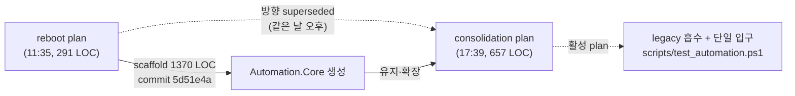

# test-automation-reboot — Superseded

> **상태**: Superseded by `ghostwin-test-automation-consolidation.plan.md` (같은 날, 6시간 뒤)
> **대체일**: 2026-05-09
> **Archive 사유**: 동일 주제 (테스트 자동화 통합) 에 대해 더 포괄적인 후속 plan 이 같은 날 작성되어 활성 plan 으로 대체됨. 본 plan 은 이력 추적 목적으로 보존.

---

## 맨 위 요약

`ghostwin-test-automation-reboot.plan.md` 는 2026-05-09 오전 11:35 commit `5d51e4a` 와 함께 작성되었고, 같은 commit 에서 `tests/GhostWin.Automation.Core/` scaffold 1370 LOC 가 생성되었다. 같은 날 오후 17:39 commit `8fe4e86` 로 작성된 `ghostwin-test-automation-consolidation.plan.md` 가 본 plan 의 방향을 흡수·확장하면서 활성 plan 자리를 가져갔다.

## 두 plan 의 관계

| 항목 | reboot plan (본 문서) | consolidation plan (활성) |
|------|------------------|---------------------|
| commit | `5d51e4a` (오전 11:35) | `8fe4e86` (오후 17:39) |
| 분량 | 291 LOC | 657 LOC |
| 핵심 메시지 | "처음부터 다시 정리한다" | "삭제 전 흡수, 단일 실행 입구" |
| Automation.Core scaffold | **생성** (1370 LOC 동시 commit) | reboot 의 scaffold 를 **그대로 유지** |
| Legacy 처리 | 명시 약함 | E2E.Tests / MeasurementDriver / Python runner / PoC FlaUI 흡수 매핑 명시 |
| 단일 입구 | xUnit fixture 통합 | `scripts/test_automation.ps1` 단일 입구 + suite 분리 (Daily / Interactive / Measurement) |

## 무엇이 살아남았나

reboot plan 의 **코드 산출물 (1370 LOC)** 은 superseded 가 아니라 그대로 살아남았다:

- `tests/GhostWin.Automation.Core/` (AppLauncher / AppProcessTerminator / AppSession / ArtifactWriter / Waiter)
- `tests/GhostWin.Automation.Core.Tests/` (단위 테스트 6개)

consolidation plan 은 위 두 프로젝트를 "유지" 분류로 받아들이고, 그 위에 legacy 통합 / 단일 진입점 / Daily·Interactive·Measurement 분리 규칙을 추가한다.

## 무엇이 superseded 되었나

reboot plan 의 **계획 본문 (291 LOC)** 은 다음 사유로 superseded:

1. **legacy 흡수 단계 미명시** — reboot 은 "처음부터 다시" 톤으로 작성되어 legacy 파일 (`tests/GhostWin.E2E.Tests/`, `tests/GhostWin.MeasurementDriver/`, `scripts/e2e/e2e_operator/` Python runner) 의 매핑을 누락. consolidation 은 흡수 후 제거 분류표 (현재 분류 § 9행) 로 명시.
2. **단일 실행 입구 없음** — reboot 은 xUnit 직접 실행 가정. consolidation 은 `scripts/test_automation.ps1` suite 진입점 + `Daily / Interactive / Measurement` 모드 분리.
3. **artifact 정책 약함** — consolidation 은 `artifacts/test-automation/<timestamp>/...` 통일 규칙 명시.

## 후속 plan 위치

- 활성: `docs/01-plan/features/ghostwin-test-automation-consolidation.plan.md`
- 본 superseded plan: `docs/archive/2026-05/test-automation-reboot-superseded/ghostwin-test-automation-reboot.plan.md`

## 관련 commit

| commit | 시각 | 내용 |
|--------|------|------|
| `5d51e4a` | 2026-05-09 11:35 | feat: add automation core scaffold (reboot plan + Core/Core.Tests scaffold 1370 LOC) |
| `8fe4e86` | 2026-05-09 17:39 | docs: plan automation consolidation (consolidation plan 657 LOC, reboot 대체) |

## 요약 한 줄

reboot 의 **코드 (Automation.Core scaffold)** 는 consolidation 이 그대로 받아 살아남았고, **plan 본문** 만 같은 날 더 포괄적인 consolidation plan 으로 대체되어 본 archive 에 보존.
