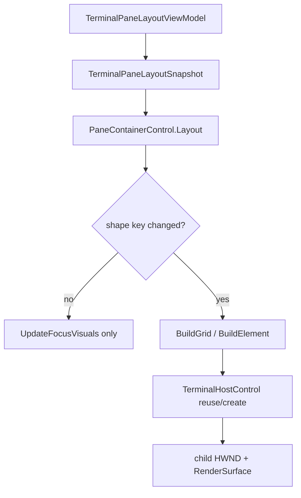

# M-16-E PaneContainer Measurement Design

## Summary

M-16-E does not rewrite `PaneContainerControl` first. It first proves whether the current WPF visual tree rebuild behavior is actually costly or visually unstable.

The implemented scope is measurement-first plus visual proof: add deterministic pane split and workspace switch churn scenarios, record per-action timings and pane geometry, capture the live window before shutdown, and add unit regression tests that prove focus-only layout updates do not rebuild the whole visual tree. The follow-up repeat harness runs the same scenario multiple times and aggregates visual/timing results.

## Current Flow



`PaneContainerControl` already has a shape-key fast path. Focus changes are intentionally excluded from the shape key, so a focus-only update should keep `Content` and host instances stable.

## Problem

The old M-16-E stub assumed `BuildElement` might rebuild too often. After the MVVM boundary refactor and hardening work, that assumption is stale for focus-only changes, but split and workspace switch paths still deserve measurement.

During 2026-05-11 validation, a confirmed user-visible issue was added to this scope: in a restored/normal window, the active terminal border could lose its right and bottom edges. Fullscreen looked closer to correct because the rounding happened to land more favorably.

Root cause: `TerminalHostControl` is an `HwndHost`. WPF sibling/border painting around a child HWND is not a reliable place to draw all four terminal focus edges, especially with 150% DPI and restored-window physical pixel rounding.

## Design

| Area | Decision |
|------|----------|
| Primary strategy | Measure first, refactor only if evidence crosses the threshold |
| Scope | `pane-split-churn` and `workspace-switch-churn` scenarios plus focus fast-path unit tests |
| Artifact | `driver-events.csv`, `pane-geometry.json`, `workspace-events.csv`, `workspace-geometry.json`, existing `render-perf.csv`, `cpu.csv` |
| Visual proof | `visual-window.png`, `visual-check.json`, `visual-pane-*.png` with text-pixel and active-border checks |
| Repeat proof | `measure_render_repeats.ps1` writes `repeat-summary.csv`, `repeat-summary.json`, and a root `summary.txt` |
| Entry point | Existing `scripts/test_automation.ps1 -Suite Measurement` |
| App launch contract | Measurement must not let `GhostWin.App` inherit redirected stdout/stderr handles |
| Active border strategy | Reserve stable WPF layout space, draw the visible focused border inside the focused DX surface |
| Threshold | Keep current structure if frame-drop ratio is below 5%; consider diff update if 5% or higher |

## Implementation Shape

1. Extend the automation runner with `pane-split-churn` and `workspace-switch-churn` scenarios.
2. Drive `Alt+V`, `Alt+H`, `Alt+H` and record timing around each split action.
3. Drive workspace creation and `Ctrl+Tab` switching, then record timing around each transition.
4. Capture UIA host count and bounding rectangles after each action.
5. Emit sidecar artifacts in the measurement output directory.
6. Capture the live app window before closing it, convert UIA geometry to physical pixels with `GetDpiForWindow`, and crop each pane.
7. Detect terminal text pixels in every pane crop.
8. Detect a complete focused border in at least one pane crop.
9. Draw the visible focused border in the DX surface, not in WPF around `HwndHost`.
10. Reassert surface focus when applying a layout snapshot or reselecting the same focused pane.
11. Add a repeat wrapper that calls the baseline script N times and treats any visual proof failure as a failed gate.
12. Keep JSON parsing compatible with both Windows PowerShell 5.1 and PowerShell 7 by avoiding `@(ConvertFrom-Json)` around top-level arrays.
13. Add unit tests proving focus-only layout changes keep `PaneContainerControl.Content` stable.
14. Update M-16-E docs to use the current `tests/GhostWin.Automation.Runner` path.

## Measurement Launch Finding

During 2026-05-11 validation, `pane-split-churn` reproduced a blank terminal surface while PowerShell prompt text appeared in the measurement stdout log. The native DLLs were loaded and `render-perf` samples existed, so the issue was not a DLL reference failure.

Root cause: `measure_render_baseline.ps1` launched `GhostWin.App` with `ProcessStartInfo.UseShellExecute=false` while the measurement script's stdout was redirected. The child shell inherited redirected stdio through the app process, so shell output escaped to the measurement log instead of the ConPTY surface.

The launch contract is now: set `GHOSTWIN_RENDER_PERF` and `GHOSTWIN_LOG_FILE` only around `Start-Process`, and launch the app without inheriting redirected stdio handles.

## Non-Goals

- Do not introduce diff-based visual tree patching in this pass.
- Do not make screenshot/pixel comparison a Daily gate.
- Do not depend on the removed `tests/GhostWin.MeasurementDriver` project.

## Validation

```powershell
dotnet test tests\GhostWin.App.Tests\GhostWin.App.Tests.csproj -c Debug --filter PaneContainerControlTests
dotnet test tests\GhostWin.Automation.Core.Tests\GhostWin.Automation.Core.Tests.csproj -c Debug --filter "MeasurementDriverContractTests|AutomationRunnerScriptTests"
powershell.exe -NoProfile -ExecutionPolicy Bypass -File scripts\test_automation.ps1 -Suite Measurement -Configuration Release -MeasurementScenario pane-split-churn -DurationSec 10 -ResetSession
powershell.exe -NoProfile -ExecutionPolicy Bypass -File scripts\test_automation.ps1 -Suite Measurement -Configuration Release -MeasurementScenario workspace-switch-churn -DurationSec 10 -ResetSession
```

Latest validation after the launch fix and active-border fix:

- `pane-split-churn`: `DurationSec=8`, `ObservedPanes=4`, `ObservedActions=3`, `sample_count=19`, `total_us p95=54482.9`, `visual_valid=True`, `visual_text_valid=True`, `visual_active_border_complete=True`.
- `workspace-switch-churn`: `DurationSec=8`, `ObservedPanes=2`, `ObservedActions=7`, `sample_count=27`, `total_us p95=73137.3`, `visual_valid=True`, `visual_text_valid=True`, `visual_active_border_complete=True`.
- `pane-split-churn` repeat smoke: `RepeatCount=2`, `DurationSec=6`, `driver_valid=True`, `visual_valid=True`, `failure_count=0`, `total_us avg_p95=50711.8`, `total_us max_p95=57869`.

## Decision Rule

If both churn scenarios show acceptable frame timing and stable geometry, M-16-E closes as “measured, no structural rewrite.” If either shows frame-drop ratio at or above 5%, the next cycle can justify a targeted diff-based update.
