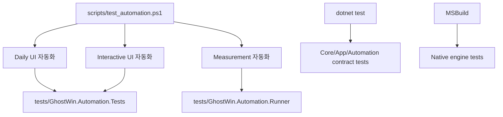

# GhostWin Tests

이 문서는 GhostWin 테스트의 현재 구조와 실행 방법을 정리한다.

테스트의 기준은 다음과 같다.

1. 의미 있는 제품 회귀 테스트는 `GhostWin.Automation.*` 체계에 둔다.
2. UI 자동화 실행 입구는 `scripts/test_automation.ps1` 하나로 유지한다.
3. 실험용 PoC, 오래된 Python/PowerShell E2E runner, 실행 산출물은 테스트 체계로 보지 않는다.



## 빠른 실행

대부분의 개발 중 확인은 아래 순서면 충분하다.

```powershell
dotnet test tests\GhostWin.Core.Tests\GhostWin.Core.Tests.csproj -c Debug
dotnet test tests\GhostWin.App.Tests\GhostWin.App.Tests.csproj -c Debug
dotnet test tests\GhostWin.Automation.Core.Tests\GhostWin.Automation.Core.Tests.csproj -c Debug
powershell.exe -NoProfile -ExecutionPolicy Bypass -File scripts\test_automation.ps1 -Suite Daily -Configuration Debug
```

실제 foreground 마우스/커서까지 확인해야 할 때만 Interactive suite를 추가로 실행한다.

```powershell
powershell.exe -NoProfile -ExecutionPolicy Bypass -File scripts\test_automation.ps1 -Suite Interactive -Configuration Debug
```

## 테스트 프로젝트

| 프로젝트 | 성격 | 주 검증 대상 | 실행 방법 |
|---|---|---|---|
| `GhostWin.Core.Tests` | 순수 단위 테스트 | core model, pane tree, session snapshot, selection, IME preview policy | `dotnet test tests\GhostWin.Core.Tests\GhostWin.Core.Tests.csproj -c Debug` |
| `GhostWin.App.Tests` | WPF/App 단위 및 계약 테스트 | automation id, hook pipe protocol, test-control handler, cursor mapper/oracle formatter, text composition controller, animation | `dotnet test tests\GhostWin.App.Tests\GhostWin.App.Tests.csproj -c Debug` |
| `GhostWin.Automation.Core.Tests` | 자동화 인프라 contract 테스트 | app launch/session/artifact/wait/test-control client, runner script 계약, legacy 제거 계약, measurement runner contract | `dotnet test tests\GhostWin.Automation.Core.Tests\GhostWin.Automation.Core.Tests.csproj -c Debug` |
| `GhostWin.Automation.Tests` | 실제 앱 UI 자동화 | Daily UIA/Test-Control 자동화, Interactive Win32 cursor smoke | `scripts/test_automation.ps1` 사용 |
| `GhostWin.Automation.Runner` | 자동화 helper executable | measurement scenario 실행, window discovery, focus, pane split, workload 입력, JSON 결과 출력 | 직접 테스트 프로젝트가 아니라 `scripts/measure_render_baseline.ps1`에서 호출 |
| `GhostWin.Engine.Tests` | C++ native 테스트 harness | vt-core, ConPTY, DX11 render, render state, TSF, Korean glyph | MSBuild로 개별 native exe 빌드/실행 |

`tests/HwndHostPoC`는 현재 활성 테스트 프로젝트가 아니다. 남아 있는 `bin/obj` 산출물은 테스트 체계의 일부로 보지 않는다.

## UI 자동화

UI 자동화는 `scripts/test_automation.ps1`가 단일 entrypoint다.

```powershell
powershell.exe -NoProfile -ExecutionPolicy Bypass -File scripts\test_automation.ps1 `
  -Suite Daily `
  -Configuration Debug
```

공통 옵션:

| 옵션 | 값 | 의미 |
|---|---|---|
| `-Suite` | `Daily`, `Interactive`, `Measurement`, `All` | 실행할 자동화 suite |
| `-Configuration` | `Debug`, `Release` | 빌드 구성 |
| `-NoBuild` | switch | dotnet test 또는 measurement build 생략 |
| `-ResultsRoot` | path | 결과 저장 root. 기본값은 `artifacts/test-automation` |

결과는 매 실행마다 timestamp 폴더에 저장된다.

```text
artifacts/test-automation/<yyyyMMdd_HHmmss>/
  daily/daily.trx
  interactive/interactive.trx
  measurement/<scenario>/
```

### Daily

Daily는 일반 개발 중 기본 UI 회귀 suite다.

```powershell
powershell.exe -NoProfile -ExecutionPolicy Bypass -File scripts\test_automation.ps1 -Suite Daily -Configuration Debug
```

내부적으로 다음 환경 변수를 켜고 `Category=DailyE2E`만 실행한다.

```text
GHOSTWIN_AUTOMATION_RUN_REAL_APP=1
```

현재 Daily 테스트는 `tests/GhostWin.Automation.Tests`에 있다.

| 테스트 | 의미 |
|---|---|
| `StructureTests` | 핵심 UIA surface가 존재하는지 확인. workspace, pane split, settings, notification, command palette, mouse cursor probe |
| `StateTests` | 실제 앱 state snapshot이 active workspace/session/focused pane을 추적하는지 확인 |
| `CommandTests` | Test-Control IPC command로 workspace 생성, pane 분할/닫기, settings open/close가 동작하는지 확인 |
| `NotificationTests` | OSC notification이 notification panel/open state로 연결되는지 확인 |
| `SettingsTests` | isolated profile에서 settings 변경이 저장되고 재실행 후 다시 로드되는지 확인 |
| `CursorOracleTests` | OSC 22 mouse cursor 값이 UIA oracle surface에 반영되는지 확인. `text`, `pointer`, `ew-resize`, `default`를 검증 |

Daily는 real app을 띄우지만 foreground 마우스 조작에 의존하지 않도록 설계한다.

### Interactive

Interactive는 foreground, 실제 마우스 위치, Win32 cursor handle처럼 환경 영향을 받는 테스트다. CI나 백그라운드 세션보다 로컬 데스크톱에서 수동으로 실행하는 것이 맞다.

```powershell
powershell.exe -NoProfile -ExecutionPolicy Bypass -File scripts\test_automation.ps1 -Suite Interactive -Configuration Debug
```

내부적으로 다음 환경 변수를 켠다.

```text
GHOSTWIN_AUTOMATION_RUN_REAL_APP=1
GHOSTWIN_INTERACTIVE_AUTOMATION=1
```

현재 Interactive 테스트:

| 테스트 | 의미 |
|---|---|
| `Interactive/Win32CursorSmokeTests` | OSC 22가 UIA oracle을 지나 실제 `GhostWinTermChild` HWND의 Win32 cursor handle까지 바꾸는지 확인. 현재 안정적인 대표 cursor인 `text`, `pointer`, `default`를 검증 |

주의:

- 실행 중 마우스 위치와 foreground window가 테스트에 영향을 줄 수 있다.
- 실패 시 먼저 같은 명령을 한 번 더 실행해 foreground 경쟁인지 확인한다.
- Daily의 `CursorOracleTests`가 더 넓은 cursor mapping을 검증하고, Interactive는 실제 Win32 적용 smoke만 맡는다.

## Measurement

Measurement는 렌더 성능 baseline 수집용 자동화다.

```powershell
powershell.exe -NoProfile -ExecutionPolicy Bypass -File scripts\test_automation.ps1 `
  -Suite Measurement `
  -Configuration Release `
  -MeasurementScenario idle `
  -DurationSec 60
```

지원 scenario:

| 값 | 의미 |
|---|---|
| `idle` | 앱 실행 후 유휴 렌더/CPU 샘플 수집 |
| `load` | 자동 workload 입력 후 렌더/CPU 샘플 수집 |
| `resize` | 1-pane resize baseline |
| `resize-4pane` | `resize` + 4-pane 준비/검증. `scripts/test_automation.ps1`가 `measure_render_baseline.ps1 -Scenario resize -Panes 4`로 변환 |

주요 옵션:

| 옵션 | 의미 |
|---|---|
| `-DurationSec` | 측정 시간 |
| `-PresentMonPath` | PresentMon CSV를 함께 남길 때 사용 |
| `-ResetSession` | `%APPDATA%\GhostWin\session.json`을 임시 백업하고 fresh session으로 측정 |
| `-NoBuild` | 이미 빌드된 runner/app을 사용할 때만 사용 |

Measurement는 내부적으로 `scripts/measure_render_baseline.ps1`를 호출하고, 그 스크립트가 `tests/GhostWin.Automation.Runner` executable을 실행한다.

결과 파일:

```text
artifacts/test-automation/<run>/measurement/<scenario>/
  ghostwin.log
  render-perf.csv
  cpu.csv
  driver-result.json
  summary.txt
```

주의:

- 성능 판단은 `Release` 결과를 기준으로 한다. `Debug`는 동작 확인용이다.
- `ghostwin.log` 안에 `render-perf` 로그가 생성되어야 `render-perf.csv`를 만들 수 있다.
- `-NoBuild`는 stale binary를 사용할 수 있으므로, 측정 신뢰도가 필요하면 생략한다.

## 자동화 Core 계약 테스트

`GhostWin.Automation.Core.Tests`는 테스트 자동화 자체가 무너지지 않았는지 확인한다.

```powershell
dotnet test tests\GhostWin.Automation.Core.Tests\GhostWin.Automation.Core.Tests.csproj -c Debug
```

주요 테스트:

| 테스트 | 의미 |
|---|---|
| `AppLauncherTests` | `GhostWin.App.exe` 탐색, hook pipe 이름, 환경 변수 주입 계약 |
| `AppSessionTests` | run id, artifact dir, temp profile 경로 계약 |
| `AppProcessTerminatorTests` | 테스트가 띄운 앱 process 종료 계약 |
| `ArtifactWriterTests` | 실패 진단 artifact 작성 계약 |
| `WaiterTests` | retry/wait timeout 동작 |
| `TestControlClientTests` | test-control named pipe client serialization 계약 |
| `RealAppSmokeTests` | 환경 변수가 켜졌을 때 실제 앱과 test-control 연결 smoke |
| `AutomationRunnerScriptTests` | `scripts/test_automation.ps1`가 Daily/Interactive/Measurement 분리를 유지하는지, legacy runner가 되살아나지 않았는지 확인 |
| `MeasurementDriverContractTests` | measurement runner option/result/pane count contract |

`RealAppSmokeTests`는 기본 실행에서는 환경 변수 gate 때문에 실앱 실행을 건너뛰도록 작성되어 있다. 실제 앱 smoke가 필요하면 아래처럼 실행한다.

```powershell
$env:GHOSTWIN_AUTOMATION_RUN_REAL_APP='1'
dotnet test tests\GhostWin.Automation.Core.Tests\GhostWin.Automation.Core.Tests.csproj -c Debug --filter FullyQualifiedName~RealAppSmokeTests
Remove-Item Env:GHOSTWIN_AUTOMATION_RUN_REAL_APP
```

## Core 단위 테스트

Core 테스트는 앱을 띄우지 않는다.

```powershell
dotnet test tests\GhostWin.Core.Tests\GhostWin.Core.Tests.csproj -c Debug
```

주요 범위:

| 영역 | 대표 테스트 |
|---|---|
| pane tree | `PaneNodeTests` |
| session persistence model | `SessionSnapshotTests` |
| selection model | `SelectionStateTests` |
| IME preview policy | `ImeCompositionPreviewPolicyTests` |

## App 단위/계약 테스트

App 테스트는 WPF/App 계층의 순수 로직과 automation surface 계약을 확인한다.

```powershell
dotnet test tests\GhostWin.App.Tests\GhostWin.App.Tests.csproj -c Debug
```

주요 범위:

| 영역 | 대표 테스트 |
|---|---|
| automation ids | `AutomationIdsTests`, `NotificationAutomationSurfaceTests` |
| hook/test-control protocol | `HookPipeProtocolTests`, `TestControlHandlerTests` |
| input UX | `TextCompositionPreviewControllerTests` |
| mouse cursor | `MouseCursorShapeMapperTests`, `MouseCursorOracleFormatterTests`, `SessionManagerMouseShapeTests` |
| animation | `GridLengthAnimationTests` |
| app reference smoke | `SmokeTest` |

## Native Engine 테스트

Native 테스트는 `tests/GhostWin.Engine.Tests`에서 관리한다. 자세한 목록은 `tests/GhostWin.Engine.Tests/README.md`를 본다.

개별 테스트 빌드:

```powershell
msbuild tests\GhostWin.Engine.Tests\GhostWin.Engine.Tests.vcxproj `
  /p:GhostWinTestName=vt_core_test `
  /p:Configuration=Debug
```

실행:

```powershell
build\tests\Debug\vt_core_test.exe
```

대표 테스트:

| 이름 | 의미 |
|---|---|
| `vt_core_test` | VT core wrapper 기본 동작 |
| `conpty_integration_test` | ConPTY와 VT core 통합 |
| `render_state_test` | render state dirty row/shape 계약 |
| `quad_korean_test` | 한글 glyph 렌더링 |
| `dx11_render_test` | DX11 renderer smoke |
| `tsf_init_test` | TSF 초기화 |

## 권장 실행 조합

### 빠른 코드 변경 확인

```powershell
dotnet test tests\GhostWin.Core.Tests\GhostWin.Core.Tests.csproj -c Debug --no-restore
dotnet test tests\GhostWin.App.Tests\GhostWin.App.Tests.csproj -c Debug --no-restore
```

### 자동화 체계 변경 확인

```powershell
dotnet test tests\GhostWin.Automation.Core.Tests\GhostWin.Automation.Core.Tests.csproj -c Debug --no-restore
powershell.exe -NoProfile -ExecutionPolicy Bypass -File scripts\test_automation.ps1 -Suite Daily -Configuration Debug
```

### UI 회귀 최종 확인

```powershell
powershell.exe -NoProfile -ExecutionPolicy Bypass -File scripts\test_automation.ps1 -Suite Daily -Configuration Debug
powershell.exe -NoProfile -ExecutionPolicy Bypass -File scripts\test_automation.ps1 -Suite Interactive -Configuration Debug
```

### 성능 baseline 확인

```powershell
powershell.exe -NoProfile -ExecutionPolicy Bypass -File scripts\test_automation.ps1 `
  -Suite Measurement `
  -Configuration Release `
  -MeasurementScenario idle `
  -DurationSec 60 `
  -ResetSession
```

## 새 테스트 추가 기준

새 테스트는 아래 기준으로 위치를 정한다.

| 추가하려는 테스트 | 위치 |
|---|---|
| 순수 model/policy 테스트 | `tests/GhostWin.Core.Tests` |
| WPF/App class의 순수 로직 또는 automation id 계약 | `tests/GhostWin.App.Tests` |
| 테스트 자동화 infra 자체의 계약 | `tests/GhostWin.Automation.Core.Tests` |
| 실제 앱을 띄우는 반복 가능한 UI 테스트 | `tests/GhostWin.Automation.Tests`, `Category=DailyE2E` |
| foreground/mouse/keyboard 상태에 민감한 UI smoke | `tests/GhostWin.Automation.Tests/Interactive`, `Category=Interactive` |
| 렌더 측정용 app driving helper | `tests/GhostWin.Automation.Runner` |
| C++ engine/native behavior | `tests/GhostWin.Engine.Tests` |

추가 원칙:

- 새 UI 자동화 script를 `scripts/test_*.ps1`, `scripts/diag_*.ps1`, `scripts/e2e/` 형태로 만들지 않는다.
- UI 자동화는 `scripts/test_automation.ps1`에 suite로 연결한다.
- 실패 분석 artifact는 `artifacts/test-automation/` 아래에 남긴다.
- test output이나 screenshot을 repo root나 `test_results/`에 커밋하지 않는다.

## 문제 해결

| 증상 | 확인할 것 |
|---|---|
| Daily가 앱을 띄우지 않고 통과/스킵처럼 보임 | `scripts/test_automation.ps1 -Suite Daily`로 실행했는지 확인. 직접 `dotnet test`만 실행하면 `GHOSTWIN_AUTOMATION_RUN_REAL_APP`가 없을 수 있다 |
| Interactive cursor smoke 실패 | 마우스/foreground 경쟁 가능성이 있다. 다른 창 조작을 멈추고 재실행한다 |
| Measurement가 `ghostwin.log` 없음으로 실패 | app binary가 최신인지, `GHOSTWIN_RENDER_PERF`가 적용되는 빌드인지, `-NoBuild`를 잘못 사용하지 않았는지 확인한다 |
| `GhostWin.App.exe`를 찾지 못함 | `msbuild GhostWin.sln /p:Configuration=Debug /p:Platform=x64` 또는 `scripts/test_automation.ps1`에서 build를 포함해 실행한다 |
| 테스트 간 UI 상태가 섞임 | `GhostWin.Automation.Tests`는 assembly-level로 xUnit parallelization을 끈다. 새 UI 테스트에서 별도 parallel 실행을 강제하지 않는다 |

## 현재 정리된 legacy 경로

아래 경로는 되살리면 안 된다. `AutomationRunnerScriptTests`가 일부를 계약으로 막고 있다.

```text
tests/GhostWin.E2E.Tests/
tests/GhostWin.MeasurementDriver/
tests/e2e-flaui-cross-validation/
tests/e2e-flaui-split-content/
scripts/e2e/
scripts/test_e2e.ps1
scripts/repro_first_pane.ps1
scripts/tests/
test_results/
```

테스트 체계는 `GhostWin.Automation.Core`, `GhostWin.Automation.Tests`, `GhostWin.Automation.Runner`를 중심으로 유지한다.
